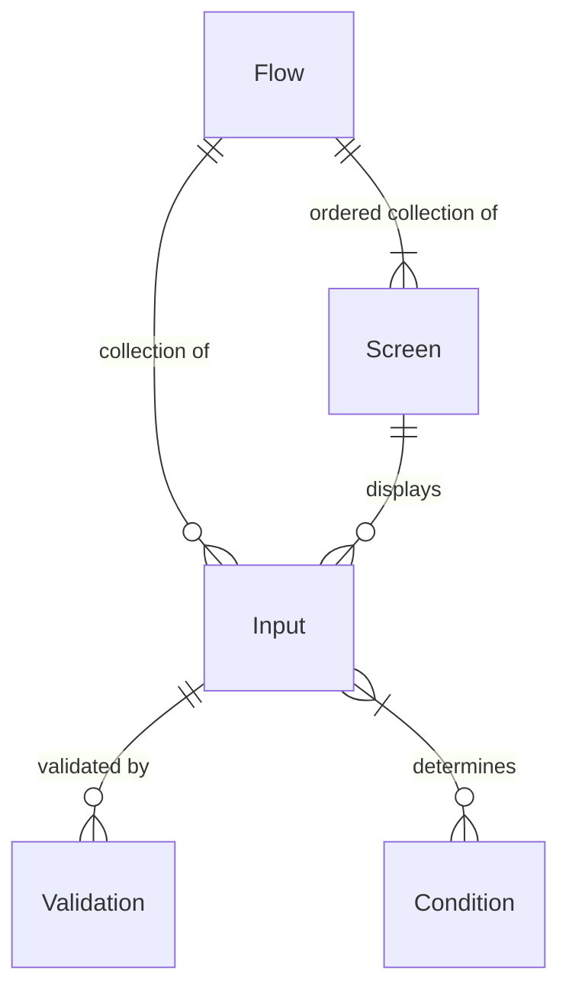
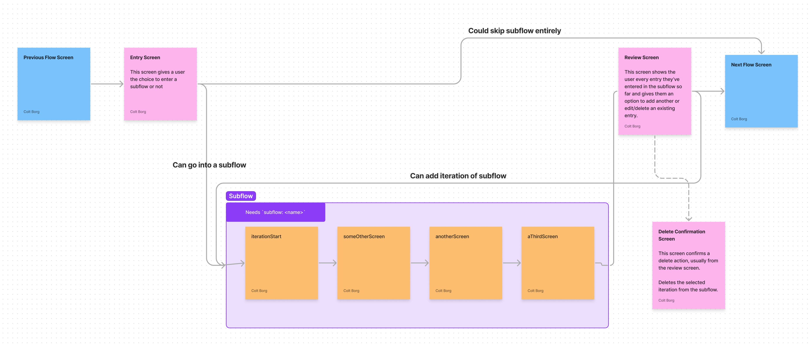
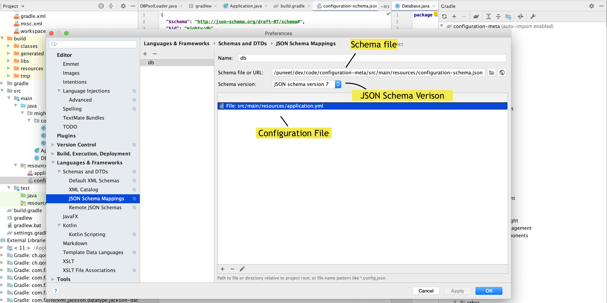

# Form Flow Library

Table of Contents
=================
<!-- Update this section when you update sections now. 
    **  This is not automatically generated. **
     Please don't go more than three layers deep, so we can keep the TOC
     a reasonable size 
-->

* [What is a form flow?](#what-is-a-form-flow)
* [Concepts](#concepts)
    * [Flow](#flow)
    * [Screen](#screen)
    * [Defining Screens](#defining-screens)
    * [Subflows](#subflows)
        * [Dedicated Subflow Screens](#dedicated-subflow-screens)
    * [Conditions](#conditions)
        * [Using conditions in templates](#using-conditions-in-templates)
    * [Submission Object](#submission-object)
    * [Actions](#actions)
    * [Defining Inputs](#defining-inputs)
        * [Input Class](#input-class)
        * [Custom Validations](#custom-validations)
        * [Input Data JSON Structure](#input-data-json-structure)
* [General Information](#general-information)
    * [Thymeleaf](#thymeleaf)
        * [Using Thymeleaf](#using-thymeleaf)
        * [Templates](#templates)
        * [Static Pages](#static-pages)
        * [Fragments](#fragments)
        * [Input Types](#input-types)
        * [Accessing Conditions](#accessing-conditions)
        * [Accessing Submission Object](#accessing-submission-object)
    * [Document Upload](#document-upload)
        * [AWS S3](#aws-s3)
        * [File Naming Conventions](#file-naming-conventions)
        * [File Upload Widget](#file-upload-widget)
        * [Configuring the Dropzone Widget](#configuring-the-dropzone-widget)
        * [Uploaded File Storage](#uploaded-file-storage)
        * [Deleting Uploaded Files](#deleting-uploaded-files)
        * [S3 File Retention Policies](#s3-file-retention-policies)
    * [Address Validation](#address-validation)
* [How to use](#how-to-use)
    * [Configuration Details](#configuration-details)
        * [Environment Variables](#environment-variables)
        * [Application Configuration](#application-configuration)
        * [flows-config.yaml file](#flows-configyaml-file)
        * [Flow and Subflow Configuration](#flow-and-subflow-configuration)
        * [Screens](#screens)
        * [Defining Subflows](#defining-subflows)
        * [Thymeleaf Model Data](#thymeleaf-model-data)
        * [Conditions / Actions](#conditions--actions)
        * [Library Details](#library-details)
* [Developer Setup](#developer-setup)
    * [Java Development Kit](#java-development-kit)
    * [Set up jenv to manage your jdk versions](#set-up-jenv-to-manage-your-jdk-versions)
    * [Gradle](#gradle)
        * [Build Web/Fat Jar](#build-webfat-jar)
    * [Spring Profiles](#spring-profiles)
        * [DevController](#devcontroller)
        * [IntelliJ Configuration](#intellij-configuration)
    * [IntelliJ Setup](#intellij-setup)
        * [Connect flows config schema](#connect-flows-config-schema)
        * [Applying Live Templates to your IntelliJ IDE](#applying-live-templates-to-your-intellij-ide)
        * [Using Live Templates](#using-live-templates)
        * [Contribute new Live Templates](#contribute-new-live-templates)
        * [Set Java SDK](#set-java-sdk)
        * [Setup Platform Flavored Google Styles for Java](#setup-platform-flavored-google-styles-for-java)
        * [Testing](#testing)
    * [Setup Fake Filler (optional, Chrome &amp; Firefox)](#setup-fake-filler-optional-chrome--firefox)
* [How to contribute](#how-to-contribute)
    * [Maintainer information](#maintainer-information)

A Spring Boot Java library that provide a framework for developing *form-flow* based applications.
The intention is to speed up the creation of web applications that are a series of forms that
collect input from users.

The library includes tooling for:

- Conditions and Actions
- Conditions for the flow of screens
- Revealing of elements on a screen

- Subflows
    - Repeating sections of screen(s) that build a collection of information (ex. ask for
      information about all members of a household) before returning to the main flow
- Input Validations
    - Uses [JPA Validation](https://www.baeldung.com/spring-boot-bean-validation)
- Template fragments
    - A set
      of [Thymeleaf fragments](https://github.com/codeforamerica/form-flow/tree/main/src/main/resources/templates/fragments)

      that create a library of reusable HTML components for Inputs, Screens, Forms, etc.
- Data Persistence
- File Uploads

Out-of-the-box, integrations can be set up with common third-party services:

- Intercom
- Google Analytics
- Mixpanel
- Optimizely
- Google Ads
- Facebook Ads

An example project built off of this Form Flow library can be found in
our [Form Flow Starter App](https://github.com/codeforamerica/form-flow-starter-app) repository.

# What is a form flow?

# Concepts

* Flows
* Inputs
* Screens
* Conditions
* Validations

Flows are the top-level construct that define the navigation between a collection of screens. A flow
can have many inputs to accept user data (e.g. first name, zip code, email, file upload). Each input
can have zero to many validations.

A flow also has many screens. Each screen can be made up of zero or more inputs. A flow has an
ordering of screens, and can use defined conditions to control navigation. Conditions use submitted
inputs to make a logical decision about showing or not showing a screen / part of a screen.



## Flow

## Screen

## Defining Screens ##

All screens must have an entry in the flows-config in order to be rendered. Additionally, each
screen should have its own template defined in a folder respective to the flow that screen is
contained within. Example `/src/resources/templates/<flowName>/<templateName>`.

We have provided a number of IntelliJ Live templates to make the creation of screens faster and
easier. [More on Live Templates here](#applying-live-templates-to-your-intellij-ide).

When setting up a new flow, create a folder in `src/main/resources/templates` to hold all HTML
files. In the starter app, we name the respective template folders after their respective flows.

For example, add an HTML file such
as `about-you.html` [in the flow's templates folder](src/main/resources/templates). Here is an
example using our [live templates for a form screen](#applying-live-templates-to-your-intellij-ide):

```html

<th:block th:replace="'fragments/form' :: form(action=${formAction}, content=~{::formContent})">
  <th:block th:ref="formContent">
    <div class="form-card__content">
      <th:block th:replace="'icons' :: 'clipboard'"></th:block>
      <th:block th:replace="'content' :: cardHeader(header='Tell us about yourself')"/>
      <th:block
          th:replace="'inputs' :: textInput(name='firstName', label='What's your first name?')"/>
      <th:block
          th:replace="'inputs' :: textInput(name='lastName', label='What's your last name?')"/>
      <th:block
          th:replace="'inputs' :: textInput(name='emailAddress', label='What's your email address?')"/>
    </div>
    <div class="form-card__footer">
      <th:block th:replace="'fragments/continueButton' :: continue"/>
    </div>
  </th:block>
</th:block>
```

## Subflows

Subflows are repeating sections of one or more screens within a regular flow. These can be things
like household builders that ask a repeating set of questions about members of a household. Subflows
represent an array of screens and their respective inputs (represented as a HashMap) where each item
in the array is one iteration.

### Dedicated Subflow Screens

These are screens that every subflow must have.

Here is an example of a *subflow* yaml:

```yaml
subflow:
  docs:
    entryScreen: docsEntry
    iterationStartScreen: docsStart
    reviewScreen: docsReview
    deleteConfirmationScreen: docsDeleteConfirmation
```

#### Entry Screen

This screen represents the entry point to a subflow, it is usually the point at which a user makes a
decision to enter the subflow or not. Example: a screen that asks "Would you like to add household
members?" could be the entry screen for a household based subflow.

The entry screen is not part of the repeating set of pages internal to the subflow and as such does
not need to be demarked with `subflow: subflowName` in the `flows-config.yaml`.

#### Iteration Start Screen

This screen is the first screen in a subflows set of repeating screens. When this screen is
submitted, it creates a new iteration which is then saved to the subflow array within the Submission
object.

Because this screen is part of the repeating screens within the subfow, it **should** be denoted
with `subflow: subflowName` in the `flows-config.yaml`.

#### Review Screen

This is the last screen in a subflow. This screen lists each iteration completed within a subflow,
and provides options to edit or delete a single iteration.

This screen does not need to be demarked with `subflow: subflowName` in the `flows-config.yaml`. It
is not technically part of the repeating screens within a subflow, however, you do visit this screen
at the end of each iteration to show iterations completed so far and ask the user if they would like
to add another.

#### Delete Confirmation Screen

This screen appears when a user selects `delete` on a iteration listed on the review screen. It asks
the user to confirm their deletion before submitting the actual deletion request to the server.

This page is not technically part of the subflow and as such, does not need to be demarked
with `subflow: subflowName`
in the `flows-config.yaml`.

## Submission Object

Submission data is stored in the `Submission` object, persisted to PostgreSQL via the Hibernate ORM.

```java
class Submission {

  @Id
  @GeneratedValue
  private Long id;

  private String flow;

  @CreationTimestamp
  @Temporal(TIMESTAMP)
  private Timestamp createdAt;

  @UpdateTimestamp
  @Temporal(TIMESTAMP)
  private Timestamp updatedAt;

  @Temporal(TIMESTAMP)
  private Timestamp submittedAt;

  @Type(JsonType.class)
  private Map<String, String> inputData = new HashMap<>();

}
```

The `inputData` field is a JSON object that stores data from the user's input as a given flow
progresses. This field is placed in the model handed to the Thymeleaf templates, so each page should
have access to it.

## Conditions

Conditions are intended to be small pieces of code that can be run from a template or from the
form-flow configuration file. They are generally used to help determine template or page flow.

Conditions are defined in Java and are objects that implement the `Condition`
[interface](https://github.com/codeforamerica/form-flow/blob/main/src/main/java/formflow/library/config/submission/Condition.java)
. Conditions have the Submission object available to them, so when creating new conditions, the
instance variable `inputData` is accessible.

Here is a simple condition that looks at data in the submission to see if the email provided is a
Google address.

```java
public class CheckGmailUser implements Condition {

  public boolean run(Submission submission) {
    return submission.getInputData().get('emailAddress').contains("gmail.com");
  }
} 
```

More examples of conditions can be found in our
[starter application](https://github.com/codeforamerica/form-flow-starter-app/tree/main/src/main/java/org/formflowstartertemplate/app/submission/conditions)
.

### Using conditions in templates

We have created a Java object named `templateManager` that's part of the model data handed to the
Thymeleaf templates. Template code can run conditions via this object, like so:

```html

<div
    th:with="showCondition=${templateManager.runCondition('ConditionName', submission, 'data')}">
  <h1 th:if="showCondition">Conditionally show this element</h1>
</div>
```

## Actions

Actions provide the ability for an application using this library to inject application specific
logic at strategic points in the POST and GET processing.

Actions are defined in Java and are objects that implement the
`Action` [interface](https://github.com/codeforamerica/form-flow/blob/main/src/main/java/formflow/library/config/submission/Action.java)
. Actions have a `Submission` or `FormSubmission` object available to them, depending on the
type of Action being created.

There are four types of actions available in the Form Flow library:

| Action Name | Data Available | Returns    | Action Definition |
| ----------- |--------------- |------------|----------------------------------------------------------------------------------------------------------------------------------------------------------------------------------------------------------------------------------------|
| onPostAction | FormSubmission | nothing    | HTTP POST: An action of this type is run when data has been sent to the server, but before any validation has been done on the data. It's a way to inject/update any new data needed before any validation occurs. |
| crossFieldValidationAction | Form Submission | List of error messages | HTTP POST: An action of this type is run just after field-level validation has occurred, but before database been saved to the database. It's a way to find out if any fields that relate to one another are missing necessary data. |
| beforeSaveAction | Submission | nothing | HTTP POST: An action of this type is run after data validation and just before the data is saved to the database. It's a spot that data can be updated before it is saved. An example would be encrypting any sensitive data. |
| beforeDisplayAction | Submission | nothing | HTTP GET: An action of this type is run on a call after data is retrieved from the database, in the case of a GET. It provides a spot where data can be unencrypted or updated before sending the data to the template for rendering. |

`beforeDisplayActions` are run on an HTTP GET, _before_ the page it's attached to is actually
rendered. The rest of the actions are called when the page's data is submitted to the server.

Here is an example of a `beforeSaveAction` Action class:

```java
public class CalculateBeforeSave implements Action {

  public void run(Submission submission) {
    float rate = 0.59;
    int mileage = submission.getInputData().get('mileage');
    submission.getInputData().put('reimbursement', mileage * rate);
  }
} 
```

Actions are run by connecting them to a screen in the `flows-config.yaml` file. When data from that
screen is submitted (or retrieved, in the case of `beforeDisplayAction`), any actions indicated
would be run on the data, like so:

```yaml
name: exampleFlow
flow:
  firstScreen:
    beforeSaveAction: path.to.class.CalculateBeforeSave
    beforeDisplayAction: path.to.class.DecryptSSN
    nextScreens:
      - name: secondScreen
  secondScreen:
    nextScreens:
      - name: Success
  success:
    nextScreens: null
```

More example actions can be found in
our [starter application](https://github.com/codeforamerica/form-flow-starter-app/tree/main/src/main/java/org/formflowstartertemplate/app/submission/actions)
.

## Defining Inputs

Inputs to the application are defined in two places - the template in which they are rendered, and
in a separate class for validation.

### Input Class

The inputs class's location is defined by the application using this library. The application using
this library will need a field in its `application.yaml` that shows the location of the input class(
es). It should look like this:

```yaml
form-flow:
  inputs: 'org.formflowstartertemplate.app.inputs.'
```

The library will expect a class that matches the name of the flow there. So if the flow name, as
defined in the application's `flows-config.yaml` configuration, is `ubi` we will expect a class by
the name of `Ubi` to be located at the specified input path.

An example inputs class can be seen below, with example validations. Note that all inputs classses
should extend the class `FlowInputs` which provides CSRF functionality for security.

Also note that for single value inputs the type when defining the input is String. However, for
input types that can contain more than one value, the type is ArrayList<String>.

When naming your inputs in your templates, **you must use camel case so that the given input name
can also be used as a field name in your inputs class**. Java will require that to be the case.

```java
class ApplicationInformation extends FlowInputs {

  @NotBlank(message = "{personal-info.provide-first-name}")
  String firstName;

  @NotBlank(message = "{personal-info.provide-last-name}")
  String lastName;

  String emailAddress;

  String phoneNumber;

  @NotEmpty(message = "{personal-info.please-make-a-gender-selection}")
  ArrayList<String> gender;
}
```

### Validating Inputs

Validations for inputs use the Java Bean Validation, more specifically, Hibernate
validations. For a list of validation decorators,
see [Hibernate's documentation.](https://docs.jboss.org/hibernate/stable/validator/reference/en-US/html_single/#section-builtin-constraints)

Note that our implementation does not make a field required, unless `@NotEmpty`, `@NotBlank`, or
`@NotNull` is used. That is to say if a validation annotation such as `@Email` is used, it will not
actually
validate the annotated input unless a user actually enters a value for that input. If you use
`@Email` and `@NotBlank` together, that causes both validations to run even if the user did not
enter a value,
validating both that they need to enter a value due to `@NotBlank` and because the blank value needs
to be
a validly formatted email address due to `@Email`.

### Custom Validations

We also
implement [custom validations for convenience](/src/main/java/formflow/library/data/validators). Use
them the same way you would any other JavaX validator, like so:

#### @Money

```java
@Money(message = "Please make sure to enter a valid dollar amount.")
private String income;
```

Used to validate monetary values. Accepts values such as:

```
0
0.5
1
1.2
10.20
```

Does not accept values such as:

```
-1
012
12.123
.5
```

#### @Phone

Used to validate 10-digit phone numbers.

```java
@Phone(message = "{contact-info.invalid-phone-number}")
private String phoneNumber;
```

Phone numbers must consist of a String with 10-digits passed to the validator in the pattern
of `(333) 451-7777`.
Phone numbers can not start with a zero or one.

**Note that if you are using the [phone number input fragment](#phone) provided by the Form Flow
Library
the
fragment uses input masking which will automatically format 10 digits entered into the
correct `(333) 451-7777`
format**

```
"(333) 333-3333",
"(923) 456-7890",
"(823) 456-7890",
"(707) 987-5266",
"(829) 622-9048"
```

Does not accept values such as:

```
"+1(111)-1111",
"(111)222-3333",
"(111)111-11",
"999999999",
"(123) 456-7890",
"(077) 987-5266",
"(892) 622-9048",
"22",
"der"
```

### Input Data JSON Structure

As the end user walks through the flow entering data, their input data will get stored as JSON in
the database. It is stored in a column named `inputData` on the `submissions` table.

* The organization of the data is based on the form flow setup and the field names on the forms.
* The input fields on pages that are not part of a subflow will be stored in the main part of the
  JSON data. The keys will be the input fields name.
* The input fields that are part of a subflow will be stored in an array under a key that is the
  name of the subflow.
* Field names are used as keys. We use them directly as they are and therefore they must be unique
  across a whole flow to avoid naming collisions. The example applies a prefix to the fields, but
  that's just for ease of being clear in the example. The system does not apply prefixes.

For example, for the docs subflow configuration described above in
the [Defining Subflows](#defining-subflows) section, the resulting data might be organized as
follows.

In the example below the following assumptions are applied:

* Each screen has some fields, named input1, input2, and so on. Below they are prefixed with their
  page so that they have a unique name. All fields across a particular flow must have a unique name.
* Some screens may not have any input fields, as they are pages displaying text to the user.

```JSON
{
  "first_input1": "some value",
  "first_input2": "some value",
  "second_input1": "a`Gbcd",
  "docsStart_input1": "some doc info",
  "doc": [
    {
      "uuid": "31259552-e0bc-4efe-bbc7-b5e63d2b5407",
      "doc_input1": "some data",
      "doc_input2": "other data",
      "doc_fileIds": "[2,3,5]"
    },
    {
      "uuid": "d612bc77-11de-419f-b7cc-71e4ab2ad571",
      "doc_input1": "some data",
      "doc_input2": "other data",
      "doc_fileIds": "[7]"
    },
    {
      "uuid": "e88c6602-9abf-4bfa-b4c8-5a77c44d5ab4",
      "doc_input1": "some data",
      "doc_input2": "other data",
      "doc_fileIds": "[8,12]"
    }
  ]
}
```

So the resulting JSON stored in the database has input fields as key values, and for subflow the
subflow name is the key value.

Note that the subflows are an array of repeating entries - one for each iteration a user did of the
subflow. Each iteration has a unique UUID associated with it so we can have a way of working with a
specific iteration's data.

# General Information

## Thymeleaf

### Using Thymeleaf

We use Thymeleaf for frontend views. Thymeleaf is a Java based HTML framework for frontend
templating.
[You can learn more about Thymeleaf here.](https://www.thymeleaf.org/doc/tutorials/3.0/usingthymeleaf.html)

We use Thymeleaf's concept
of  [fragments](https://www.thymeleaf.org/doc/tutorials/3.0/usingthymeleaf.html#fragments) to store
complex mark up into simple reusable imports.

Fragments simplify the process of creating more complex HTML pages. Some places we use fragments
include input types, forms, page headers and footers, error handlers,
etc. [You can view these fragments here.](src/main/resources/templates/fragments)

Thymeleaf is also capable of making direct calls to Java class methods using what is known as the
Spring Expression Language T operator. This allows you to implement Java code in your Thymeleaf
templates. We provide two classes for this purpose:

- ConditionDefinitions
    - Houses methods which should always return Booleans and can be used to conditionally show or
      hide sections of a Thymeleaf template
- ViewUtilities
    - Houses methods for general purpose manipulation of data to display on the frontend in
      Thymeleaf templates

An example of using the T operator can be found in the `incomeAmounts` template from the starter
app.

```html

<main id="content" role="main" class="form-card spacing-above-35"
      th:with="selectedSelf=${T(org.codeforamerica.formflowstarter.app.config.ConditionDefinitions).incomeSelectedSelf(submission, uuid)},
                     houseHoldMemberName=${T(org.codeforamerica.formflowstarter.app.data.Submission).getSubflowEntryByUuid('income', uuid, submission).householdMember}">
  ...
</main>
```

### Templates

The templates will contain the HTML which drive how the pages that run the flow are rendered. The
application using this library will have a set of templates to gather input with.

We have provided a suite of input based Live Templates, more
on [live templates here.](#applying-live-templates-to-your-intellij-ide)

Live templates are provided for the following input types:

- `Address`
- `Checkbox`
- `Date`
- `Fieldset`
- `Money`
- `Number`
- `Radio`
- `Select`
- `SelectOption`
- `Text`
- `TextArea`
- `Phone`
- `Ssn`
- `State`
- `YesOrNo`
- `Submit`
- `FileUpload`

### Static Pages

Unlike Screens, Static Pages are HTML content and are not part of a flow. Examples include the home
page, privacy policy, or FAQ.

Generally your application would have a static page controller (named something like
StaticPageController.java) file. At a minimum, it would handle the routing to your home
page (`index.html`) and FAQ (`faq.html`).

The [Form Flow Starter App's StaticPageController.java](https://github.com/codeforamerica/form-flow-starter-app/blob/main/src/main/java/org/formflowstartertemplate/app/StaticPageController.java)
is a good example of what a basic static page controller might look like.

To add a new Static Page to your application:

1. If you don't already have a StaticPageController.java file in your application, create one.
2. Add an annotated method (`@GetMapping`) to the `StaticPageController`
3. Create a page template in `src/resources/templates`.

The template HTML can look like:

```html
<!DOCTYPE html>
<html th:lang="${#locale.language}">
<head th:replace="fragments/head :: head(title='')"></head>
<body>
<div class="page-wrapper">
  <th:block th:replace="fragments/toolbar :: toolbar"/>
  <th:block th:replace="fragments/demoBanner :: demoBanner"/>
  <section class="slab">
    <div class="grid">
      <div class="grid__item">
        <h1 class="spacing-below-35"></h1>
      </div>
    </div>
  </section>
  <main id="content" role="main" class="slab slab--white">

  </main>
</div>
<th:block th:replace="fragments/footer :: footer"/>
</body>
</html>
```

The IntelliJ Live Template for the above example can be generated with `cfa:staticPage`.

#### Error Page

A generic error page is provided by the library in place of a white label page. In order to see the
error page you will need to add the following to your application's `application.yaml` file:

```yaml
server:
  error:
    whitelabel:
      enabled: false
```

You can also override our error page by placing your own `error.html` file in your application's
templates folder.

### Fragments

#### Form

A form fragment is provided for easily creating forms. It can be quickly accessed via the Live
Template `cfa:form` which will create a form fragment the field for `content` (which will fill in
the empty `th:ref` that you see when first inserting the Live Template). This is needed so that you
can any content you desire within the form fragment. You will also notice areas for the forms
content and the form's footer. These normally contain the forms inputs, and the forms submit button
respectively.

Additionally, the form fragment has an optional formId parameter which may be passed to give the
form an ID.

Example form fragment:

```html

<th:block
    th:replace="'fragments/form' :: form(action=${formAction}, content=~{::exampleForm}, formId='exampleID')">
  <th:block th:ref="exampleForm">
    <div class="form-card__content">
      INPUTS GO HERE
    </div>
    <div class="form-card__footer">
      SUBMIT BUTTON GOES HERE
    </div>
  </th:block>
</th:block>
```

A Fragment for the submit button is also provided through `cfa:inputSubmitButton`.

#### Icon reference

If you need to see a reference of all icons from the form flow library, you can paste this fragment
into your template to quickly see a preview and names of icons:

```
<th:block th:replace="fragments/icons :: icons-list"></th:block>
```

## Input Types

Inputs are the building blocks of the form flow library. The library provides a set of input
fragments
which can be easily accessed using our live templates.

Some inputs have optional parameters such as placeholder text.

Note that **all** inputs have an optional help text parameter which can be used to provide further
descriptive or helpful text if just a label is not enough.

Optional parameters for all inputs can be used by adding them to the thymeleaf fragments passed
parameters
when you use the fragment like below:

```html

<th:block th:replace="'fragments/inputs/text' ::
                  text(inputName='firstName',
                  label=#{personal-info.first-name-label},
                  helpText=#{personal-info.first-name-help})"/>
```

Notice that in this example both the label and the optional help text are using the `#{}` syntax to
indicate that they are pulling from a message.properties file for internationalization.

Note that sometimes an input fragment may not need a label, for example if the only input on the
page is labeled by the page header. In this case we recommend using the `cfa:screenWithOneInput`
live
template which we have provided. This template makes use of an `aria-label` referencing the header
of
the page instead of a traditional label.

### Text

Text inputs are used to gather text input from the user. They can be used to gather things like
names, addresses, and emails, etc.

Text inputs have an optional placeholder parameter which can be used to display a placeholder within
the rendered input field.

Example of using a text input:

```html

<th:block th:replace="'fragments/inputs/text' ::
                  text(inputName='firstName',
                  label=#{personal-info.first-name-label},
                  placeholder=#{personal-info.first-name-placeholder})"/>
```

A convenience fragment is provided through `cfa:inputText`.

### Text Area

Text area inputs are used to gather large amounts of text. They are usually used for things like
asking for user feedback, or more detailed explanations for question answers. Textarea inputs have
optional parameters for `placeholder`, `rows`, and `maxlength`. The `rows` parameter controls how
many rows
the textarea will display by default, where the `maxlength` parameter controls how many characters
are
allowed to be entered. Both `rows` and `maxlength` are provided as integers. Rows will default to 6
if no value is passed and maxlength will default to 500 if no value is passed.

A convenience live template for text area inputs is provided through `cfa:inputTextArea`.

### Number

Number inputs are used to gather numbers from users. The number input makes use
of `inputmode="numeric"`
which
will cause mobile devices to display the number pad when entering values into the input. The number
input
is useful for gathering numbers that don't already have a specific input type, such as the phone,
money,
date or SSN inputs.

Number inputs have an optional `title` parameter, which when passed will set the `title` attribute
on the input
The text given for the title will be displayed as a tooltip when the user hovers over the input as
well as in
client-side HTML based validation errors. The default title if one is not passed will
be `Please make sure you are entering a positive, whole number or decimal value with 2 decimal places.`

Number inputs also have an optional `pattern` parameter which represents a regex pattern that must
be met for the input to be valid.
The default regex pattern is `^\d*(\.\d{0,2})?$` which allows for any positive number with up to 2
decimal places.
A different pattern can be passed if you wish to change this default behavior. If you change
the `pattern`
make sure you also change the `title` to represent your new pattern.

Number inputs have an optional `placeholder` parameter.

A convenience live template for numbers is provided through `cfa:inputNumber`.

### Social Security Number

The social security number input is provided specifically for asking users for their social security
number.

SSN inputs are visually displayed as three separate sections seperated by dashes, the first three
digits,
the middle 2 digits and the last 4 like so: 123-45-6789.

SSN inputs also have an optional `placeholder` parameter which can be passed to provide a
placeholder.

A convenience live template for SSN inputs is provided through `cfa:inputSSN`.

### State

The state input provides a dropdown with all the US states pre-populated in it, in the format of
state code to state name, like so:

`MA - Massachusetts`

The value saved from this input is the selected state's code. Example `MA`.

### Submit Button

Submit button will submit form data to the server and will move you along to the next screen,
providing data validation was successful.

Optional parameters:

* `classes` - the CSS style(s) to use. Default is `button button--primary`
* `text` - the name of the button. Default is `Submit`

### Continue Button

The Continue Button input will simply pass the user onto the next screen in the flow.
No form data is submitted.

Optional parameter:

* `text` - the name of the button. Default is `Continue`

### Money

Money inputs are used to gather monetary values. Visually, they are displayed as a single input with
a dollar sign `$` prefixed in front of the input. Money inputs have an optional `placeholder`
parameter.

We also provide a convenience validator for money inputs, `@Money`
which validates that entered values are valid monetary values.

A convenience live template for money inputs is provided through `cfa:inputMoney`.

### Phone

Phone inputs are used to gather phone numbers. Visually, they are displayed as three seperate
sections,
the first three digits, the middle 3 digits and the last 4 like so: (123) 456-7890. This is also how
entered
values will be stored in the database. Phone inputs also have an optional `placeholder` parameter.

A convenience live template for phone inputs is provided through `cfa:inputPhone`.

### YesOrNo

Yes or no inputs are used to gather a yes or no answers from a user. They are visually displayed as
two buttons, one with a green check and the word `Yes`, the other with a red X and the word `No`.
The values that are submitted to the server are `true` and `false` respectively.

Yes or No inputs are traditionally used for simple yes or no questions, such as "Are you pregnant?"
or
"Do you have a disability?". Traditionally this input style is used on pages where the header is the
question
to which the user is answering yes or no. As such, we recommend using this input style in
conjunction
with the `cfa:screenWithOneInput` live template.

The Yes or No input has an optional but recommended `ariaDescribe` parameter which takes the string
value
of the HTML ID of the element that describes the input. Most often this is `header` which is the
default
ID of page headers in the form-flow library.

A convenience live template for yes or no inputs is provided through `cfa:inputYesOrNo`.

### Checkbox

We provide two types of checkbox inputs. One is a single `checkbox`, useful for things like asking a
user
to check the box if they agree to the terms of an application, etc. The other, `checkboxInSet` is
used
in unison with `checkboxFieldset` to create a group of checkboxes that are all related to each
other.

A checkbox uses the `value` field to indicate what value should be submitted to the server if that
checkbox
is selected.

Note that both checkbox types have an optional `icon` field which can be used to display an icon
next the checkbox. These icons are pulled from Google's Material Fonts
and [Honeycrisp](https://honeycrisp.herokuapp.com/cfa/styleguide) provides some convenience access
classes.
For those listed in Honeycrisp, you just need to include the icon name, without the leading `icon-`.
For example:

```html

<th:block th:replace="'fragments/inputs/checkbox' ::
                  checkbox(inputName='agreeToTerms',
                  value='agree',
                  icon='check')"/>
```

For icons not listed in Honeycrisp you can use
the [character codepoint for the icon](https://github.com/google/material-design-icons/blob/f5f56570741833bdd36463f1f1b6b7d4edd3f9c1/font/MaterialIconsOutlined-Regular.codepoints)
.

Below are examples of both types of checkboxes:

#### Checkbox in set

```html

<th:block th:replace="'fragments/inputs/checkboxFieldset' ::
                          checkboxFieldset(inputName='vehiclesOwned',
                          label='This label is actually a legend for the checkbox fieldset',
                          fieldsetHelpText='This help text will appear below the legend',
                          content=~{::vehiclesOwnedContent})">
  <th:block th:ref="vehiclesOwnedContent">
    <th:block
        th:replace="'fragments/inputs/checkboxInSet' :: checkboxInSet(inputName='vehiclesOwned',value='CAR', label='Car', checkboxHelpText='This help text will appear next to the checkbox.')"/>
    <th:block
        th:replace="'fragments/inputs/checkboxInSet' :: checkboxInSet(inputName='vehiclesOwned',value='BIKE', label='Bike')"/>
  </th:block>
</th:block>
```

Note that the `checkboxInSet` fragment is used to provide multiple options within
a `checkboxFieldset` fragment. Also note that the input name fo the `checkboxFieldset` and
the `checkboxInSet`
are the same. This is how the fieldset and internal checkbox options are grouped into a single
multiple checkbox
input.

#### Checkbox

```html

<th:block th:replace="'fragments/inputs/checkbox' ::
                  checkbox(inputName='agreeToTerms',
                  label='I agree to the terms of service',
                  checkboxHelpText='This help text will appear next to the checkbox')"/>
```

For both checkbox types note the difference between checkboxHelpText and fieldsetHelpText where
checkboxHelpText is used for the help text next to the checkbox and fieldsetHelpText is used for the
help text below the legend.

For convenience, we have provided a `cfa:inputFieldsetWithCheckbox` live template which can be used
to quickly
create groupings of checkbox inputs. Note that when using this template, you can copy the inner
checkbox option fragment
as many times as you like to create the necessary number of checkbox options.

### Radio

Radio inputs are used to gather a single selection from a set of options. They are used in unison
with
a `radioFieldset` fragment to create a group of radio inputs that are all related to each other.

A radio uses the `value` field to indicate what value should be submitted to the server if that
radio
is selected.

An example of a radio input:

```html

<th:block th:replace="'fragments/inputs/radioFieldset' ::
                          radioFieldset(inputName='favoriteColor',
                          label='What\'s your favorite color?',
                          fieldsetHelpText='The only true answer is blue',
                          content=~{::favoriteColorContent})">
  <th:block th:ref="favoriteColorContent">
    <th:block
        th:replace="'fragments/inputs/radio' :: radio(inputName='favoriteColor',value='BLUE', label='Blue')"/>
    <th:block
        th:replace="'fragments/inputs/radio' :: radio(inputName='favoriteColor',value='RED', label='Red')"/>
    <th:block
        th:replace="'fragments/inputs/radio' :: radio(inputName='favoriteColor',value='YELLOW', label='Yellow')"/>
  </th:block>
</th:block>
```

Notice how the `radioFieldset` fragment wraps multiple `radio` fragments, where both the fieldset
and
the radio use the same input name. This is how you create a group of radio inputs that are all
associated
with each other.

Note that similar to `checkboxFieldset`, `radioFieldset` also has an optional `radioHelpText` field
which will appear under the fieldsets legend.

For convenience, we have provided a `cfa:inputFieldsetWithRadio` live template which can be used to
quickly
create groupings of radio inputs. Not that when using this template, you can copy the inner radio
option fragment
as many times as you like to create the necessary number of radio options.

### Select

Select inputs are used to gather a single selection from a set of options. They are usually used
when
you want a user to select one of many options, but you don't want to overwhelm them with a large
list taking
up the whole screen.

An example select input:

```html

<th:block
    th:replace="'fragments/inputs/select' :: select(inputName='favoriteFruit', label='What\'s your favorite fruit?', helpText='Mine is banana', content=~{::favoriteFruitContent})">
  <th:block th:ref="favoriteFruitContent">
    <th:block
        th:replace="'fragments/inputs/selectOption' :: selectOption(value='', optionText='Choose one')"/>
    <th:block
        th:replace="'fragments/inputs/selectOption' :: selectOption(value='APPLE', optionText='Apple')"/>
    <th:block
        th:replace="'fragments/inputs/selectOption' :: selectOption(value='BANANA', optionText='Banana')"/>
    <th:block
        th:replace="'fragments/inputs/selectOption' :: selectOption(value='KIWI', optionText='Kiwi')"/>
  </th:block>
</th:block>
```

Note that we use three seperate fragments here, `select`, `selectOptionPlaceholder`,
and `selectOption`.

`select` wraps the internal options and provides a label and optional help text for the grouping.
`selectOptionPlaceholder` is used to provide a placeholder option that will be displayed but
not
selectable. It will appear greyed out to the user. This should typically be the first item in the
list of
possible selections.
`selectOption` represents a selectable option where value represents what will be submitted to the
server
if that option is selected and optionText is the text that will be displayed to the user.

For convenience, we have provided a `cfa:inputSelectWithOption` live template which can be used to
quickly
create a grouping with a label and internal options which can be copied as many times as you need.
We also
provide a `cfa:selectOptionPlaceholder` live template which can be used to quickly create a
placeholder option
as mentioned above.

### Date

Date inputs are used to gather dates, such as birthdates, start dates for places of employment,
etc.
They are visually displayed as three separate inputs for Month, Day and Year in MM/DD/YYYY format.

A convenience live template for date's is provided through `cfa:inputDate`.

### Address

For convenience, we have provided a `cfa:address` live template to quickly create an address
fragment.
The address fragment is a combination of multiple fields including:

- Street Address
- Street Address 2 (Apt Number, Suite Number, etc.)
- City
- State
- Zip Code

The address fragment has two parameters, `validate` and `inputName`.

- `validate` is a boolean value that determines whether the address should be validated by Smarty
- `inputName` is the name that will be associated with all of the above inputs. For example, if the
- `inputName` is homeAddress then the corresponding inputs will be homeAddressStreetAddress1,
  homeAddressStreetAddress2,
  homeAddressCity, homeAddressState, and homeAddressZipCode.

Please note that when using the address fragment you will need to create corresponding fields in
your
flow inputs class for each of the above-mentioned inputs created by the fragment. For example, if
your
address fragments input name is mailingAddress, then you will need to create the following fields in
your flow inputs class:

```
    String mailingAddressStreetAddress1;
    String mailingAddressStreetAddress2;
    String mailingAddressCity;
    String mailingAddressState;
    String mailingAddressZipCode;
```

### Accessing Conditions

### Accessing Submission Object

## Document Upload

The library provides a file upload feature using the client side JavaScript
library [Dropzone JS](https://www.dropzone.dev/). File uploads need a configured AWS S3 Bucket to
upload to and provide functionality for uploading, retrieving and deleting files.

### AWS S3

You will need a registered AWS account to set up an S3 bucket. Once you have registered your AWS
account you
can [follow the instructions here to create an S3 bucket](https://docs.aws.amazon.com/AmazonS3/latest/userguide/create-bucket-overview.html)
.

Make sure to note your buckets name and region as well as your AWS access and secret keys as you
will need these for configuring file uploads in the library. The bucket and region are configured in
your `application.yaml`. See the section on
[application.yaml configuration](#application-configuration).

Add your `AWS_ACCESS_KEY` and `AWS_SECRET_KEY` to your `.env` file as mentioned in
the [Environment Variables](#environment-variables) section below.

### File Naming Conventions

Before a file is uploaded to S3, we give it a normalized filename. It consists of the flow name,
input field the file was uploaded from, and a UUID. Then we store it in S3, organized by which
submission it is a part of, like so:

```
   `{{submission_id}}/{{flow_name}}_{{input_name}}_UUID.{jpg, png, docx…} `
```

The `flow_name` is the current flow the user is in and the `input_name` is the name of the file
upload widget that uploaded the file. If there are multiple files uploaded via the same widget, then
there will be many files with the same `flow_name` and `input_name`, though the UUID will be unique
for each file.

Here is an example of what two files uploaded via the same input will look like in S3 (flow name
is `ubi` and widget name is `homedoc`):

```
    42/ubi_homedoc_1c43c9da-126e-126e-41c5-960e-08d84e3984bd.jpg
    42/ubi_homedoc_d612bc77-11de-419f-b7cc-71e4ab2ad571.jpg
```

### File Upload Widget

A file upload thymeleaf fragment has been provided for uploading files. You can add it to a screen
using our handy `cfa:fileUploader` live template. More information
about [Live Templates here.](#applying-live-templates-to-your-intellij-ide)

The live template will prompt you to enter an input name for the file uploader fragment. This input
name (field name) will be the key under which uploaded files for this fragment are stored in the
database's JSON structure. It will also be part of the normalized filename used in S3.

The file upload widget allows for single or multiple file uploads and will provide a list of
uploaded files along with thumbnails for image files or a default icon for documents. The list of
uploaded files will include a thumbnail, the original file name, file size and links for canceling
or deleting the upload. The cancel link will only be present before the file has finished uploading,
once the upload is complete it will become a delete link.

#### Thumbnails

If the file has an extension of .jpg, .png, .bmp or .gif, DropZone will create a thumbnail for that
image and display it on the screen.

For files with extensions other than the ones listed (like tif files and various document formats),
we will display a default image for those thumbnails.

We do not store the thumbnails on the server side at all.

### Configuring the Dropzone Widget

#### Accepted file types

In the [application.yaml](#application-configuration) file, an implementor may update the file types
that the uploader can accept.

```yaml
form-flow:
  uploads:
    accepted-file-types: '.jpeg,.jpg,.png,.pdf,.bmp,.gif,.doc,.docx,.odt,.ods,.odp,.heic'
```

This list is passed to DropZone and anything not listed in `accepted-file-types` will be rejected by
the file upload widget.

_Note: `.tif`/`.tiff` and `heic` extensions do not seem to work right in DropZone, and we do not
recommend including these file types. We've noticed that thumbnails are not created correctly for
TIFF and HEIC files and they fail to correct upload when batched with other uploaded files._

#### Max File Size

You can configure a max file in MB, in `application.yaml`
you just need to declare as `max-file-size` like below:

```yaml
form-flow:
  uploads:
    max-file-size: '20'
```

This will prevent a user from uploading any file that is larger than this set limit.

Notice that the number value is in Megabytes but does not need the trailing MB.

**Note:** if this value is not set, then the server will use it's default value of 1MB preventing
any uploads larger than 1MB. When configuring this value, be sure to also
set `spring.servlet.multipart.max-file-size` as well as `spring.servlet.multipart.max-request-size`
and `server.tomcat.max-http-form-post-size` to be equal to the set value, in MB. Example below:

```yaml
spring:
  servlet:
  multipart:
    max-file-size: ${form-flow.uploads.max-file-size}MB
    max-request-size: ${form-flow.uploads.max-file-size}MB
server:
  tomcat:
    max-http-form-post-size: ${form-flow.uploads.max-file-size}MB
```

#### Max number of files

You can configure a maximum number of files allowed to be uploaded in your `application.yaml`. Just
set `max-files` to the value you desire like below:

```yaml
form-flow:
  uploads:
    max-files: '20'
```

This will prevent a user from uploading more than that number of files.

#### Thumbnail Size Configuration

You can configure the desired width and height of the thumbnails the dropzone widget creates. To do
so set a `thumbnail-width` and `thumbnail-height` value like so:

```yaml
form-flow:
  uploads:
    thumbnail-width: '64'
    thumbnail-height: '60'
```

Note that these values are in pixels. We don't recommend going much larger than the values listed
here to maintain a good-looking responsive design across both desktop and mobile.

### Uploaded File Storage

The resulting file information will be stored in the database in two places:

1. the `submissions` table
2. the `user_files` table

The saved JSON is store in the `submissions` table with the field name being the key.

Example JSON:

```JSON
{
  /* other content */
  "license_upload": "[34,47]"
  /* other content */
}
```

This indicates that there were two files uploaded via the `license_upload` widget. Their file ids
are `34` and `47`, and can be looked up in the `user_files` table (detailed below) using those ids.

The `user_files` table holds information about a submission's uploaded user files, which includes:
`file_id`, the corresponding submission's `submission_id`, a `created_at` time, the `original_name`
of the file, and the S3 `repository_path`.

### Deleting Uploaded Files

Upon successful upload a link is provided to delete the file. When the link is used, a browser
native delete confirmation pop-up will appear asking the user if they are sure they want to delete
the selected file. If the user selects yes from the pop-up, the file will be deleted from
the `user_files` table in the database, as well as from S3 storage.

### S3 File Retention Policies

We recommend setting a maximum file retention period in S3 by setting up a retention policy on your
bucket. This will automatically delete files in your bucket that are older than the retention policy
permits.
[You can read more about configuring a retention policy in S3 here.](https://docs.aws.amazon.com/AmazonS3/latest/userguide/how-to-set-lifecycle-configuration-intro.html)

## Address Validation

`Form-flow` will support address validation through [Smarty](https://www.smarty.com/).

### Smarty

#### Registration with Smarty

Create an account with Smarty at [Smarty](https://www.smarty.com/) and once setup, go to the API
keys screen
and make note of your `auth-id` and `auth-token`. You will need these to configure your application.

#### How to configure

You will need to add `SMARTY_AUTH_ID` and `SMARTY_AUTH_TOKEN` to your `.env` file. Note that
the [sample.env](https://github.com/codeforamerica/form-flow-starter-app/blob/main/sample.env)
file in the starter app repo has an example for creating the `.env` for a form-flow application.
You will also need to add the following to your `application.yaml` file:

```yaml
  address-validation:
    smarty:
      auth-id: ${SMARTY_AUTH_ID}
      auth-token: ${SMARTY_AUTH_TOKEN}
      license: "us-core-cloud" # This is the default license, but can be changed to any of the licenses listed here: https://smartystreets.com/docs/cloud/licensing
```

### Validating an Address

We have provided a `cfa:address` live template which provides form fields for Street Address, Apt
Number,
City, State and Zipcode. The address fragment in the live template has two parameters, `validate`
and
`inputName`. The `validate` parameter is a boolean (true or false) that determines whether the
address will be
validated by Smarty. The `inputName` parameter is the name of the associated address that will be
linked
to each of the Street Address, Apartment Number (as Street Address 2), City, State and Zipcode
fields. In example, an inputName
of
`homeAddress` will result in the following fields:

- `homeAddressStreetAddress1`
- `homeAddressStreetAddress2`
- `homeAddressCity`
- `homeAddressState`
- `homeAddressZipcode`

**Note that you will need to include all the associated fields in your Flow Inputs Class file.
Meaning
if you give the address fragment an inputName of `homeAddress` you will need to include all the
above-mentioned fields in your Flow Inputs Class file.**

### Storage of Validated Addresses

The validated address will be stored in the database in the `submissions` table's `input_data` JSON
column.
The JSON will be in the form of:

```JSON
{
  "homeAddressStreetAddress1": "1719 5th Street",
  "homeAddressStreetAddress2": "Apt D",
  "homeAddressCity": "Berkeley",
  "homeAddressState": "CA",
  "homeAddressZipCode": "94710",
  "_validatehomeAddress": "true",
  "homeAddressStreetAddress1_validated": "1719 5th St Apt D",
  "homeAddressStreetAddress2_validated": "D",
  "homeAddressCity_validated": "Berkeley",
  "homeAddressState_validated": "CA",
  "homeAddressZipCode_validated": "94710-1738"
}
```

Note that both the original address and the validated address are stored, with the validated fields
having the suffix `_validated`.

Also note the input prefixed with `_validate` which appears here as `_validatehomeAddress` with a
value of true.
This is a hidden field which is applied within the address fragment. This field is used to determine
whether Smarty validation for that address should be performed. The before mentioned `validate`
parameter
of the address fragment is used to determine the value of this hidden field.

### Viewing the validated address

We have provided a live template `cfa:addressValidationScreen` which will display a radio input with
selections for the validated address that came back from Smarty if one was found, and the original
address the user entered for them to select between. When using this live template you will be asked
to provide a number of parameters:

| Paramater           | Type                 | Description                                                                                                                                                                                                                                                                                                   |
|---------------------|----------------------|---------------------------------------------------------------------------------------------------------------------------------------------------------------------------------------------------------------------------------------------------------------------------------------------------------------|
| title               | String               | The HTML title of the screen. This is what displays in the browser tab for the screen.                                                                                                                                                                                                                        |
| content             | Thymeleaf identifier | An identifier that matches the `ref`. Used by Thymeleaf for identifying the content of the form.                                                                                                                                                                                                              |
| ref                 | String               | A unique identifier for the form content. Should match `content`                                                                                                                                                                                                                                              |
| addressInputToCheck | String               | Name of the address input being verified.                                                                                                                                                                                                                                                                     |
| inputName           | String               | Name of the radio input that will be displayed on the screen. This will either be the address that comes back from Smarty along with the original address entered, or just the original address entered if there is no address found by smarty or if the address entered matches what Smarty returns exactly. |
| editAddressURL      | String               | The URL of the screen with the address being verified so the user can go back and edit if they need to.                                                                                                                                                                                                       |

# How to use

## Configuration Details

### Environment Variables

When configuring your application, the form-flow library will expect to find your secret information
in the environment. One way to do this is by creating an `.env` file that is a copy of
this [sample.env](https://github.com/codeforamerica/form-flow-starter-app/blob/main/sample.env). The
sample file has a detailed description of information that would be expected in the setup.

From there you can add your information and source the file into your environment:
`source .env`. Now the information will be loaded into your environment and available to the
form-flow library.

You can also tell IntelliJ to load environment information from this file, too, by using
the [Env File Plugin](https://plugins.jetbrains.com/plugin/7861-envfile/).

### Application Configuration

The main configuration file for any Spring Boot application is the `application.yaml` file. For
general information about the file, please see
the [Spring.io documentation](https://docs.spring.io/spring-boot/docs/current/reference/html/features.html#features.external-config.files)
. To learn more about what configuration can be set there, please see the
[Spring Documentation](https://docs.spring.io/spring-boot/docs/current/reference/html/application-properties.html)
.

It is expected that this file will be located within the application that is using this form flow
library.

There are a few properties that the Form Flow Library will look for in the `application.yaml`
file.

```yaml
form-flow:
  inputs: 'org.formflowstartertemplate.app.inputs.'
  aws:
    region: 'us-west-1'
    s3_bucket_name: 'form-flow'
    access_key: ${AWS_ACCESS_KEY}
    secret_key: ${AWS_SECRET_KEY}
```

Note that the two AWS keys above are set in the `.env` file above. Also note that if you change the
name of your `flows-config.yaml` file to anything else you will need to add it to
your `application.yaml` like such:

```yaml
form-flow:
  path: 'name-of-file.yaml'
```

We've chosen to use a yaml version of the application file, but you could also store this as a
`application.properties` file. In that file, the hierarchy would be all in one line, where the
inputs line would look like this: `form-flow.path='flows-config.yaml'. Throughout this document,
when we reference a configuration from this file, we will write it as dot separated parameters.

### flows-config.yaml file

### Flow and Subflow Configuration

Flows are defined in a file specified in the `application.yaml` file. The library will look for
the `form-flow.path` property. If that property is not set, the default file it will look for is
named `flows-config.yaml`.

To configure a flow, create a `flow-config.yaml` in your app at `src/main/resources`.

You can define multiple flows by
[separating them with `---`](https://docs.spring.io/spring-boot/docs/1.2.0.M1/reference/html/boot-features-external-config.html#boot-features-external-config-multi-profile-yaml)
.

At it's base a flow as defined in yaml has a name, a flow object, and a collection of screens, their
next screens, any conditions for navigation between those screens, and optionally one or more
subflows.

#### form-flow.yaml basic configuration

A basic flow configuration could look like this:

```yaml
name: exampleFlow
flow:
  firstScreen:
    nextScreens:
      - name: secondScreen
  secondScreen:
    nextScreens:
      - name: thirdScreen
      - name: otherScreen
        condition: userSelectedExample
  thirdScreen:
    nextScreens:
      - name: success
  otherScreen:
    nextScreens:
      - name: success
  success:
    nextScreens: null
  ___
name: someOtherFlow
flow:
  otherFlowScreen:
```

You can have autocomplete and validation for flows-config by connecting your IntelliJ to the
flows-config-schema.json [as described here.](#applying-live-templates-to-your-intellij-ide)

### Screens

Screens are the actual form that will be displayed to the user. Screens are specified as steps in
the form flow.

Screens are defined in the Spring Boot `flows-config.yaml`, along with template views.

This library [defines Thymeleaf fragments](lib/src/main/resources/templates/fragments) that can be
accessed from the Spring Boot app.

### Defining Subflows

What do you need to do to create a subflow?

- In `flows-config.yaml`:
    - Define a `subflow` section
    - Create a name for your subflow in the `subflow` section
    - Define `entryScreen`, `iterationStartScreen`, `reviewScreen`, and `deleteConfirmationScreen`
      in the `subflow` section
    - Add all subflow screens into the `flow`, with `subflow: <subflow-name>` unless otherwise noted
      above
      (for dedicated subflow screens)
    - Note for screens that aren't ever defined in `NextScreens` (delete confirmation screen), they
      still need to be somewhere in the `flow`
- Define `fields` that appear in subflow screens just like you would in a `screen`, in your flow
  Java Class
  (e.g. Ubi.java in the starter app)
- Define `screen` templates in `resources/templates/<flow-name>`

Example `flow-config.yaml` with a docs subflow

```yaml
name: docFlow
flow:
  first:
    nextScreens:
      - name: second
  second:
    nextScreens:
      - name: docsEntry
  docsEntry:
    nextScreens:
      - name: docsStart
  docsStart:
    subflow: docs
    nextScreens:
      - name: docsInfo
  docsInfo:
    subflow: docs
    nextScreens:
      - name: docsReview
  docsReview:
    nextScreens:
      - name: success
  success:
    nextScreens:
  # NOTE: this screen still needs to be defined in `flow` to be rendered even though
  # it isn't the nextScreen of any other Screen
  docsDeleteConfirmation:
    nextScreens:
subflow:
  docs:
    entryScreen: docsEntry
    iterationStartScreen: docsStart
    reviewScreen: docsReview
    deleteConfirmationScreen: docsDeleteConfirmation
```

#### When do you need to define `subflow` on a screen?



### Thymeleaf Model Data

We provide some data to the model for ease of use access in Thymeleaf templates. Below are the data
types we pass and when they are available.

| Name              | Type                    | Availability                                                                     | Description                                                                                                                                                         |
|-------------------|-------------------------|----------------------------------------------------------------------------------|---------------------------------------------------------------------------------------------------------------------------------------------------------------------|
| `flow`            | String                  | Always available                                                                 | The name of the flow the screen is contained within.                                                                                                                |
| `screen`          | String                  | Always available                                                                 | the name of the screen.                                                                                                                                             |
| `inputData`       | HashMap<String, Object> | Always available                                                                 | `inputData` is a HashMap of user submitted input data. If editing a subflow, `inputData` will only contain the data for that specific iteration within the subflow. |
| `submission`      | Submission              | Always available                                                                 | `submission` is the entire Submission object that contains a single users submission data.                                                                          |
| `formAction`      | String                  | Always available                                                                 | Is the correct endpoint for the forms `POST` action if `flows-config` is set up correctly.                                                                          |
| `errorMessages`   | ArrayList<String>       | On screens that fail validation                                                  | A list of error messages for inputs that failed validation.                                                                                                         |
| `subflow`         | String                  | On `deleteConfirmationScreen` screens                                            | This is the name of the subflow that the `deleteConfirmationScreen` screen belongs to.                                                                              |
| `noEntryToDelete` | Boolean                 | On `deleteConfirmationScreen` screens if corresponding `uuid` is no longer there | Indicates that the subflow entry containing a `uuid` is no longer available.                                                                                        |
| `reviewScreen`    | String                  | On `deleteConfirmationScreen` screens if corresponding `uuid` is no longer there | Name of the review screen for the subflow that the `deleteConfirmationScreen` belongs to.                                                                           |
| `subflowIsEmpty`  | Boolean                 | On `deleteConfirmationScreen` screens if no entries in a subflow exist           | Indicates that the subflow being accessed no longer has entries.                                                                                                    |
| `entryScreen`     | String                  | On `deleteConfirmationScreen` screens if no entries in a subflow exist           | Name of the entry screen for the subflow that the `deleteConfirmationScreen` belongs to.                                                                            |

There are spots in the templates where the `T` operator is used.
[For more information on the T Operator see Spring's documentation.](https://docs.spring.io/spring-framework/docs/3.0.x/reference/expressions.html)

### Conditions / Actions

#### Creating them

### Library Details

#### Publishing

##### Maven Central

Currently, the Form Flow builder library is published on Sonatype. It can be pulled into a gradle
file like so:

```text
   implementation 'org.codeforamerica.platform:form-flow:0.0.1-SNAPSHOT'
```

For an example of how to pull in the file as well a how one might pull in a local jar see the
form-flow-starter-app's
[gradle.build](https://github.com/codeforamerica/form-flow-starter-app/blob/main/build.gradle)
file.

#### Building Fat Jars

This library is created as a Web/Fat jar to include all the items this class depends on.
Specifically it's created this way to ensure that all the resources are included in the
distribution.

# Developer Setup

_Note: these instructions are specific to macOS, but the same dependencies do need to be installed
on Windows as well._

## Java Development Kit

```
brew install openjdk@17
```

Make sure that you follow the instructions printed for `Caveats` inside your terminal when the
installation completes.

## Set up jenv to manage your jdk versions

First run `brew install jenv`.

Add the following to your `~/.bashrc` or `~/.zshrc`:

```
export PATH="$HOME/.jenv/bin:$PATH"
eval "$(jenv init -)"
```

Reload your terminal, then finally run this from the repo's root directory:

```
jenv add /Library/Java/JavaVirtualMachines/openjdk.jdk/Contents/Home/
```

## Gradle

`brew install gradle`

### Build Web/Fat Jar

Go into `lib/build.gradle` and run the `webjar` task with IntelliJ. This will generate a build file
that can be used for local development.

## Spring Profiles

There are a few  
[Spring Profiles](https://docs.spring.io/spring-boot/docs/1.2.0.M1/reference/html/boot-features-profiles.html)
we use in the Form Flow library.

### `dev` profile

This `dev` profile allows for some information to be accessible to developers more easily. The
profile should only be used in a developer's environment.

#### DevController

The developer profile controller is the `DevController` and it contains endpoints that developers
might be interested in.

Current endpoints available:

| Endpoint     | Description                                                                   |
|--------------|-------------------------------------------------------------------------------|
| `/dev/icons` | Displays the icons available for developers to pull in with the icon fragment |

#### IntelliJ Configuration

To run under a specific profile in IntelliJ, go to the `Run` menu and
choose `Edit Configurations...`. Choose your application's profile. In the `Active profiles` field
add `dev`. If no `Active Profiles` field exists, click on `Modify Options` and
choose `Spring Boot -> Active profiles`. This should add the `Active Profiles` field to the IntelliJ
form for you to fill in.

### `test` profile

The items that are part of this profile will only be available when unit and journey tests are being
run.

### `demo` profile

The items that are part of this profile will be available in the staging/demo environment.

## IntelliJ Setup

### Connect flows config schema

We use [JSON schema](https://json-schema.org/understanding-json-schema/index.html) to autocomplete
and validate the `flows-config.yaml` file.

Follow the steps below in IntelliJ to connect the schema to your project's version
of `flows-config.yaml`:

1. Download [`flows-config-schema.json` here.](intellij-settings/flows-config-schema.json)
1. Open IntelliJ preferences (`Cmd + ,` on mac)
1. Navigate to "JSON Schema Mappings"
1. Select the "+" in the top left to add a new mapping
1. Name can be anything (i.e. "Flow Config")
1. "Schema file or URL" needs to be set to the `flows-config-schema.json` file you just downloaded
1. "Schema version" set to "JSON Schema version 7"
1. Use the "+" under schema version to add:
    - a new file and connect to `src/main/resources/flows-config.yaml`
    - a folder and connect to `src/test/resources/flows-config`

To confirm that the connection is work, go into `flows-config.yaml` and see if autocomplete is
appearing for you.



### Applying Live Templates to your IntelliJ IDE ###

As a team, we use [IntelliJ](https://www.jetbrains.com/idea/) and can use
the [Live Templates](https://www.jetbrains.com/help/idea/using-live-templates.html) feature to
quickly build Thymeleaf templates.

Support for importing/exporting these Live Templates is
a [buggy process](https://youtrack.jetbrains.com/issue/IDEA-184753) that can sometimes wipe away all
of your previous settings. So we're going to use a copy/paste approach.

1. Open the [intellij-settings/LiveTemplates.xml](intellij-settings/LiveTemplates.xml) from the root
   of this repo
2. Copy the whole file
3. Open Preferences (`cmd + ,`), search or find the section "Live Templates"
4. If there isn't a template group already called CfA, create one by pressing the "+" in the top
   right area and selecting "Template group..."
5. Highlight the template group "CfA", right click and "Paste"
6. You should now see Live templates with the prefix "cfa:" populated in the template group

### Using Live Templates ###

Once you have Live Templates installed on your IntelliJ IDE, in (`.html`, `.java`) files you can use
our Live Templates by typing `cfa:` and a list of templates to autofill will show itself.

### Contribute new Live Templates ###

If you have created a template which you feel is valuable outside the context of your specific app,
you can contribute it to this project so that other teams can use it.

1. Open Preferences (`cmd + ,`), search or find the section "Live Templates"
2. Find or create the Live Template you want to contribute
3. Right click and "Copy" (this will copy the Live Template in XML form)
4. Create a PR on this repository in GitHub which includes an update to the templates.
   a. Open [intellij-settings/LiveTemplates.xml](intellij-settings/LiveTemplates.xml) in this repo
   b. Paste at the bottom of the file
   c. Someone from the Platforms team will work with you to get this PR merged into the codebase.
5. Now others can copy/paste your Live Templates

### Set Java SDK

- Set the Project SDK to Java 17 in `File -> Project Structure -> SDK`
- Enable annotation processing
  in `Preferences -> Build, Execution, Deployment -> Compiler -> Annotation Processor`
- Set the Gradle JVM version to `17 Eclipse Temurin version 17.0.5`
  in `Preferences -> Build, Execution, Deployment -> Build Tools -> Gradle`
- Set the Project SDK in `File > Project Structure` to `17 Eclipse Temurin version 17.0.5`
  in `File > Project Structure`

### Setup Platform Flavored Google Styles for Java ##

In IntelliJ go to `Preferences --> Editor --> Code Style --> Java` and next to Scheme hit the
cogwheel and `Import Scheme --> IntelliJ Code Style XML` with
[intellij-settings/PlatformFlavoredGoogleStyle.xml](intellij-settings/PlatformFlavoredGoogleStyle.xml)

### Testing

#### Terminal

From the project root invoke
```./gradlew clean test```

#### IntelliJ

You can run tests directly in IntelliJ by running tests from test folder (via right click
or `ctrl + shift + r`).

## Setup Fake Filler (optional, Chrome & Firefox)

We use an automatic form filler to make manual test easier.

Install [Fake Filler for Chrome](https://chrome.google.com/webstore/detail/fake-filler/bnjjngeaknajbdcgpfkgnonkmififhfo)
or [Fake Filler for FireFox](https://addons.mozilla.org/en-US/firefox/addon/fake-filler/?utm_source=addons.mozilla.org&utm_medium=referral&utm_content=search)

- Go
  to [fakeFillerConfig.txt](https://github.com/codeforamerica/form-flow/blob/main/fakeFillerConfig.txt)
  ,
  click on "Raw", then save the file to your
  computer.
- Open the Fake Filler Options then click
  on [Backup and Restore (chrome)](chrome-extension://bnjjngeaknajbdcgpfkgnonkmififhfo/options.html#/backup)
- Click on "Import Settings" and upload the config file that you saved above.
- Click
  on [Keyboard Shortcuts (chrome)](chrome-extension://bnjjngeaknajbdcgpfkgnonkmififhfo/options.html#/keyboard-shortcuts)
  to choose the shortcut you want to use to fill out the page.

# How to contribute

## Maintainer information

This form-flow library was created and is maintained by the Platform team at Code for America. Email
addresses? More information about contacting us? Email list somewhere?
