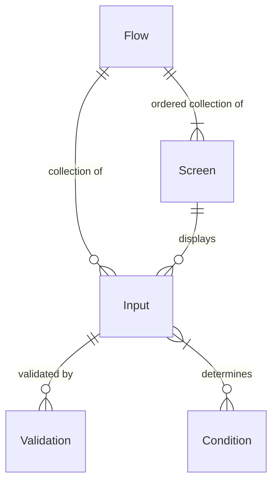

Table of Contents
=================

* [Form Flow Library](#form-flow-library)
    * [Form Flow Concepts](#form-flow-concepts)
    * [Web/Fat Jar](#webfat-jar)
    * [Defining Flows](#defining-flows)
    * [Defining Screens](#defining-screens)
        * [Thymeleaf Model Data](#thymeleaf-model-data)
        * [Icon reference](#icon-reference)
    * [Defining Inputs](#defining-inputs)
    * [About Submissions](#about-submissions)
    * [Subflows](#subflows)
        * [Dedicated Subflow Screens](#dedicated-subflow-screens)
            * [Entry Screen](#entry-screen)
            * [Iteration Start Screen](#iteration-start-screen)
            * [Review Screen](#review-screen)
            * [Delete Confirmation Screen](#delete-confirmation-screen)
        * [Defining Subflows](#defining-subflows)
        * [Example flow-config.yaml with a docs subflow](#example-flow-configyaml-with-a-docs-subflow)
        * [When do you need to define subflow on a screen?](#when-do-you-need-to-define-subflow-on-a-screen)
    * [Defining Conditions](#defining-conditions)
        * [Using conditions in templates](#using-conditions-in-templates)
    * [Defining Static Pages](#defining-static-pages)
    * [Development setup](#development-setup)
        * [Install the following system dependencies:](#install-the-following-system-dependencies)
            * [Java Development Kit](#java-development-kit)
            * [Set up jenv to manage your jdk versions](#set-up-jenv-to-manage-your-jdk-versions)
            * [Gradle](#gradle)
        * [Build Web/Fat Jar](#build-webfat-jar)
        * [Setup IntelliJ for the project:](#setup-intellij-for-the-project)
        * [Test:](#test)
            * [Terminal](#terminal)
            * [IntelliJ](#intellij)
        * [Setup Fake Filler (optional, Chrome &amp; Firefox):](#setup-fake-filler-optional-chrome--firefox)
    * [About IntelliJ Live Templates](#about-intellij-live-templates)
        * [Applying Live Templates to your IntelliJ IDE](#applying-live-templates-to-your-intellij-ide)
        * [Using Live Templates](#using-live-templates)
        * [Contribute new Live Templates](#contribute-new-live-templates)
    * [Connect flows config schema with IntelliJ IDE](#connect-flows-config-schema-with-intellij-ide)

(new work)

# Form-Flow-Library Overview

A java library that provide a framework for developing *form-flow* based applications. The library
includes tooling for:

- Conditions
    - Conditions for the flow of screens
    - Revealing of elements on a screen
- Subflows
    - Repeating sections of screen(s) that build a collection of information (ex. ask for
      information about all members of a household) before returning to the main flow
- Input Validations
    - Uses [JPA Validation](https://www.baeldung.com/spring-boot-bean-validation)
- Template fragments
    - A set
      of [Thymeleaf fragments](https://github.com/codeforamerica/form-flow/tree/main/src/main/resources/templates/fragments)
      that create a library of reusable HTML components such as for Inputs, Screens, Forms, etc.
- Data Persistence
- File Uploads

(old work)

# Form Flow Library

A Java Library to include in Spring Boot applications that speeds up the creation of web forms.

TODO: better document only library things and have less overlap with the starter app README

## Form Flow Concepts

* Flows
* Inputs
* Screens
* Conditions
* Validations

Flows are the top-level construct that define the navigation between a collection of screens.
A flow can have many inputs to accept user data (e.g. first name, zip
code, email, file upload). Each input can have zero to many validations.

A flow also has many screens. Each screen can be made up of zero or more inputs. A flow has an
ordering of screens, and can use defined conditions to control navigation. Conditions use
submitted inputs to make a logical decision about showing or not showing a screen / part of a
screen.



## Web/Fat Jar

TODO: why is this a web/fat jar?

## Defining Flows

Flows are consumed from a Spring Boot app with the `form-flow.path` application property. For more
information
see [form-flow-starter](https://github.com/codeforamerica/form-flow-starter-app#defining-flows)

## Defining Screens

Screens are defined in the Spring Boot `flows-config.yaml`, along with template views.

This library [defines Thymeleaf fragments](lib/src/main/resources/templates/fragments) that can be
accessed from the Spring Boot app.

#### Thymeleaf Model Data

We provide some data to the model for ease of use access in Thymeleaf templates. Below are the data
types
we pass and when they are available.

| Name              | Type                    | Availability                                                                     | Description                                                                                                                                                         |
|-------------------|-------------------------|----------------------------------------------------------------------------------|---------------------------------------------------------------------------------------------------------------------------------------------------------------------|
| `flow`            | String                  | Always available                                                                 | The name of the flow the screen is contained within.                                                                                                                |
| `screen`          | String                  | Always available                                                                 | the name of the screen.                                                                                                                                             |
| `inputData`       | HashMap<String, Object> | Always available                                                                 | `inputData` is a HashMap of user submitted input data. If editing a subflow, `inputData` will only contain the data for that specific iteration within the subflow. |
| `submission`      | Submission              | Always available                                                                 | `submission` is the entire Submission object that contains a single users submission data.                                                                          |
| `formAction`      | String                  | Always available                                                                 | Is the correct endpoint for the forms `POST` action if `flows-config` is set up correctly.                                                                          |
| `errorMessages`   | ArrayList<String>       | On screens that fail validation                                                  | A list of error messages for inputs that failed validation.                                                                                                         |
| `subflow`         | String                  | On `deleteConfirmationScreen` screens                                            | This is the name of the subflow that the `deleteConfirmationScreen` screen belongs to.                                                                              |
| `noEntryToDelete` | Boolean                 | On `deleteConfirmationScreen` screens if corresponding `uuid` is no longer there | Indicates that the subflow entry containing a `uuid` is no longer available.                                                                                        |
| `reviewScreen`    | String                  | On `deleteConfirmationScreen` screens if corresponding `uuid` is no longer there | Name of the review screen for the subflow that the `deleteConfirmationScreen` belongs to.                                                                           |
| `subflowIsEmpty`  | Boolean                 | On `deleteConfirmationScreen` screens if no entries in a subflow exist           | Indicates that the subflow being accessed no longer has entries.                                                                                                    |
| `entryScreen`     | String                  | On `deleteConfirmationScreen` screens if no entries in a subflow exist           | Name of the entry screen for the subflow that the `deleteConfirmationScreen` belongs to.                                                                            |

[For more information on the T Operator see section 6.5.8 here.](https://docs.spring.io/spring-framework/docs/3.0.x/reference/expressions.html)

#### Icon reference

There's `/icons` endpoint to view all
available [icon fragments](src/main/resources/templates/fragments/icons.html)

## Defining Inputs

Inputs are defined in two places - the template in which they are rendered, and in a separate class
for validation.
The inputs class is defined in `/src/main/java/app/inputs/<nameOfFlowAsNameOfInputsClass>`

[When defining inputs we have provided a suite of input based Live Templates, more on that here.](#about-intellij-live-templates)

Live templates are provided for the following input types:

- `Checkbox`
- `Date`
- `Fieldset`
- `Money`
- `Number`
- `Radio`
- `Select`
- `SelectOption`
- `Text`
- `TextArea`
- `Phone`
- `Ssn`
- `YesOrNo`
- `Submit`
- `FileUpload` (TBD)

An example inputs class can be seen below, with example validations.

Please note that for single value inputs the type when defining the input is String. However, for
input types
that can contain more than one value, the type is ArrayList<String>.

```java
class Apply {

  @NotBlank(message = "{personal-info.provide-first-name}")
  String firstName;

  @NotBlank(message = "{personal-info.provide-last-name}")
  String lastName;

  String emailAddress;

  String phoneNumber;

  @NotEmpty(message = "{personal-info.please-make-a-gender-selection}")
  ArrayList<String> gender;
}
```

Validations for inputs use the JSR-303 bean validation paradigm, more specifically, Hibernate
validations. For a list of validation
decorators,
see [Hibernate's documentation.](https://docs.jboss.org/hibernate/stable/validator/reference/en-US/html_single/#section-builtin-constraints)

## About Submissions

Submission data is stored in the `Submission` object, persisted to PostgreSQL via the Hibernate ORM.

```java
class Submission {

  @Id
  @GeneratedValue
  private Long id;

  private String flow;

  @CreationTimestamp
  @Temporal(TIMESTAMP)
  private Timestamp createdAt;

  @UpdateTimestamp
  @Temporal(TIMESTAMP)
  private Timestamp updatedAt;

  @Temporal(TIMESTAMP)
  private Timestamp submittedAt;

  @Type(JsonType.class)
  private Map<String, String> inputData = new HashMap<>();

}
```

The `inputData` field is a JSON object that stores input data from the inputs as a given
flow progresses. It can be used for defining conditions.

An instance variable `currentSubmission` is available for use in the `ScreenController` and
`inputData` is placed on the Thymeleaf model.

## Subflows

Subflows are repeating sections of one or more screens within a regular flow. These can be things
like household builders
that ask a repeating set of questions about members of a household. Subflows represent an array of
screens and their respective inputs (represented as a HashMap) where each item in the array is one
iteration.

### Dedicated Subflow Screens

These are screens that every subflow must have.

Here is an example of a *subflow* yaml:

```yaml
subflow:
  docs:
    entryScreen: docsEntry
    iterationStartScreen: docsStart
    reviewScreen: docsReview
    deleteConfirmationScreen: docsDeleteConfirmation
```

#### Entry Screen

This screen represents the entry point to a subflow, it is usually the point at which a user makes a
decision to enter the subflow or not. Example: a screen that asks "Would you like to add household
members?"
could be the entry screen for a household based subflow.

The entry screen is not part of the repeating
set of pages internal to the subflow and as such does not need to be demarked
with `subflow: subflowName`
in the `flows-config.yaml`.

#### Iteration Start Screen

This screen is the first screen in a subflows set of repeating screens. When this screen is
submitted,
it creates a new iteration which is then saved to the subflow array within the Submission object.

Because this screen is part of the repeating screens within the subfow, it **should** be denoted
with
`subflow: subflowName` in the `flows-config.yaml`.

#### Review Screen

This is the last screen in a subflow. This screen lists each iteration completed within a subflow,
and provides options to edit or delete
a single iteration.

This screen does not need to be demarked with `subflow: subflowName`
in the `flows-config.yaml`. It is not technically part of the repeating screens within a subflow,
however,
you do visit this screen at the end of each iteration to show iterations completed so far and ask
the
user if they would like to add another?

#### Delete Confirmation Screen

This screen appears when a user selects `delete` on a iteration listed on the review screen. It asks
the user to confirm their deletion before submitting the actual deletion request to the server.

This page is not technically part of the subflow and as such, does not need to be demarked
with `subflow: subflowName`
in the `flows-config.yaml`.

### Defining Subflows

What do you need to do to create a subflow?

- In `flows-config.yaml`:
    - Define a `subflow` section
    - Create a name for your subflow in the `subflow` section
    - Define `entryScreen`, `iterationStartScreen`, `reviewScreen`, and `deleteConfirmationScreen`
      in
      the `subflow` section
    - Add all subflow screens into the `flow`, with `subflow: <subflow-name>` unless otherwise noted
      above
      (for dedicated subflow screens)
    - Note for screens that aren't ever defined in `NextScreens` (delete confirmation screen), they
      still need to be somewhere in the `flow`
- Define `fields` that appear in subflow screens just like you would in a `screen`, in your flow
  Java Class
  (e.g. Ubi.java in the starter app)
- Define `screen` templates in `resources/templates/<flow-name>`

### Example `flow-config.yaml` with a docs subflow

```yaml
name: docFlow
flow:
  first:
    nextScreens:
      - name: second
  second:
    nextScreens:
      - name: docsEntry
  docsEntry:
    nextScreens:
      - name: docsStart
  docsStart:
    subflow: docs
    nextScreens:
      - name: docsInfo
  docsInfo:
    subflow: docs
    nextScreens:
      - name: docsReview
  docsReview:
    nextScreens:
      - name: success
  success:
    nextScreens:
  # NOTE: this screen still needs to be defined in `flow` to be rendered even though
  # it isn't the nextScreen of any other Screen
  docsDeleteConfirmation:
    nextScreens:
subflow:
  docs:
    entryScreen: docsEntry
    iterationStartScreen: docsStart
    reviewScreen: docsReview
    deleteConfirmationScreen: docsDeleteConfirmation
```

### When do you need to define `subflow` on a screen?


## Defining Conditions

Conditions are defined in Java as methods, and can read from the `currentSubmission` object. When
defining new conditions as methods, the instance variable `inputData` is accessible.

```java
public class ApplyConditions extends FlowConditions {

  public boolean isGmailUser() {
    return inputData.get('emailAddress').contains("gmail.com");
  }

} 
```

### Using conditions in templates

You can pull in conditions into a Thymeleaf with the T operator, then use the variable to define
show logic:

```html

<div
    th:with="showCondition=${T(org.codeforamerica.formflowstarter.app.config.ConditionDefinitions).<show-method>()}">
  <h1 th:if="showCondition">Conditionally show this element</h1>
</div>
```

## Defining Static Pages

Unlike Screens, Static Pages are HTML content not part of a flow. Examples include the home page,
privacy policy, or FAQ. This starter app contains a home page (`index.html`) and FAQ (`faq.html`)
as examples in the `resources/templates` folder.

To add a new Static Page:

1. Add an annotated method (`@GetMapping`) to the `StaticPageController`
2. Create a page template in `src/resources/templates`.

The template HTML can look like:

```html
<!DOCTYPE html>
<html th:lang="${#locale.language}">
<head th:replace="fragments/head :: head(title='')"></head>
<body>
<div class="page-wrapper">
  <th:block th:replace="fragments/toolbar :: toolbar"/>
  <th:block th:replace="fragments/demoBanner :: demoBanner"/>
  <section class="slab">
    <div class="grid">
      <div class="grid__item">
        <h1 class="spacing-below-35"></h1>
      </div>
    </div>
  </section>
  <main id="content" role="main" class="slab slab--white">

  </main>
</div>
<th:block th:replace="fragments/footer :: footer"/>
</body>
</html>
```

The IntelliJ Live Template for the above example can be generated with `cfa:staticPage`.

## Development setup

### Install the following system dependencies:

_Note: these instructions are specific to macOS, but the same dependencies do need to be installed
on Windows as well._

#### Java Development Kit

```
brew install openjdk@17
```

Make sure that you follow the instructions printed for `Caveats` inside your terminal when the
installation completes.

#### Set up jenv to manage your jdk versions

First run `brew install jenv`.

Add the following to your `~/.bashrc` or `~/.zshrc`:

```
export PATH="$HOME/.jenv/bin:$PATH"
eval "$(jenv init -)"
```

Reload your terminal, then finally run this from the repo's root directory:

```
jenv add /Library/Java/JavaVirtualMachines/openjdk.jdk/Contents/Home/
```

#### Gradle

`brew install gradle`

### Build Web/Fat Jar

Go into `lib/build.gradle` and run the `webjar` task with IntelliJ. This will generate a build file
that can be used for local development.

### Setup IntelliJ for the project:

- Enable annotation processing
  in `Preferences -> Build, Execution, Deployment -> Compiler -> Annotation Processor`
- Set the Gradle JVM version to 17
  in `Preferences -> Build, Execution, Deployment -> Build Tools -> Gradle`
- Set the Project SDK to Java 17 in `File > Project Structure`
- Run the application using the `FormflowstarterApplication` configuration

### Test:

#### Terminal

From the project root invoke
```./gradlew clean test```

#### IntelliJ

You can run tests directly in IntelliJ by running tests from test folder (via right click
or `ctrl + shift + r`).

## About IntelliJ Live Templates

As a team, we use [IntelliJ](https://www.jetbrains.com/idea/) and can use
the [Live Templates](https://www.jetbrains.com/help/idea/using-live-templates.html) feature to
quickly build
Thymeleaf templates.

Support for importing/exporting these Live Templates is
a [buggy process](https://youtrack.jetbrains.com/issue/IDEA-184753) that can sometimes wipe away all
of your previous
settings. So we're going to use a copy/paste approach.

### Applying Live Templates to your IntelliJ IDE

1. Open the [intellij-live-templates/CfA.xml](intellij-live-templates/CfA.xml) from the root of
   this repo
2. Copy the whole file
3. Open Preferences (`cmd + ,`), search or find the section "Live Templates"
4. If there isn't a template group already called CfA, create one by pressing the "+" in the top
   right area and selecting "Template group..."
5. Highlight the template group "CfA", right click and "Paste"
6. You should now see Live templates with the prefix "cfa:" populated in the template group

### Using Live Templates

Once you have Live Templates installed on your IntelliJ IDE, in (`.html`, `.java`) files you can use
our
Live Templates by typing `cfa:` and a list of templates to autofill will show itself.

### Contribute new Live Templates

1. Open Preferences (`cmd + ,`), search or find the section "Live Templates"
2. Find the Live Template you want to contribute
3. Right click and "Copy" (this will copy the Live Template in XML form)
4. Open [intellij-live-templates/CfA.xml](intellij-live-templates/CfA.xml) in this repo
5. Paste at the bottom of the file
6. Commit to GitHub
7. Now others can copy/paste your Live Templates


