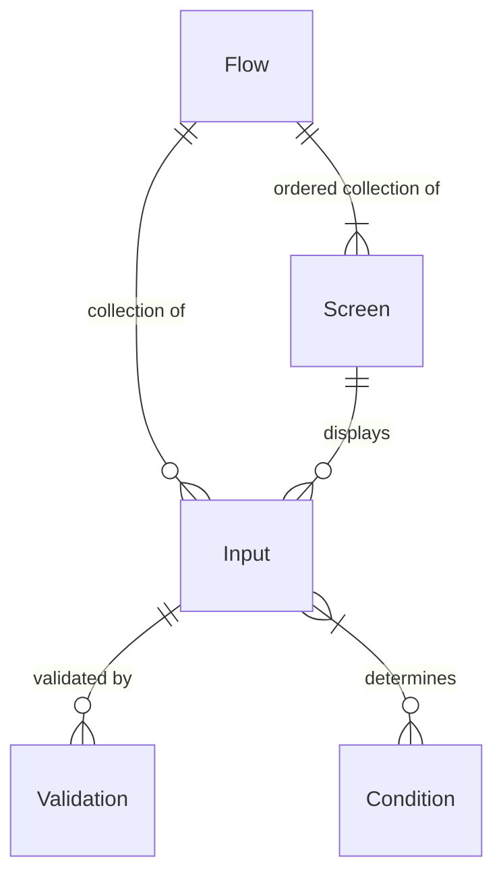

# Form Flow Library

Table of Contents
=================
<!-- Update this section when you update sections now. 
    **  This is not automatically generated. **
     Please don't go more than three layers deep, so we can keep the TOC
     a reasonable size 
-->

* [What is a form flow?](#what-is-a-form-flow)
* [Concepts](#concepts)
    * [Flow](#flow)
    * [Screen](#screen)
    * [Subflows](#subflows)
        * [Dedicated Subflow Screens](#dedicated-subflow-screens)
    * [Conditions and Actions](#conditions-and-actions)
        * [Defining Conditions](#defining-conditions)
        * [Using conditions in templates](#using-conditions-in-templates)
    * [Submission Object](#submission-object)
    * [Defining Inputs](#defining-inputs)
        * [Input Class](#input-class)
        * [Custom Validations](#custom-validations)
        * [Input Data JSON Structure](#input-data-json-structure)
* [General Information](#general-information)
    * [Thymeleaf](#thymeleaf)
        * [Using Thymeleaf](#using-thymeleaf)
        * [Templates](#templates)
        * [Static Pages](#static-pages)
        * [Fragments](#fragments)
        * [Inputs](#inputs)
        * [Accessing Conditions](#accessing-conditions)
        * [Accessing Submission Object](#accessing-submission-object)
    * [Document Upload](#document-upload)
        * [AWS S3](#aws-s3)
        * [File Naming Conventions](#file-naming-conventions)
        * [File Upload Widget](#file-upload-widget)
        * [Uploaded File Storage](#uploaded-file-storage)
        * [Deleting Uploaded Files](#deleting-uploaded-files)
* [How to use](#how-to-use)
    * [Configuration Details](#configuration-details)
        * [Environment Variables](#environment-variables)
        * [Application Configuration](#application-configuration)
        * [flows-config.yaml file](#flows-configyaml-file)
        * [Flow and Subflow Configuration](#flow-and-subflow-configuration)
        * [Screens](#screens)
        * [Defining Subflows](#defining-subflows)
        * [Thymeleaf Model Data](#thymeleaf-model-data)
        * [Conditions / Actions](#conditions--actions)
        * [Library Details](#library-details)
* [Help](#help)
    * [IntelliJ Live Templates](#intellij-live-templates)
    * [Icons](#icons)
* [Developer Setup](#developer-setup)
    * [Java Development Kit](#java-development-kit)
    * [Set up jenv to manage your jdk versions](#set-up-jenv-to-manage-your-jdk-versions)
    * [Gradle](#gradle)
        * [Build Web/Fat Jar](#build-webfat-jar)
    * [Spring Profile: `dev`](#spring-profile--dev)
    * [Setup Platform Flavored Google Styles for Java](#setup-platform-flavored-google-styles-for-java)
    * [IntelliJ Setup](#intellij-setup)
        * [Set Java SDK](#set-java-sdk)
        * [Testing](#testing)
* [How to contribute](#how-to-contribute)
    * [Maintainer information](#maintainer-information)

<!-- Created by https://github.com/ekalinin/github-markdown-toc -->

A Spring Boot Java library that provide a framework for developing *form-flow* based applications.
The intention is to speed up the creation of web applications that are a series of forms that
collect
input from users.

The library includes tooling for:

- Conditions and Actions
- Conditions for the flow of screens
- Revealing of elements on a screen

- Subflows
    - Repeating sections of screen(s) that build a collection of information (ex. ask for
      information about all members of a household) before returning to the main flow
- Input Validations
    - Uses [JPA Validation](https://www.baeldung.com/spring-boot-bean-validation)
- Template fragments
    - A set
      of [Thymeleaf fragments](https://github.com/codeforamerica/form-flow/tree/main/src/main/resources/templates/fragments)

      that create a library of reusable HTML components for Inputs, Screens, Forms, etc.
- Data Persistence
- File Uploads

# What is a form flow?

# Concepts

* Flows
* Inputs
* Screens
* Conditions
* Validations

Flows are the top-level construct that define the navigation between a collection of screens.
A flow can have many inputs to accept user data (e.g. first name, zip
code, email, file upload). Each input can have zero to many validations.

A flow also has many screens. Each screen can be made up of zero or more inputs. A flow has an
ordering of screens, and can use defined conditions to control navigation. Conditions use
submitted inputs to make a logical decision about showing or not showing a screen / part of a
screen.



## Flow

## Screen

## Subflows

Subflows are repeating sections of one or more screens within a regular flow. These can be things
like household builders
that ask a repeating set of questions about members of a household. Subflows represent an array of
screens and their respective inputs (represented as a HashMap) where each item in the array is one
iteration.

### Dedicated Subflow Screens

These are screens that every subflow must have.

Here is an example of a *subflow* yaml:

```yaml
subflow:
  docs:
    entryScreen: docsEntry
    iterationStartScreen: docsStart
    reviewScreen: docsReview
    deleteConfirmationScreen: docsDeleteConfirmation
```

#### Entry Screen

This screen represents the entry point to a subflow, it is usually the point at which a user makes a
decision to enter the subflow or not. Example: a screen that asks "Would you like to add household
members?" could be the entry screen for a household based subflow.

The entry screen is not part of the repeating set of pages internal to the subflow and as such does
not need to be demarked with `subflow: subflowName` in the `flows-config.yaml`.

#### Iteration Start Screen

This screen is the first screen in a subflows set of repeating screens. When this screen is
submitted, it creates a new iteration which is then saved to the subflow array within the Submission
object.

Because this screen is part of the repeating screens within the subfow, it **should** be denoted
with `subflow: subflowName` in the `flows-config.yaml`.

#### Review Screen

This is the last screen in a subflow. This screen lists each iteration completed within a subflow,
and provides options to edit or delete a single iteration.

This screen does not need to be demarked with `subflow: subflowName` in the `flows-config.yaml`. It
is not technically part of the repeating screens within a subflow, however,
you do visit this screen at the end of each iteration to show iterations completed so far and ask
the user if they would like to add another?

#### Delete Confirmation Screen

This screen appears when a user selects `delete` on a iteration listed on the review screen. It asks
the user to confirm their deletion before submitting the actual deletion request to the server.

This page is not technically part of the subflow and as such, does not need to be demarked
with `subflow: subflowName`
in the `flows-config.yaml`.

## Conditions and Actions

### Defining Conditions

Conditions are defined in Java as methods, and can read from the `currentSubmission` object. When
defining new conditions as methods, the instance variable `inputData` is accessible.

```java
public class ApplyConditions extends FlowConditions {

  public boolean isGmailUser() {
    return inputData.get('emailAddress').contains("gmail.com");
  }

} 
```

### Using conditions in templates

```html

<div
    th:with="showCondition=${templateManager.runCondition('ConditionName', submission, 'data')}">
  <h1 th:if="showCondition">Conditionally show this element</h1>
</div>
```

## Submission Object

Submission data is stored in the `Submission` object, persisted to PostgreSQL via the Hibernate ORM.

```java
class Submission {

  @Id
  @GeneratedValue
  private Long id;

  private String flow;

  @CreationTimestamp
  @Temporal(TIMESTAMP)
  private Timestamp createdAt;

  @UpdateTimestamp
  @Temporal(TIMESTAMP)
  private Timestamp updatedAt;

  @Temporal(TIMESTAMP)
  private Timestamp submittedAt;

  @Type(JsonType.class)
  private Map<String, String> inputData = new HashMap<>();

}
```

The `inputData` field is a JSON object that stores data from the user's input as a given
flow progresses. This field is placed in the model handed to the Thymeleaf templates, so each page
should have access to it.

## Defining Inputs

Inputs to the application are defined in two places - the template in which they are rendered,
and in a separate class for validation.

### Input Class

The inputs class's location is defined by the application using this library. The application using
this library will need a field in its `application.yaml` that shows the location of the input
class(es). It should look like this:

```yaml
form-flow:
  inputs: 'org.formflowstartertemplate.app.inputs.'
```

The library will expect a class that matches the name of the flow there. So if the flow name, as
defined in the application's `flows-config.yaml` configuration, is `ubi` we will expect a class by
the name of `Ubi` to be located at the specified input path.

An example inputs class can be seen below, with example validations.

Please note that for single value inputs the type when defining the input is String. However, for
input types that can contain more than one value, the type is ArrayList<String>.

```java
class ApplicationInformation {

  @NotBlank(message = "{personal-info.provide-first-name}")
  String firstName;

  @NotBlank(message = "{personal-info.provide-last-name}")
  String lastName;

  String emailAddress;

  String phoneNumber;

  @NotEmpty(message = "{personal-info.please-make-a-gender-selection}")
  ArrayList<String> gender;
}
```

Validations for inputs use the JSR-303 bean validation paradigm, more specifically, Hibernate
validations. For a list of validation decorators,
see [Hibernate's documentation.](https://docs.jboss.org/hibernate/stable/validator/reference/en-US/html_single/#section-builtin-constraints)

### Custom Validations

We also
implement [custom validations for convenience](/src/main/java/formflow/library/data/validators). Use
them the same way you would any other JavaX validator, like so:

```java
@Money(message = "Please make sure to enter a valid dollar amount.")
private String income;
```

### Input Data JSON Structure

As the end user walks through the flow entering data, their input data will get stored as
JSON in the database. It is stored in a column named `inputData` on the `submissions` table.

* The organization of the data is based on the form flow setup and the field names on the forms.
* The input fields on pages that are not part of a subflow will be stored in the main part of the
  JSON data. The keys will be the input fields name.
* The input fields that are part of a subflow will be stored in an array under a key that is the
  name of the subflow.
* Field names are used as keys. We use them directly as they are and therefore they must
  be unique across a whole flow to avoid naming collisions. The example applies a prefix to the
  fields, but that's just for ease of being clear in the example. The system does not apply
  prefixes.

For example, for the docs subflow configuration described above in
the [Defining Subflows](#defining-subflows) section, the resulting data might be organized as
follows.

In the example below the following assumptions are applied:

* Each screen has some fields, named input1, input2, and so on. Below they are prefixed with their
  page so that they have a unique name. All fields across a particular flow must have a unique name.
* Some screens may not have any input fields, as they are pages displaying text to the user.

```JSON
{
  "first_input1": "some value",
  "first_input2": "some value",
  "second_input1": "abcd",
  "docsStart_input1": "some doc info",
  "doc": [
    {
      "uuid": "31259552-e0bc-4efe-bbc7-b5e63d2b5407",
      "doc_input1": "some data",
      "doc_input2": "other data",
      "doc_fileIds": "[2,3,5]"
    },
    {
      "uuid": "d612bc77-11de-419f-b7cc-71e4ab2ad571",
      "doc_input1": "some data",
      "doc_input2": "other data",
      "doc_fileIds": "[7]"
    },
    {
      "uuid": "e88c6602-9abf-4bfa-b4c8-5a77c44d5ab4",
      "doc_input1": "some data",
      "doc_input2": "other data",
      "doc_fileIds": "[8,12]"
    }
  ]
}
```

So the resulting JSON stored in the database has input fields as key values, and for subflow the
subflow name is the key value.

Note that the subflows are an array of repeating entries - one for each iteration a user did
of the subflow. Each iteration has a unique UUID associated with it so we can have a way of working
with a specific iteration's data.

# General Information

## Thymeleaf

### Using Thymeleaf

### Templates

The templates will contain the HTML which drive how the pages that run the flow are rendered.
The application using this library will have a set of templates to gather input with.

We have provided a suite of input based Live Templates, more
on [live templates here.](https://github.com/codeforamerica/form-flow-starter-apphttps://github.com/codeforamerica/form-flow-starter-app#applying-live-templates-to-your-intellij-ide)

Live templates are provided for the following input types:

- `Checkbox`
- `Date`
- `Fieldset`
- `Money`
- `Number`
- `Radio`
- `Select`
- `SelectOption`
- `Text`
- `TextArea`
- `Phone`
- `Ssn`
- `YesOrNo`
- `Submit`
- `FileUpload`

### Static Pages

Unlike Screens, Static Pages are HTML content not part of a flow. Examples include the home page,
privacy policy, or FAQ.

This starter app contains a home page (`index.html`) and FAQ (`faq.html`)
as examples in the `resources/templates` folder.

Generally your application would have a static page controller (named something like
StaticPageController.java) file. At a minimum, it would handle the routing to your home
page (`index.html`) and FAQ (`faq.html`).

The [Form Flow Starter App's StaticPageController.java](https://github.com/codeforamerica/form-flow-starter-app/blob/main/src/main/java/org/formflowstartertemplate/app/StaticPageController.java)
is a good example of what a basic static page controller might look like.

To add a new Static Page to your application:

1. If you don't already have a StaticPageController.java file in your application, create one.
2. Add an annotated method (`@GetMapping`) to the `StaticPageController`
3. Create a page template in `src/resources/templates`.

The template HTML can look like:

```html
<!DOCTYPE html>
<html th:lang="${#locale.language}">
<head th:replace="fragments/head :: head(title='')"></head>
<body>
<div class="page-wrapper">
  <th:block th:replace="fragments/toolbar :: toolbar"/>
  <th:block th:replace="fragments/demoBanner :: demoBanner"/>
  <section class="slab">
    <div class="grid">
      <div class="grid__item">
        <h1 class="spacing-below-35"></h1>
      </div>
    </div>
  </section>
  <main id="content" role="main" class="slab slab--white">

  </main>
</div>
<th:block th:replace="fragments/footer :: footer"/>
</body>
</html>
```

The IntelliJ Live Template for the above example can be generated with `cfa:staticPage`.

### Fragments

#### Form

A form fragment is provided for easily creating forms. It can be quickly accessed via the Live
Template `cfa:form` which will create a form fragment the field for `content` (which will fill in
the empty `th:ref` that you see when first inserting the Live Template). This is needed so that you
can
any content you desire within the form fragment. You will also notice areas for
the forms content and the form's footer. These normally contain the forms inputs, and the forms
submit button respectively.

Additionally, the form fragment has an optional formId parameter which may be passed to give the
form an
ID.

Example form fragment:

```html

<th:block
    th:replace="'fragments/form' :: form(action=${formAction}, content=~{::exampleForm}, formId='exampleID')">
  <th:block th:ref="exampleForm">
    <div class="form-card__content">
      INPUTS GO HERE
    </div>
    <div class="form-card__footer">
      SUBMIT BUTTON GOES HERE
    </div>
  </th:block>
</th:block>
```

A Fragment for the submit button is also provided through `cfa:inputSubmitButton`.

### Inputs

### Accessing Conditions

### Accessing Submission Object

## Document Upload

The library provides a file upload feature using the client side JavaScript
library [Dropzone JS](https://www.dropzone.dev/).
File uploads need a configured AWS S3 Bucket to upload to and provide functionality for uploading,
retrieving and deleting files.

### AWS S3

You will need a registered AWS account to set up an S3 bucket. Once you have registered your AWS
account you
can [follow the instructions here to create an S3 bucket](https://docs.aws.amazon.com/AmazonS3/latest/userguide/create-bucket-overview.html)
.

Make sure to note your buckets name and region as well as your AWS access and secret keys as you
will need these for configuring file uploads
in the library. The bucket and region are configured in your `application.yaml`. See the section on
[application.yaml configuration](#application-configuration).

Add your `AWS_ACCESS_KEY` and `AWS_SECRET_KEY` to your `.env` file as mentioned in the [Environment
Variables](#environment-variables) section below.

### File Naming Conventions

Before a file is uploaded to S3, we give it a normalized filename. It consists of the flow name,
input field the file was uploaded from, and a UUID. Then we store it in S3, organized by
which submission it is a part of, like so:

```
   `{{submission_id}}/{{flow_name}}_{{input_name}}_UUID.{jpg, png, docx…} `
```

The `flow_name` is the current flow the user is in and the `input_name` is the name of the
file upload widget that uploaded the file. If there are multiple files uploaded via the same widget,
then there will be many files with the same `flow_name` and `input_name`, though the UUID will be
unique for each file.

Here is an example of what two files uploaded via the same input will look like in S3 (flow name
is `ubi` and widget name
is `homedoc`):

```java
    42/ubi_homedoc_1c43c9da-126e-126e-41c5-960e-08d84e3984bd.jpg
    42/ubi_homedoc_d612bc77-11de-419f-b7cc-71e4ab2ad571.jpg
```

### File Upload Widget

A file upload thymeleaf fragment has been provided for uploading files. You can add it to a screen
using our handy `cfa:fileUploader` live template. More information
about [Live Templates here.](https://github.com/codeforamerica/form-flow-starter-apphttps://github.com/codeforamerica/form-flow-starter-app#applying-live-templates-to-your-intellij-ide)

The live template will prompt you to enter an input name for the file uploader fragment. This input
name (field name) will be the key under which uploaded files for this fragment are stored in the
database's JSON
structure. It will also be part of the normalized filename used in S3.

The file upload widget allows for single or multiple file uploads and will provide a list of
uploaded files along with thumbnails for image files or a default icon for documents. The list of
uploaded files will include a thumbnail, the original file name, file size and links for canceling
or deleting the upload. The cancel link will only be present before the file has finished uploading,
once the upload is complete it will become a delete link.

#### Thumbnails

If the file has an extension of .jpg, .png, .bmp or .gif, DropZone will create a thumbnail for that
image and display it on the screen.

For files with extensions other than the ones listed (like tif files and various document formats),
we will display a default image for those thumbnails.

We do not store the thumbnails on the server side at all.

### Configuring the Dropzone Widget

#### Accepted file types

In the [application.yaml](#application-configuration) file, an implementor may
update the file types that the uploader can accept.

```yaml
form-flow:
  uploads:
    accepted-file-types: '.jpeg,.jpg,.png,.pdf,.bmp,.gif,.doc,.docx,.odt,.ods,.odp,.heic'
```

This list is passed to DropZone and anything not listed in `accepted-file-types` will be rejected by
the file upload widget.

_Note: `.tif`/`.tiff` and `heic` extensions do not seem to work right in DropZone, and we do not
recommend
including these file types. We've noticed that thumbnails are not created correctly for TIFF and
HEIC files
and they fail to correct upload when batched with other uploaded files._

#### Max File Size

You can configure a max file in MB, in `application.yaml`
you just need to declare as `max-file-size` like below:

```yaml
form-flow:
  uploads:
    max-file-size: '20'
```

This will prevent a user from uploading any file that is larger than this set limit.

Notice that the number value is in Megabytes but does not need the trailing MB.

**Note:** if this value is not set, then the server will use it's default value of 1MB preventing
any
uploads larger than 1MB. When configuring this value, be sure to also
set `spring.servlet.multipart.max-file-size` as well as `spring.servlet.multipart.max-request-size`
and `server.tomcat.max-http-form-post-size` to be equal to the set value, in MB. Example below:

```yaml
spring:
  servlet:
  multipart:
    max-file-size: ${form-flow.uploads.max-file-size}MB
    max-request-size: ${form-flow.uploads.max-file-size}MB
server:
  tomcat:
    max-http-form-post-size: ${form-flow.uploads.max-file-size}MB
```

#### Max number of files

You can configure a maximum number of files allowed to be uploaded in your `application.yaml`. Just
set `max-files` to the value you desire like below:

```yaml
form-flow:
  uploads:
    max-files: '20'
```

This will prevent a user from uploading more than that number of files.

#### Thumbnail Size Configuration

You can configure the desired width and height of the thumbnails the dropzone widget creates. To do
so
set a `thumbnail-width` and `thumbnail-height` value like so:

```yaml
form-flow:
  uploads:
    thumbnail-width: '64'
    thumbnail-height: '60'
```

Note that these values are in pixels. We don't recommend going much larger than the values listed
here
to maintain a good-looking responsive design across both desktop and mobile.

### Uploaded File Storage

The resulting file information will be stored in the database in two places:

1. the `submissions` table
2. the `user_files` table

The saved JSON is store in the `submissions` table with the field name being the key.

Example JSON:

```JSON
{
  /* other content */
  "license_upload": "[34,47]"
  /* other content */
}
```

This indicates that there were two files uploaded via the `license_upload` widget. Their file ids
are `34` and `47`, and can be looked up in the `user_files` table (detailed below) using those ids.

The `user_files` table holds information about a submission's uploaded user files, which includes:
`file_id`, the corresponding submission's `submission_id`, a `created_at` time,
the `original_name` of the file, and the S3 `repository_path`.

### Deleting Uploaded Files

Upon successful upload a link is provided to delete the file. When the link is used, a browser
native delete confirmation pop-up will appear asking the user if they are sure they want to delete
the selected file. If the user selects yes from the pop-up, the file will be deleted
from the `user_files` table in the database, as well as from S3 storage.

### S3 File Retention Policies

We recommend setting a maximum file retention period in S3 by setting up a retention policy on your
bucket.
This will automatically delete files in your bucket that are older than the retention policy
permits.
[You can read more about configuring a retention policy in S3 here.](https://docs.aws.amazon.com/AmazonS3/latest/userguide/how-to-set-lifecycle-configuration-intro.html)

# How to use

## Configuration Details

### Environment Variables

When configuring your application, the form-flow library will expect to find your secret
information in the environment. One way to do this is by creating an `.env` file that is a copy
of this [sample.env](https://github.com/codeforamerica/form-flow-starter-app/blob/main/sample.env).
The template file has a detailed description of information that would be expected in the setup.

From there you can add your information and source the file into your environment:
`source .env`. Now the information will be loaded into your environment and available to the
form-flow library.

You can also tell IntelliJ to load environment information from this file, too, by using
the [Env File Plugin](https://plugins.jetbrains.com/plugin/7861-envfile/).

### Application Configuration

The main configuration file for any Spring Boot application is the `application.yaml` file.
For general information about the file, please see
the [Spring.io documentation](https://docs.spring.io/spring-boot/docs/current/reference/html/features.html#features.external-config.files)
.
To learn more about what configuration can be set there, please see the
[Spring Documentation](https://docs.spring.io/spring-boot/docs/current/reference/html/application-properties.html)
.

It is expected that this file will be located within the application that is using this form flow
library.

There are a few properties that the Form Flow Library will look for in the `application.yaml`
file.

```yaml
form-flow:
  inputs: 'org.formflowstartertemplate.app.inputs.'
  aws:
    region: 'us-west-1'
    s3_bucket_name: 'form-flow'
    access_key: ${AWS_ACCESS_KEY}
    secret_key: ${AWS_SECRET_KEY}
```

Note that the two AWS keys above are set in the `.env` file above.
Also note that if you change the name of your `flows-config.yaml` file to anything else you will
need
to add it to your `application.yaml` like such:

```yaml
form-flow:
  path: 'name-of-file.yaml'
```

We've chosen to use a yaml version of the application file, but you could also store this as a
`application.properties` file. In that file, the hierarchy would be all in one line, where the
inputs line would look like this: `form-flow.path='flows-config.yaml'. Throughout this document,
when we reference a configuration from this file, we will write it as dot separated parameters.

### flows-config.yaml file

### Flow and Subflow Configuration

Flows are defined in a file specified in the `application.yaml` file. The library will look for
the `form-flow.path` property. If that property is not set, the default file it will look for is
named `flows-config.yaml`.

To configure a flow, create a `flow-config.yaml` in your app at `src/main/resources`.

You can define multiple flows by
[separating them with `---`](https://docs.spring.io/spring-boot/docs/1.2.0.M1/reference/html/boot-features-external-config.html#boot-features-external-config-multi-profile-yaml)
.

At it's base a flow as defined in yaml has a name, a flow object, and a collection of screens,
their next screens, any conditions for navigation between those screens, and optionally one or
more subflows.

#### form-flow.yaml basic configuration

A basic flow configuration could look like this:

```yaml
name: exampleFlow
flow:
  firstScreen:
    nextScreens:
      - name: secondScreen
  secondScreen:
    nextScreens:
      - name: thirdScreen
      - name: otherScreen
        condition: userSelectedExample
  thirdScreen:
    nextScreens:
      - name: success
  otherScreen:
    nextScreens:
      - name: success
  success:
    nextScreens: null
  ___
name: someOtherFlow
flow:
  otherFlowScreen:
```

You can have autocomplete and validation for flows-config by connecting your IntelliJ to the
flows-config-schema.json [as described here.](https://github.com/codeforamerica/form-flow-starter-app#applying-live-templates-to-your-intellij-ide)

### Screens

Screens are the actual form that will be displayed to the user. Screens are specified as steps
in the form flow.

Screens are defined in the Spring Boot `flows-config.yaml`, along with template views.

This library [defines Thymeleaf fragments](lib/src/main/resources/templates/fragments) that can be
accessed from the Spring Boot app.

### Defining Subflows

What do you need to do to create a subflow?

- In `flows-config.yaml`:
    - Define a `subflow` section
    - Create a name for your subflow in the `subflow` section
    - Define `entryScreen`, `iterationStartScreen`, `reviewScreen`, and `deleteConfirmationScreen`
      in
      the `subflow` section
    - Add all subflow screens into the `flow`, with `subflow: <subflow-name>` unless otherwise noted
      above
      (for dedicated subflow screens)
    - Note for screens that aren't ever defined in `NextScreens` (delete confirmation screen), they
      still need to be somewhere in the `flow`
- Define `fields` that appear in subflow screens just like you would in a `screen`, in your flow
  Java Class
  (e.g. Ubi.java in the starter app)
- Define `screen` templates in `resources/templates/<flow-name>`

Example `flow-config.yaml` with a docs subflow

```yaml
name: docFlow
flow:
  first:
    nextScreens:
      - name: second
  second:
    nextScreens:
      - name: docsEntry
  docsEntry:
    nextScreens:
      - name: docsStart
  docsStart:
    subflow: docs
    nextScreens:
      - name: docsInfo
  docsInfo:
    subflow: docs
    nextScreens:
      - name: docsReview
  docsReview:
    nextScreens:
      - name: success
  success:
    nextScreens:
  # NOTE: this screen still needs to be defined in `flow` to be rendered even though
  # it isn't the nextScreen of any other Screen
  docsDeleteConfirmation:
    nextScreens:
subflow:
  docs:
    entryScreen: docsEntry
    iterationStartScreen: docsStart
    reviewScreen: docsReview
    deleteConfirmationScreen: docsDeleteConfirmation
```

#### When do you need to define `subflow` on a screen?


### Thymeleaf Model Data

We provide some data to the model for ease of use access in Thymeleaf templates. Below are the data
types we pass and when they are available.

| Name              | Type                    | Availability                                                                     | Description                                                                                                                                                         |
|-------------------|-------------------------|----------------------------------------------------------------------------------|---------------------------------------------------------------------------------------------------------------------------------------------------------------------|
| `flow`            | String                  | Always available                                                                 | The name of the flow the screen is contained within.                                                                                                                |
| `screen`          | String                  | Always available                                                                 | the name of the screen.                                                                                                                                             |
| `inputData`       | HashMap<String, Object> | Always available                                                                 | `inputData` is a HashMap of user submitted input data. If editing a subflow, `inputData` will only contain the data for that specific iteration within the subflow. |
| `submission`      | Submission              | Always available                                                                 | `submission` is the entire Submission object that contains a single users submission data.                                                                          |
| `formAction`      | String                  | Always available                                                                 | Is the correct endpoint for the forms `POST` action if `flows-config` is set up correctly.                                                                          |
| `errorMessages`   | ArrayList<String>       | On screens that fail validation                                                  | A list of error messages for inputs that failed validation.                                                                                                         |
| `subflow`         | String                  | On `deleteConfirmationScreen` screens                                            | This is the name of the subflow that the `deleteConfirmationScreen` screen belongs to.                                                                              |
| `noEntryToDelete` | Boolean                 | On `deleteConfirmationScreen` screens if corresponding `uuid` is no longer there | Indicates that the subflow entry containing a `uuid` is no longer available.                                                                                        |
| `reviewScreen`    | String                  | On `deleteConfirmationScreen` screens if corresponding `uuid` is no longer there | Name of the review screen for the subflow that the `deleteConfirmationScreen` belongs to.                                                                           |
| `subflowIsEmpty`  | Boolean                 | On `deleteConfirmationScreen` screens if no entries in a subflow exist           | Indicates that the subflow being accessed no longer has entries.                                                                                                    |
| `entryScreen`     | String                  | On `deleteConfirmationScreen` screens if no entries in a subflow exist           | Name of the entry screen for the subflow that the `deleteConfirmationScreen` belongs to.                                                                            |

There are spots in the templates where the `T` operator is used.
[For more information on the T Operator see Spring's documentation.](https://docs.spring.io/spring-framework/docs/3.0.x/reference/expressions.html)

### Conditions / Actions

#### Creating them

### Library Details

#### Publishing

##### Github Packaging Repository

##### Maven Central

#### How to pull in the library

##### Credential Information

#### Versioning Information

##### Version / Release plan

#### Building Fat Jars

This library is created as a Web/Fat jar to include all the items this class depends on.
Specifically it's
created this way to ensure that all the resources are included in the distribution.

# Help

## IntelliJ Live Templates

As a team, we use [IntelliJ](https://www.jetbrains.com/idea/) and can use
the [Live Templates](https://www.jetbrains.com/help/idea/using-live-templates.html) feature to
quickly build Thymeleaf templates.

More information and example usage can be found in
our [starter application](https://github.com/codeforamerica/form-flow-starter-apphttps://github.com/codeforamerica/form-flow-starter-app#applying-live-templates-to-your-intellij-ide).

## Icons

There is an [icon fragment](src/main/resources/templates/fragments/icons.html)
that can provide a display of all available icons for use.

# Developer Setup

_Note: these instructions are specific to macOS, but the same dependencies do need to be installed
on Windows as well._

## Java Development Kit

```
brew install openjdk@17
```

Make sure that you follow the instructions printed for `Caveats` inside your terminal when the
installation completes.

## Set up jenv to manage your jdk versions

First run `brew install jenv`.

Add the following to your `~/.bashrc` or `~/.zshrc`:

```
export PATH="$HOME/.jenv/bin:$PATH"
eval "$(jenv init -)"
```

Reload your terminal, then finally run this from the repo's root directory:

```
jenv add /Library/Java/JavaVirtualMachines/openjdk.jdk/Contents/Home/
```

## Gradle

`brew install gradle`

### Build Web/Fat Jar

Go into `lib/build.gradle` and run the `webjar` task with IntelliJ. This will generate a build file
that can be used for local development.

## Spring Profile: `dev`

There is
a [Spring Profile](https://docs.spring.io/spring-boot/docs/1.2.0.M1/reference/html/boot-features-profiles.html)
named `dev` to allow for some information to be accessible to developers more easily.

The profile should only be used in a developer's environment.

### DevController

The developer profile controller is the `DevController` and it contains endpoints that developers
might be interested in.

Current endpoints available:

| Endpoint     | Description                                                                   |
|--------------|-------------------------------------------------------------------------------|
| `/dev/icons` | Displays the icons available for developers to pull in with the icon fragment |

### IntelliJ Configuration

To run under a specific profile in IntelliJ, go to the `Run` menu and
choose `Edit Configurations...`. Choose your application's profile. In the `Active profiles` field
add `dev`. If no `Active Profiles` field exists, click on `Modify Options` and
choose `Spring Boot -> Active profiles`. This should add the `Active Profiles` field to the IntelliJ
form for you to fill in.

## IntelliJ Setup

This is the minimum IDE setup to contribute to the project, instructions for installing additional
tools like live templates, yaml validation, and more can be
found [in the starter-app README here.](https://github.com/codeforamerica/form-flow-starter-app#intellij-setup)

### Set Java SDK

- Set the Project SDK to Java 17 in `File -> Project Structure -> SDK`
- Enable annotation processing
  in `Preferences -> Build, Execution, Deployment -> Compiler -> Annotation Processor`
- Set the Gradle JVM version to `17 Eclipse Temurin version 17.0.5`
  in `Preferences -> Build, Execution, Deployment -> Build Tools -> Gradle`
- Set the Project SDK in `File > Project Structure` to `17 Eclipse Temurin version 17.0.5`
  in `File > Project Structure`

### Setup Platform Flavored Google Styles for Java ##

In IntelliJ go to `Preferences --> Editor --> Code Style --> Java` and next to Scheme hit the
cogwheel
and `Import Scheme --> IntelliJ Code Style XML` with
[intellij-settings/PlatformFlavoredGoogleStyle.xml](intellij-settings/PlatformFlavoredGoogleStyle.xml)

### Testing

#### Terminal

From the project root invoke
```./gradlew clean test```

#### IntelliJ

You can run tests directly in IntelliJ by running tests from test folder (via right click
or `ctrl + shift + r`).

# How to contribute

## Maintainer information

This form-flow library was created and is maintained by a team at Code for America.
Email addresses? More information about contacting us? Email list somewhere?
