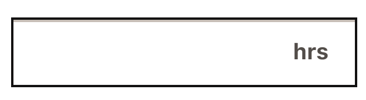
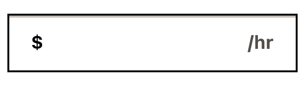

# Form Flow Library  (FFB)

A Spring Boot based Java library that provides a framework for developing **form flow** based
applications. The intention is to speed up the creation of web applications that are a series of
forms that collect input from users.

The library includes tooling for:

- Conditional navigation between screens and conditional display of elements on a screen
- Manipulation of data before or after it is saved to the database
- Subflows
    - Repeating sections of screen(s) that build a collection of information (ex. ask for
      information about all members of a household) before returning to the main flow
- Input Validations
    - Using [JPA Validation](https://www.baeldung.com/spring-boot-bean-validation)
- Address Validation using [Smarty](https://smarty.com/)
- A set
  of [Thymeleaf fragments](https://github.com/codeforamerica/form-flow/tree/main/src/main/resources/templates/fragments)
  that create a library of reusable HTML components for Inputs, Screens, Forms, etc.
- Data Persistence using [Hibernate](https://hibernate.org/)
- File Uploads
- PDF Generation based on user input
- Sending emails using [Mailgun](https://www.mailgun.com/)

An example project built with the use of this Form Flow library can be found in
our [Form Flow Starter App](https://github.com/codeforamerica/form-flow-starter-app) repository.

Table of Contents
=================
<!-- Update this section when you update sections now. 
    **  This is not automatically generated. **
     Please don't go more than three layers deep, so we can keep the TOC
     a reasonable size 
-->

* [What Is a Flow?](#what-is-a-flow)
    * [Defining Screens](#defining-screens)
    * [Subflows](#subflows)
        * [Dedicated Subflow Screens](#dedicated-subflow-screens)
        * [Subflows Data](#subflows-data)
        * [Defining Relationships Between Subflows](#defining-relationships-between-subflows)
    * [Conditions](#conditions)
        * [Using Conditions in Templates](#using-conditions-in-templates)
    * [Actions](#actions)
* [Data Persistence and Defining Inputs](#data-persistence-and-defining-inputs)
    * [Submission Object](#submission-object)
      * [Short Code](#submission-short-code) 
    * [Inputs Class](#inputs-class)
        * [Validating Inputs](#validating-inputs)
        * [Required Inputs](#required-inputs)
    * [Dynamic Input Fields](#dynamic-input-fields)
    * [Custom Annotations](#custom-annotations)
        * [Validation Annotations](#validation-annotations)
        * [Marker Annotations](#marker-annotations)
    * [Input Data JSON Structure](#input-data-json-structure)
* [General Information](#general-information)
    * [Thymeleaf](#thymeleaf)
        * [Using Thymeleaf](#using-thymeleaf)
        * [Templates](#templates)
        * [Static Pages](#static-pages)
        * [Fragments](#fragments)
        * [Input Type Fragments](#input-type-fragments)
    * [Document Upload](#document-upload)
        * [AWS S3](#aws-s3)
        * [File Naming Conventions](#file-naming-conventions)
        * [File Upload Widget](#file-upload-widget)
        * [Uploaded File Storage](#uploaded-file-storage)
        * [Deleting Uploaded Files](#deleting-uploaded-files)
        * [S3 File Retention Policies](#s3-file-retention-policies)
        * [Virus Scanning](#virus-scanning)
    * [Document Download](#document-download)
        * [Downloading Individual Files](#downloading-individual-files)
        * [Downloading All Files](#downloading-all-files)
    * [Address Validation](#address-validation)
        * [Registration with Smarty](#registration-with-smarty)
        * [How to Configure](#how-to-configure)
        * [Validating an Address](#validating-an-address)
        * [Storage of Validated Addresses](#storage-of-validated-addresses)
        * [Viewing the Validated Address](#viewing-the-validated-address)
    * [PDF Generation](#pdf-generation)
        * [Creating a Template PDF File](#creating-a-template-pdf-file)
        * [Creating a pdf-map.yaml File](#creating-a-pdf-mapyaml-file)
        * [Default Field Preparers](#default-field-preparers)
        * [SubmissionField](#submissionfield)
    * [Sending Email](#sending-email)
        * [Building a Custom Email Service](#building-a-custom-email-service)
        * [Creating a Custom Email Service With EmailClient](#creating-a-custom-email-service-with-emailclient)
        * [Mailgun](#mailgun)
    * [Localization](#localization)
        * [Setting Application Properties](#setting-application-properties)
        * [Supplying Translation Files](#supplying-translation-files)
        * [Messages in the Library](#messages-in-the-library)
        * [Using Transifex](#using-transifex)
        * [How Spring Boot Handles Localization](#how-spring-boot-handles-localization)
        * [Mixpanel Event From Language Selector](#mixpanel-event-from-language-selector)
    * [Interceptors](#interceptors)
        * [Session Continuity Interceptor](#session-continuity-interceptor)
        * [Disabled Flow Interceptor](#disabled-flow-interceptor)
* [How to Configure Applications Using the Form Flow Library](#how-to-configure-applications-using-the-form-flow-library)
    * [Environment Variables](#environment-variables)
    * [Application Configuration](#application-configuration)
        * [Disabling a Flow](#disabling-a-flow)
        * [Locking the Submission for a Flow Once It Has Been Submitted](#locking-the-submission-for-a-flow-once-it-has-been-submitted)
        * [Design System](#design-system)
        * [File Upload Properties](#file-upload-properties)
        * [Error Properties](#error-properties)
        * [Actuator Endpoints](#actuator-endpoints)
    * [Flow and Subflow Configuration](#flow-and-subflow-configuration)
        * [flows-config.yaml File](#flows-configyaml-file)
        * [flows-config.yaml Basic Configuration](#flows-configyaml-basic-configuration)
        * [Multiple Flows](#multiple-flows)
        * [Screens](#screens)
        * [Defining Subflows](#defining-subflows)
    * [Thymeleaf Model Data](#thymeleaf-model-data)
    * [Conditions / Actions](#conditions--actions)
    * [Logging](#logging)
    * [Library Publishing Details](#library-publishing-details)
* [Developer Setup](#developer-setup)
    * [Mac and Linux](#mac-and-linux)
    * [Windows](#windows)
    * [Spring Profiles](#spring-profiles)
        * [Dev Profile](#dev-profile)
        * [Dev Controller](#dev-controller)
        * [Test Profile](#test-profile)
        * [Demo Profile](#demo-profile)
        * [IntelliJ Configuration](#intellij-configuration)
    * [IntelliJ Setup](#intellij-setup)
        * [Connect Flows Config Schema](#connect-flows-config-schema)
        * [Applying Live Templates to your IntelliJ IDE](#applying-live-templates-to-your-intellij-ide)
        * [Using Live Templates](#using-live-templates)
        * [Contribute New Live Templates](#contribute-new-live-templates)
        * [Set Java SDK](#set-java-sdk)
        * [Setup Platform Flavored Google Styles for Java](#setup-platform-flavored-google-styles-for-java)
        * [Testing](#testing)
    * [Setup Fake Filler (Optional - Recommended for Chrome &amp; Firefox)](#setup-fake-filler-optional---recommended-for-chrome--firefox)
* [Gradle tasks](#gradle-tasks)
    * [checkForNpm](#checkForNpm)
    * [npmInstall](#npmInstall)
    * [moveNodeModulesToGenerated](#moveNodeModulesToGenerated)
    * [moveUSWDSImagesToGenerated](#moveUSWDSImagesToGenerated)
    * [compileSass](#compileSass)
    * [compileJs](#compileJs)
    * [watchCompileSass](#watchCompileSass)
    * [watchCompileJs](#watchCompileJs)
    * [cleanGenerated](#cleanGenerated)
    * [clean](#clean)
    * [processResources](#processResources)
* [How to contribute](#how-to-contribute)
    * [Maintainer information](#maintainer-information)

# What Is a Flow?

A flow is a series of screens that collect input from a user using HTML forms and inputs. Some of
these
screens may be purely informational, while others may collect data from the user. A flow may include
one or more subflows which are repeating sections of one or more screens within a regular flow.
Examples of subflows include household builders that ask a repeating set of questions about members
of a household or job builders that ask an individual to enter information about each job they have.

A flow dictates the order in which screens are shown to the user, and the `Conditions` under which
different
screens may or may not be shown as well as any `Actions` that should be run during, before or after
data persistence
for individual screens.

Flows are defined in a YAML file called `flows-config.yaml` which is located in the `resources`
folder of your
application.

All data from form inputs within a given flow is stored in a `Submission` object. This data is
persisted
to the database as JSON.

## Defining Screens

All screens must have an entry in the `flows-config.yaml` in order to be rendered. Additionally,
each
screen should have its own template defined in a folder respective to the flow that screen is
contained within. Example `/src/main/resources/templates/<flowName>/<templateName>`.

We have provided a number of IntelliJ Live templates to make the creation of screens faster and
easier. [More on Live Templates here](#applying-live-templates-to-your-intellij-ide).

When setting up a new flow, create a folder in `src/main/resources/templates` to hold all HTML
files. In the starter app, we name the respective template folders after their respective flows.

For example, add an HTML file such
as `about-you.html` [in the flow's templates folder](src/main/resources/templates). Here is an
example using our [live templates for a form screen](#applying-live-templates-to-your-intellij-ide):

```html

<th:block th:replace="~{fragments/icons :: clipboardWithEnvelope}"/>
<th:block
        th:replace="~{fragments/cardHeader :: cardHeader(header='Tell us about yourself')}"/>
<th:block
        th:replace="~{fragments/form :: form(action=${formAction}, content=~{::formContent})}">
    <th:block th:ref="formContent">
        <div class="form-card__content">
            <th:block th:replace="~{fragments/inputs/text ::
                  text(inputName='firstName',
                  label='What\'s your first name?')}"/>
            <th:block th:replace="~{fragments/inputs/text ::
                  text(inputName='lastName',
                  label='What\'s your last name?')}"/>
            <th:block th:replace="~{fragments/inputs/text ::
                  text(inputName='emailAddress',
                  label='What\'s your email address?')}"/>
            <div class="form-card__footer">
                <th:block th:replace="~{fragments/inputs/submitButton :: submitButton(
                  text='Continue')}"/>
            </div>
        </div>
    </th:block>
</th:block>
```

## Subflows

Subflows are repeating sections of one or more screens within a regular flow. These can be things
like household builders that ask a repeating set of questions about members of a household. Subflows
represent an array of screens and their respective inputs (represented as a HashMap) where each item
in the array is one iteration.

### Dedicated Subflow Screens

These are screens that every subflow must have.

Here is an example of a `subflow` configuration in a `flows-config.yaml`:

```yaml
name: exampleFlow
flow:
  docsEntry:
    # Does not include subflow because it is technically not inside the subflow
    nextScreens:
      - name: docsStart
  docsStart:
    # Uses subflow because this screen is inside the docs subflow
    subflow: docs
    nextScreens:
      - name: docsReview
  # ... other screens ...
subflow:
  docs:
    entryScreen: docsEntry
    iterationStartScreen: docsStart
    reviewScreen: docsReview
    deleteConfirmationScreen: docsDeleteConfirmation
```

#### Entry Screen

This screen represents the entry point to a subflow. It is usually the point at which a user makes a
decision to enter the subflow or not. Example: a screen that asks "Would you like to add household
members?" could be the entry screen for a household based subflow.

The entry screen is not part of the repeating set of pages internal to the subflow and as such does
not need to be denoted with `subflow: subflowName` in the `flows-config.yaml`.

#### Iteration Start Screen

This screen is the first screen in a subflow's set of repeating screens. When this screen is
submitted, it creates a new iteration which is then saved to the subflow array within the Submission
object.

Because this screen is part of the repeating screens within the subflow, it **should** be denoted
with `subflow: subflowName` in the `flows-config.yaml`.

#### Review Screen

This screen summarizes all the completed iterations of a subflow and is shown after each iteration
is completed.
It lists the data from each iteration and provides options to edit or delete them individually.

This screen does not need to be denoted with `subflow: subflowName` in the `flows-config.yaml`. It
is not technically part of the repeating screens within a subflow. However, you do visit this screen
at the end of each iteration to show iterations completed so far and ask the user if they would like
to add another.

#### Delete Confirmation Screen

This screen appears when a user selects `delete` on an iteration listed on the review screen. It
asks the user to confirm their deletion before submitting the actual deletion request to the server.

This page is not technically part of the subflow and as such, does not need to be denoted
with `subflow: subflowName` in the `flows-config.yaml`.

### Subflows Data

Subflow information will be saved in your applications database within the larger JSON `inputData`
as an array of subflow iterations
like this example of a household subflow with two iterations:

```JSON
{
  "household": [
    {
      "uuid": "e2c18dfe-98e9-430f-9a4f-3511966d3128",
      "iterationIsComplete": true,
      "householdMemberLastName": "Example",
      "householdMemberFirstName": "Person",
      "householdMemberRelationship": "Spouse",
      "householdMemberRecentlyMovedToUS": "No"
    },
    {
      "uuid": "3fafdb80-f7e7-4fdc-aefd-461e0b6c1cdf",
      "iterationIsComplete": false,
      "householdMemberLastName": "Other Example",
      "householdMemberFirstName": "Person",
      "householdMemberRelationship": "Child",
      "householdMemberRecentlyMovedToUS": "No"
    }
  ]
}
```

Note that all information submitted for a single loop (iteration) through your subflow will show up
within a single array index.
The index includes a `uuid` field, which is a unique identifier for that iteration within the
subflow.

#### Completed iterations

The `iterationIsComplete` field will indicate if an iteration was completed, meaning the person
filling out the subflow made it all the way through all screens within the subflow and clicked
submit (POST) or continue (GET) on the
final screen of the iteration (heading to the review page). If that person backs out of the subflow
before completing it, then `iterationIsComplete` will remain false.
Incomplete iterations will not be included in the generated PDF of the submission, but are still
accessible in the
database for error resolution and debugging.

### Defining Relationships Between Subflows

There may be a need to have one subflow's iterations pre-determined by another subflow. Subflow relationships allow for 
one subflow to be defined and related to another.

```yaml
subflows:
 childcareSchedules:
   relationship:
     relatesTo: children
     relationAlias: childId
     filter: ChildrenInNeedOfChildCare
   entryScreen: schedules-intro
   iterationStartScreen: schedules-start
   reviewScreen: schedules-review
```

The above YAML defines the `childcareSchedules` subflow and its relationship with the the `children`
subflow. 

Defining the relationship:
- Preloads the `childcareSchedules` iterations based on the relatesTo data. In this case, it creates 
one subflow iteration per child in the database. Note that the children in the database were created
from the `children` subflow. 
- Defines what foreign key will be used to store the `childcareSchedules` subflow in JSON data. In this 
case, the UUID of the each `children` subflow iteration will be stored as childId.

In the JSON this will look like this:

```JSON
{
  "childCareSchedules": [
    {
      "uuid": "977c5ecb-3d15-4c6e-992a-4d3c77a5d9a7",
      "iterationIsComplete": "true",
      "childId": "a52a4e5c-6dc4-45e7-95ad-c31724755537"
    }
  ],
  "children": [
    {
      "uuid": "a52a4e5c-6dc4-45e7-95ad-c31724755537",
      "iterationIsComplete": "true",
      "childFirstName": "John",
      "childLastName": "Doe"
    }
  ]
}
```
Note that `childCareSchedules` has one iteration that includes a foreign key with the defined alias
of `childId` whose value is the UUID of the `children` subflow iteration that corresponds to that 
`childCareSchedules` iteration.

#### Accessing Related Subflows in Templates
Related subflows can be accessed in Thymeleaf templates using the `relatedSubflowIteration` key in
the Thymeleaf model. This has been added to the Thymeleaf model for convenience. When defining
relationships between subflows `relatedSubflowIteration` will be present and always hold a value of 
iteration data for the corresponding related subflow iteration. In this case, with the above JSON 
example, the `relatedSubflowIteration` for the `childCareSchedules` subflow would be the 
`HashMap<String, Object>` that represents the `children` subflow iteration or:
```JSON
{
  "uuid": "a52a4e5c-6dc4-45e7-95ad-c31724755537",
  "iterationIsComplete": "true",
  "childFirstName": "John",
  "childLastName": "Doe"
}
```

#### repeatFor
There may be a need to have a second level relationship, where the user's selections define a nested
loop pattern.

```yaml
  childcareSchedules:
    relationship:
      relatesTo: children
      relationAlias: childUuid
      filter: ChildrenInNeedOfChildCare
      repeatFor:
        inputName: childcareProvidersForCurrentChild
        saveDataAs: providerSchedules
    entryScreen: schedules-intro
    iterationStartScreen: schedules-start
    reviewScreen: schedules-review
```
The above YAML defines the `childcareSchedules` subflow and relates it to `children`. The `repeatFor` keyword 
defines the `inputName` we will use to create the nested loop pattern and `providerSchedules` is how we will 
store the nested data.

This example shows how we want to store childcare schedules for each child and provider combination.
The relationship connects the childcare schedules to the children. So, we will loop through every child.
As we loop through each child, we ask which childcare providers they are applying for. The answer to that 
question determines the nested subflows.

Defining the repeatFor in the relationship:
- Defines what inputName should be used to load the nested iterations
  once the user submits data stored in the specified input
- Defines how the nested data will be stored under the subflow.

The data for each provider will be saved in the JSON like
so:
```JSON
{
  "childcareSchedules": [
    {
      "uuid": "ebf970e4-0dd9-4cf0-a751-49aa15cd32c9",
      "childUuid": "a52a4e5c-6dc4-45e7-95ad-c31724755537",
      "providerSchedules": [
        {
          "uuid": "4df1c399-9735-405d-aa89-a0468f1404f7",
          "repeatForValue": "49bdd0fe-5f91-4f57-9234-17c99246d679",
          "iterationIsComplete": true
        }
      ],
      "iterationIsComplete": true,
      "childcareProvidersForCurrentChild[]": [
        "49bdd0fe-5f91-4f57-9234-17c99246d679"
      ]
    }
  ],
  "children": [
    {
      "uuid": "a52a4e5c-6dc4-45e7-95ad-c31724755537",
      "iterationIsComplete": "true",
      "childFirstName": "John",
      "childLastName": "Doe"
    }
  ],
  "providers": [
    {
      "uuid": "49bdd0fe-5f91-4f57-9234-17c99246d679",
      "providerType": "Individual",
      "providerLastName": "Norris",
      "providerFirstName": "Erin",
      "iterationIsComplete": true,
    }
  ]
}
```

### Accessing RepeatFor Iterations in Templates
RepeatFor iterations can be accessed in Thymeleaf templates using the `repeatForIteration` key in
the Thymeleaf model. This has been added to the Thymeleaf model for convenience. When defining
repeatFor relationships between subflows `repeatForIteration` will be present and always hold a value of
iteration data for the current repeatForIteration as long as it's defined. In this case, with the above JSON
example, the `repeatForRelationship` for the `childCareSchedules` subflow would be the
`HashMap<String, Object>` that represents the `providerSchedule` subflow iteration:
```JSON
{
  "uuid": "4df1c399-9735-405d-aa89-a0468f1404f7",
  "repeatForValue": "49bdd0fe-5f91-4f57-9234-17c99246d679",
  "iterationIsComplete": true
}
```

## Conditions

Conditions are intended to be small pieces of code that can be run from a template or from the
form flow configuration file. They are generally used to determine the flow of pages in
a `flows-config.yaml` file
or conditionally showing or hiding elements in a thymeleaf template.

Conditions are Java objects that implement the `Condition`
[interface](https://github.com/codeforamerica/form-flow/blob/main/src/main/java/formflow/library/config/submission/Condition.java)
. As conditions are called with the Submission object, the instance variable `inputData` is
available to them.

Here is a simple condition that looks at data in the submission to see if the email provided is a
Google address.

```java

@Component
public class CheckGmailUser implements Condition {

  public boolean run(Submission submission) {
    return submission.getInputData().get("emailAddress").contains("gmail.com");
  }
} 
```

Note that when creating a condition, the `@Component` annotation is required. This is so that Spring
registers the condition as a bean and makes it available to the application during component
scanning.

More examples of conditions can be found in our
[starter application](https://github.com/codeforamerica/form-flow-starter-app/tree/main/src/main/java/org/formflowstartertemplate/app/submission/conditions)
.

### Using Conditions in `flows-config.yaml`

Conditions can be configured at the screen level as a pre-condition or at the next screen level as a
post-condition.
Depending on the scenario, it may be better to configure it in one way vs the other. In either case,
the application
flow will behave the same way. The difference is that pre-conditions prevent the page from being
viewed at all - the
ScreenController will look for the next viewable page.

The following 2 examples of condition configuration result in the same flow behavior.

``` yaml
flow: ubi
  incomeQuestion:
    nextScreens:
    - name: incomeDetails
  incomeDetails:
    condition: HasIncome # pre-condition
    nextScreens:
      - name: expensesQuestion
```

``` yaml
flow: ubi
  incomeQuestion:
    nextScreens:
    - name: incomeDetails
      condition: HasIncome # post-condition
    - name: expensesQuestion
  incomeDetails:
    nextScreens:
      - name: expensesQuestion
```

### Using Conditions in Templates

We have created a Java object named `ConditionManager` that's part of the model data handed to the
Thymeleaf templates. Template code can run conditions via this object, like so:

```html

<div
        th:with="showCondition=${conditionManager.runCondition('ConditionName', submission, 'data')}">
    <h1 th:if="showCondition">Conditionally show this element</h1>
</div>
```

## Actions

Actions provide the ability for an application using this library to inject application specific
logic at strategic points in the POST and GET processing.

Actions are Java objects that implement the
`Action` [interface](https://github.com/codeforamerica/form-flow/blob/main/src/main/java/formflow/library/config/submission/Action.java)
. Actions have a `Submission` or `FormSubmission` object available to them, depending on the
type of Action being created.

Generally, actions are a place where the data can be manipulated, so they generally don't return a
value, but rather just update the `Submission` or `FormSubmission` data.

In the case of the `crossValidationAction`, error messages are returned so that they can be
displayed on the screen with any other validation error messages.

There are five types of actions available in the Form Flow library:

| Action Name                | Data Available              | Returns                | Action Definition                                                                                                                                                                                                                                                                                                                                          |
|----------------------------|-----------------------------|------------------------|------------------------------------------------------------------------------------------------------------------------------------------------------------------------------------------------------------------------------------------------------------------------------------------------------------------------------------------------------------|
| onPostAction               | FormSubmission + Submission | nothing                | HTTP POST: An action of this type is run when data has been sent to the server, but before any validation has been performed on the data. It's a way to inject/update any data before any validation occurs.                                                                                                                                               |
| crossFieldValidationAction | FormSubmission + Submission | List of error messages | HTTP POST: An action of this type is run just after field-level validation has occurred, but before the data has been saved to the database. It's a way to find out if any fields that relate to one another are missing necessary data.                                                                                                                   |
| beforeSaveAction           | Submission                  | nothing                | HTTP POST: An action of this type is run after data validation and just before the data is saved to the database. It's a spot that data can be updated before it is saved. An example would be encrypting any sensitive data. Note that since validation has been done before this point any changes to data will **not** be validated before being saved. |
| beforeDisplayAction        | Submission                  | nothing                | HTTP GET: An action of this type is run after data is retrieved from the database just before it's sent to the template. It provides a spot where data can be unencrypted or updated before sending the data to the template for rendering.                                                                                                                |
| afterSaveAction            | Submission                  | nothing                | HTTP POST: An action of this type is run after data has been sent to the server and saved to submission. It's a way to add a hook into a page after a save. For example, you could add a method that sends an email or fires a task after a save is complete.                                                                                              |

**Note**: `beforeDisplayActions` are run on an HTTP GET, _before_ the screen it's attached to is
actually rendered. The rest of the actions are called when the screen's data is submitted to the
server, on an HTTP POST.

Here is an example of a `beforeSaveAction` Action class:

```java
public class CalculateBeforeSave implements Action {

  public void run(Submission submission) {
    float rate = 0.59;
    int mileage = submission.getInputData().get("mileage");
    submission.getInputData().put("reimbursement", mileage * rate);
  }
} 
```

Actions are run by connecting them to a screen in the `flows-config.yaml` file. When data from that
screen is submitted (or retrieved, in the case of `beforeDisplayAction`), any actions indicated
would be run on the data.

Here is the configuration setup for the above action:

```yaml
name: exampleFlow
flow:
  firstScreen:
    beforeSaveAction: path.to.class.CalculateBeforeSave
    beforeDisplayAction: path.to.class.DecryptSSN
    nextScreens:
      - name: secondScreen
  secondScreen:
    nextScreens:
      - name: Success
  success:
    nextScreens: null
```

More example actions can be found in
our [starter application](https://github.com/codeforamerica/form-flow-starter-app/tree/main/src/main/java/org/formflowstartertemplate/app/submission/actions)
.

# Data Persistence and Defining Inputs

The Form Flow Library uses the Hibernate ORM to persist data to a PostgreSQL database.
Data is stored in a Java object called `Submission` which is persisted to the database as JSON.

Inputs to the application are defined in two places - the template in which they are rendered, and
in a separate class for validation.

## Submission Object

Submission data is stored in the `Submission` object, persisted to PostgreSQL via the Hibernate ORM.

An example `Submission` object can be seen below:

```java
class Submission {

  @Id
  @GeneratedValue
  private UUID id;

  @Column(name = "flow")
  private String flow;

  @Type(JsonType.class)
  @Column(name = "input_data", columnDefinition = "jsonb")
  private Map<String, Object> inputData;

  @Type(JsonType.class)
  @Column(name = "url_params", columnDefinition = "jsonb")
  private Map<String, String> urlParams;

  @CreationTimestamp
  @Temporal(TIMESTAMP)
  @Column(name = "created_at")
  private Date createdAt;

  @UpdateTimestamp
  @Temporal(TIMESTAMP)
  @Column(name = "updated_at")
  private Date updatedAt;

  @Temporal(TIMESTAMP)
  @Column(name = "submitted_at")
  private Date submittedAt;

  public Submission() {
    inputData = new HashMap<>();
    urlParams = new HashMap<>();
  }
}
```

Note that the `inputData` field is a JSON object that stores data from the user's input as a given
flow
progresses. This field is placed in the model handed to the Thymeleaf templates, so each screen
should
have access to it.

### Submission Short Code

A genericized implementation that can be used, among other things, as a unique confirmation code after 
completion of the flow. An example of a 6 character, all uppercase, alphanumeric code is 8H7LP2.

The short code is accessible via `getShortCode()`. It is created by default in the `ScreenController` 
after the Submission has been submitted. This can be changed via `ShortCodeConfig`'s `creationPoint` 
to be generated and set after the initial creation of the Submission. It is configurable for length, 
forced uppercase, character set, and creation point.

```yaml
form-flow:
  short-code:
      flowNameHere:
        short-code-configs:
        # default = 8
        length: 8 
        # default = alphanumeric | options: alphanumeric (A-z 0-9), alpha (A-z), numeric (0-9)
        type: alphanumeric
        # default = true | options: true, false
        uppercase: false
        # default = submission | options: submission, creation
        creation-point: submission
        # default = null
        prefix: IL-
        # default = null
        suffix: -APP
```

On creation of the short code, uniqueness is guaranteed. Because of that, it is incredibly important to
be sure the configuration allows for enough possible permutations in your data set. A minimum of 6
characters is recommended. 

The `SubmissionRepositoryService` allows for reverse lookup of the Submission by the Short Code using 
`findByShortCode`.

## Inputs Class

The inputs class's location is defined by the application using this library. Applications will need
a field in its `application.yaml` that shows the location of the input class(es).
It should look like this:

```yaml
form-flow:
  inputs: '<your-apps-custom-path-to-inputs>.inputs.'
```

The library will expect a class that matches the name of the flow there. So if the flow name, as
defined in the application's `flows-config.yaml` configuration, is `ubi` we will expect a class by
the name of `Ubi` to be located at the specified input path.

An example inputs class can be seen below, with example validations. Note that all inputs classes
should extend the class `FlowInputs` which
provides [CSRF](https://owasp.org/www-community/attacks/csrf)
functionality for security.

Also note that for single value inputs the type when defining the input is String. However, for
input types that can contain more than one value, the type is ArrayList<String>.

When naming your inputs in your templates, **you must use camel case so that the given input name
can also be used as a field name in your inputs class**. Java will require that to be the case.

```java
class ApplicationInformation extends FlowInputs {

  @NotBlank(message = "{personal-info.provide-first-name}")
  String firstName;

  @NotBlank(message = "{personal-info.provide-last-name}")
  String lastName;

  String emailAddress;

  String phoneNumber;

  @NotEmpty(message = "{personal-info.please-make-a-gender-selection}")
  ArrayList<String> gender;
}
```

### Validating Inputs

Validations for inputs use Java Bean Validation, but more specifically, Hibernate validations.
For a list of validation decorators,
see [Hibernate's documentation.](https://docs.jboss.org/hibernate/stable/validator/reference/en-US/html_single/#section-builtin-constraints)

Note that our implementation does not make a field required, unless `@NotEmpty`, `@NotBlank`, or
`@NotNull` is used. If a validation annotation such as `@Email` is used, it will not
actually validate the annotated input unless a user actually enters a value for that input. If you
use `@Email` and `@NotBlank` together, that causes both validations to run even if the user did not
enter a value, validating both that they need to enter a value due to `@NotBlank` and because the
blank value needs to be a validly formatted email address due to `@Email`.

### Required Inputs

As mentioned above in the [Validating Inputs](#validating-inputs) section, the annotations `@NotEmpty`,
`@NotBlank`, and `@NotNull` are used to make a field required. The library will automatically
append a red '(required)' to the end of your input labels.

#### Special Required Field Situations

Sometimes you may have a field that is required, but not through an annotation such as those mentioned above.
The specific scenario where this might be the case is when a field uses cross validation in 
the flows-config file and that validation makes it required.

For this situation, we have provided an attribute which can be added to inputs, `required` which is a boolean
that defaults to false. If set to true, the field will be marked as required in the UI and append the 
red `(required)` text.

For example:
```html
<th:block th:replace="~{fragments/inputs/text ::
      text(inputName='firstName',
      label=#{personal-info.first-name-label},
      required=true,
      helpText=#{personal-info.first-name-help})}"/>
```

Note that this attribute is optional and intended to be used in these special situations. It will only
append the red `(required)` to the appropriate place but will not actually validate the field as required.

#### Required Fields on Single Input Screens
The library provides a convenience template fragment for single input screens that will make such 
screens accessible to screen readers. 

When using this template and you want a field to be indicated as required, you need to provide the 
input name when defining the fragment so that Thymeleaf can access the field name when checking required
field annotations.

Example:
```html
<th:block>
  <th:block
      th:replace="~{fragments/screens/screenWithOneInput ::
  screenWithOneInput(
    title=#{economic-hardship.title},
    header=#{economic-hardship.header},
    subtext=#{economic-hardship.subheader},
    formAction=${formAction},
    inputName='economicHardshipTypes',
    inputContent=~{::inputContent})}">
... more content
```
Note the `inputName='economicHardshipTypes'` attribute. This is the name of the input field
which will appear below `more content` above. This name is used to check for required field annotations
so that the template will know the field is required.

We've also provided the same `required` attribute for this template fragment as well. Again this is
an optional attribute for situations where the field is required but not through an annotation.
Here is an example of using it with the `screenWithOneInput` fragment:
```html
<th:block
    th:replace="~{fragments/screens/screenWithOneInput ::
    screenWithOneInput(
    title=#{economic-hardship.title},
    required=true,
    header=#{economic-hardship.header},
    subtext=#{economic-hardship.subheader},
    formAction=${formAction},
    inputName='economicHardshipTypes',
    inputContent=~{::inputContent})}">
```

Note that passing `required=true` here will append the red `(required)` to the label.

#### Special situation for requiring address fields

Sometimes you may want to apply custom validations to address fields through [Actions](#actions) that effectively
make the address field required. In these situations because you are not using annotations to make the
address fields required, the library won't pick up on the fact that the fields should be marked as required.

To handle this situation, we have provided a special attribute `requireAddressFields` which is a boolean
that can be passed when calling the address input fragment like so:
```html
<th:block th:replace="~{fragments/inputs/address ::
    address(requireAddressFields=true,
    inputName='residentialAddress')}"/>

```
This will apply the red `(required)` to the address fields in the UI. Note it will not do so for the 
street address line 2 as these are typically considered optional.

## Dynamic Input Fields

A field is dynamic if it is unknown exactly how many of them will be submitted on a given form
screen.

For example, if a user uploads a number of files on one screen, and you need to attach data to
each file on another screen, the exact number of files is unknown to the template generating
the follow-up page. These input fields will need to be dynamic fields.

The way the Form Flow library accommodates this scenario is by having an annotation, `@DynamicField`
to mark this field as dynamic.

To create a dynamic field you need to do two things:

1. Create the field in the inputs file and apply the `@DynamicField` annotation to it, as well as
   any other annotations that apply to the field.
2. Create the input fields in the thymeleaf template and make sure they are named appropriately, as
   described below.

Here is an example of how to set up a dynamic field.

In this example, the `docTypeLabel` is a dynamic field. On page a user has uploaded any number of
document files. On the next page the user needs to pick a document type for each file to indicate
what type of document it is (license, birth certificate, etc.).

```java
class ApplicationInformation extends FlowInputs {

  MultipartFile documents;

  @NotBlank
  @DynamicField
  String docTypeLabel;

  @NotBlank(message = "{personal-info.provide-first-name}")
  String someOtherField;
}
```

The `@DynamicField` annotation tells the library that this field will
have multiple field submissions in one form.  `docTypeLabel` ends up being considered as a prefix
for the field name, and the system will expect multiple fields with the `docTypeLabel` as the
beginning part of their names.

To submit a dynamic field, the template must do the following in naming the input fields:
(for reference, this template code might be in a foreach where the `fileId` changes on each loop,
resulting in multiple input fields being rendered with slightly different names.)

```html

<th:block th:with
          fieldName=${'docTypeLabel' +
          T(formflow.library.inputs.FieldNameMarkers).DYNAMIC_FIELD_MARKER + fileId}">
```

The resulting form submission to the library would look like this `HashMap`

```text
  Map<String, Object> formSubmissionData =  
  
    "someOtherField"->"Test Field Value",
    "docTypeLabel_wildcard_123-4"->"License",
    "docTypeLabel_wildcard_123-0"->"Birth Certificate",
    "docTypeLabel_wildcard_123-2"->"Divorce Decree",
    "docTypeLabel_wildcard_123-1"->"Pay Stub",
    "docTypeLabel_wildcard_123-3"->"Other"
```

When the library does validation on this set of fields, it will look for the `DYNAMIC_FIELD_MARKER`
in a field's name. If it exists, then the logic will grab the prefix (`docTypeLabel`) and use the
annotations applied to that field on all the fields submitted with the proper prefix.

The suffix value (`123-4`, `123-0`, etc.) must be unique. It has no semantic meaning to the library,
but the application should use it to help align data, either via an action or via post-processing.
In the example case, it would be the `fileId` which would help correlate the doc type to the
document stored in the `user_files` table.

Note that if a field happens to have the `DYNAMIC_FIELD_MARKER` (`_wildcard_`) in its name, but
the field doesn't have the `@DynamicField` annotation, the system will not treat that field as a
dynamic field and will throw an exception.

## Custom Annotations

### Validation Annotations

We implement [custom validations for convenience](/src/main/java/formflow/library/data/validators).
Use them the same way you would any other JavaX validator.

#### @Money

```java

@Money(message = "Please make sure to enter a valid dollar amount.")
private String income;
```

Used to validate monetary values. Accepts values such as:

```
0
0.5
1
1.2
10.20
```

Does not accept values such as:

```
-1
012
12.123
.5
```

#### @Phone

Used to validate 10-digit phone numbers.

```java

@Phone(message = "{contact-info.invalid-phone-number}")
private String phoneNumber;
```

Phone numbers must consist of a String with 10-digits passed to the validator in the pattern
of `(333) 451-7777`. Phone numbers can not start with a zero or one.

**Note that if you are using the [phone number input fragment](#phone) provided by the Form Flow
Library the fragment uses input masking which will automatically format 10 digits entered into the
correct `(333) 451-7777` format**

```
"(333) 333-3333",
"(923) 456-7890",
"(823) 456-7890",
"(707) 987-5266",
"(829) 622-9048"
```

Does not accept values such as:

```
"+1(111)-1111",
"(111)222-3333",
"(111)111-11",
"999999999",
"(123) 456-7890",
"(077) 987-5266",
"(892) 622-9048",
"22",
"der"
```

#### @SSN

```java

@SSN(message = "Make sure the SSN is valid and 9 digits")
private String socialSecurityNumber;
```

Used to validate social security numbers. By default, this is based on the government's rules that the
value, in ###-##-#### format:

* does not begin with 000, 666, or 900-999
* does not have 00 in the middle group
* does not end with 0000

It would accept:

```
123-12-1234
782-98-5200
665-01-0001
899-10-0030
```

Does not accept values such as:

```
111-11
AB1-123-1234
000-12-1234
666-98-5200
900-01-0001
934-10-0030
123-00-0030
123-10-000
```

This value can be changed in the yaml using the following property:

``` yaml
form-flow:
  validation:
    ssn-pattern: "\\d{3}-\\d{2}-\\d{4}"
```

The above example would make the validation less strict, where any ###-##-#### would pass validation.

### Marker Annotations

Marker annotations are used to mark a field for certain functionality. These annotations may or may
not have any validation associated with them; they may simply mark the field for some usage.

#### @Encrypted

```java

@Encrypted
private String socialSecurityNumber;
```

This is a marker annotation that tells the FFB to encrypt the field before saving it to the
database. The FFB library uses [Google's Tink](https://developers.google.com/tink) open-source
cryptographic library to perform the cryptography.

The field will be decrypted when retrieved from the database.

Marking a field with `@Encrypted` guarantees that the field will be encrypted when present in the
database.

No validation is provided with this annotation.

## Input Data JSON Structure

As the end user walks through the flow entering data, their input data will get stored as JSON in
the database. It is stored in a column named `inputData` on the `submissions` table.

* The organization of the data is based on the form flow setup and the field names on the forms.
* The input fields on pages that are not part of a subflow will be stored in the main part of the
  JSON data. The keys will be the input fields name.
* The input fields that are part of a subflow will be stored in an array under a key that is the
  name of the subflow. To access the current item's data on a subflow page, use `fieldData`.
* Field names are used as keys. We use them directly as they are, and therefore they must be unique
  across a whole flow to avoid naming collisions. The example applies a prefix to the fields, but
  that's just for ease of being clear in the example. The system does not apply prefixes.

For example, for the docs subflow configuration described above in
the [Defining Subflows](#defining-subflows) section, the resulting data might be organized as
follows.

In the example below the following assumptions are applied:

* Each screen has some fields, named input1, input2, and so on. Below they are prefixed with their
  page so that they have a unique name. All fields across a particular flow must have a unique name.
* Some screens may not have any input fields, as they are pages displaying text to the user.

```JSON
{
  "first_input1": "some value",
  "first_input2": "some value",
  "second_input1": "abcd",
  "docsStart_input1": "some doc info",
  "doc": [
    {
      "uuid": "31259552-e0bc-4efe-bbc7-b5e63d2b5407",
      "doc_input1": "some data",
      "doc_input2": "other data",
      "doc_fileIds": "[2,3,5]"
    },
    {
      "uuid": "d612bc77-11de-419f-b7cc-71e4ab2ad571",
      "doc_input1": "some data",
      "doc_input2": "other data",
      "doc_fileIds": "[7]"
    },
    {
      "uuid": "e88c6602-9abf-4bfa-b4c8-5a77c44d5ab4",
      "doc_input1": "some data",
      "doc_input2": "other data",
      "doc_fileIds": "[8,12]"
    }
  ]
}
```

So the resulting JSON stored in the database has input fields as key values, and for subflow the
subflow name is the key value.

Note that the subflows are an array of repeating entries - one for each iteration a user made of the
subflow. Each iteration has a unique UUID associated with it, so we can have a way of working with a
specific iteration's data.

# General Information

## Thymeleaf

We use Thymeleaf for frontend templating. Thymeleaf is a Java based HTML framework for frontend
templating.
[You can learn more about Thymeleaf here.](https://www.thymeleaf.org/doc/tutorials/3.0/usingthymeleaf.html)

### Using Thymeleaf

We use Thymeleaf's concept
of  [fragments](https://www.thymeleaf.org/doc/tutorials/3.0/usingthymeleaf.html#fragments) to store
complex mark up in simple reusable imports.

Fragments simplify the process of creating more complex HTML pages. Some places we use fragments
include input types, forms, page headers and footers, error handlers,
etc. [You can view these fragments here.](src/main/resources/templates/fragments)

Thymeleaf is also capable of making direct calls to Java class methods using what is known as the
Spring Expression Language T operator. This allows you to implement Java code in your Thymeleaf
templates. The library provides a convenience class for this purpose:

- ConditionManager
    - Houses methods which should always return Booleans and can be used to conditionally show or
      hide sections of a Thymeleaf template

An example of using the T operator can be found in the `incomeAmounts` template from the starter
app.

```html

<main id="content" role="main" class="form-card spacing-above-35"
      th:with="
            selectedSelf=${conditionManager.runCondition('IncomeSelectedSelf', submission, uuid)},
                     houseHoldMemberName=${fieldData.householdMember}">
```

### Templates

The templates will contain the HTML which drive how the pages that run the flow are rendered. The
application using this library will have a set of templates to gather input with.

We have provided a suite of input based Live Templates, more
on [live templates here.](#applying-live-templates-to-your-intellij-ide)

Live templates are provided for the following input types:

- `Address`
- `Checkbox`
- `Date`
- `Fieldset`
- `Money`
- `Number`
- `Radio`
- `Select`
- `SelectOption`
- `Text`
- `TextArea`
- `Phone`
- `Ssn`
- `State`
- `YesOrNo`
- `Submit`
- `FileUpload`

### Static Pages

Unlike Screens, Static Pages are HTML content and are not part of a flow. Examples include the home
page, privacy policy, or FAQ.

Generally your application would have a static page controller (named something like
StaticPageController.java) file. At a minimum, it would handle the routing to your home
page (`index.html`) and FAQ (`faq.html`).

The [Form Flow Starter App's StaticPageController.java](https://github.com/codeforamerica/form-flow-starter-app/blob/main/src/main/java/org/formflowstartertemplate/app/StaticPageController.java)
is a good example of what a basic static page controller might look like.

To add a new Static Page to your application:

1. If you don't already have a StaticPageController.java file in your application, create one.
2. Add an annotated method (`@GetMapping`) to the `StaticPageController`
3. Create a page template in `src/resources/templates`.

The template HTML can look like:

```html
<!DOCTYPE html>
<html th:lang="${#locale.language}" xmlns:th="http://www.thymeleaf.org">
<head th:replace="~{fragments/head :: head(title='')}"></head>
<body>
<div class="page-wrapper">
    <th:block th:replace="~{fragments/toolbar :: toolbar}"/>
    <th:block th:replace="~{fragments/demoBanner :: demoBanner}"/>
    <section class="slab">
        <div class="grid">
            <div class="grid__item">
                <h1 class="spacing-below-35"></h1>
            </div>
        </div>
    </section>
    <main id="content" role="main" class="slab slab--white">

    </main>
</div>
<th:block th:replace="~{fragments/footer :: footer}"/>
</body>
</html>
```

The IntelliJ Live Template for the above example can be generated with `cfa:staticPage`.

#### Error Page

A generic error page is provided by the library in place of a white label page. In order to see the
error page you will need to add the following to your application's `application.yaml` file:

```yaml
server:
  error:
    whitelabel:
      enabled: false
```

You can also override our error page by placing your own `error.html` file in your application's
templates folder.

### Fragments

#### Form

A form fragment is provided for easily creating forms. It can be quickly accessed via the Live
Template `cfa:form` which will create a form fragment the field for `content` (which will fill in
the empty `th:ref` that you see when first inserting the Live Template). This is needed so that you
can any content you desire within the form fragment. You will also notice areas for the forms
content and the form's footer. These normally contain the forms inputs, and the forms submit button
respectively.

Additionally, the form fragment has an optional formId parameter which may be passed to give the
form an ID.

Example form fragment:

```html

<th:block
        th:replace="~{fragments/form :: form(action=${formAction}, content=~{::exampleForm}, formId='exampleID')}">
    <th:block th:ref="exampleForm">
        <div class="form-card__content">
            INPUTS GO HERE
        </div>
        <div class="form-card__footer">
            SUBMIT BUTTON GOES HERE
        </div>
    </th:block>
</th:block>
```

A Fragment for the submit button is also provided through `cfa:inputSubmitButton`.

#### Icon reference

If you need to see a reference of all icons from the form flow library, you can paste this fragment
into your template to quickly see a preview and names of icons:

```html

<th:block th:replace="~{fragments/icons :: icons-list}"></th:block>
```

### Input Type Fragments

Inputs are the building blocks of the form flow library. The library provides a set of input
fragments
which can be easily accessed using our live templates.

Some inputs have optional parameters such as placeholder text.

Note that **all** inputs have an optional help text parameter which can be used to provide further
descriptive or helpful text if just a label is not enough.

Optional parameters for all inputs can be used by adding them to the thymeleaf fragments passed
parameters
when you use the fragment like below:

```html

<th:block th:replace="~{fragments/inputs/text ::
                  text(inputName='firstName',
                  label=#{personal-info.first-name-label},
                  helpText=#{personal-info.first-name-help})}"/>
```

Notice that in this example both the label and the optional help text are using the `#{}` syntax to
indicate that they are pulling from a message.properties file for internationalization.

Note that sometimes an input fragment may not need a label, for example if the only input on the
page is labeled by the page header. In this case we recommend using the `cfa:screenWithOneInput`
live
template which we have provided. This template makes use of an `aria-label` referencing the header
of
the page instead of a traditional label. For more information on see [Screen with One Input](#screen-with-one-input).

#### Text

Text inputs are used to gather text input from the user. They can be used to gather things like
names, addresses, and emails, etc.

Text inputs have an optional placeholder parameter which can be used to display a placeholder within
the rendered input field.

Additionally, text inputs have an optional autoComplete parameter which can be used to pass auto 
complete tokens. [For more information, see the MDN article on autocomplete.](https://developer.mozilla.org/en-US/docs/Web/HTML/Attributes/autocomplete)


Example of using a text input:

```html

<th:block th:replace="~{fragments/inputs/text ::
                  text(inputName='firstName',
                  label=#{personal-info.first-name-label},
                  placeholder=#{personal-info.first-name-placeholder})}"/>
```

A convenience fragment is provided through `cfa:inputText`.

#### Text Area

Text area inputs are used to gather large amounts of text. They are usually used for things like
asking for user feedback, or more detailed explanations for question answers. Textarea inputs have
optional parameters for `placeholder`, `rows`, and `maxlength`. The `rows` parameter controls how
many rows
the textarea will display by default, where the `maxlength` parameter controls how many characters
are
allowed to be entered. Both `rows` and `maxlength` are provided as integers. Rows will default to 6
if no value is passed and maxlength will default to 500 if no value is passed.

A convenience live template for text area inputs is provided through `cfa:inputTextArea`.

Additionally, text area inputs have an optional autoComplete parameter which can be used to pass auto
complete tokens. [For more information, see the MDN article on autocomplete.](https://developer.mozilla.org/en-US/docs/Web/HTML/Attributes/autocomplete)

#### Number

Number inputs are used to gather numbers from users. The number input makes use
of `inputmode="numeric"` which will cause mobile devices to display the number pad when entering
values into the input. The number input is useful for gathering numbers that don't already have a
specific input type, such as the phone, money, date or SSN inputs.

Number inputs have an optional `title` parameter, which when passed will set the `title` attribute
on the input The text given for the title will be displayed as a tooltip when the user hovers over
the input as well as in client-side HTML based validation errors. The default title if one is not
passed will
be `Please make sure you are entering a positive, whole number or decimal value with 2 decimal places.`

Number inputs also have an optional `pattern` parameter which represents a regex pattern that must
be met for the input to be valid. The default regex pattern is `^\d*(\.\d{0,2})?$` which allows for
any positive number with up to 2 decimal places.
A different pattern can be passed if you wish to change this default behavior. If you change
the `pattern` make sure you also change the `title` to represent your new pattern.

Number inputs have an optional `placeholder` parameter.

Number inputs have an optional `postfix` parameter. When set, this will put the passed in string at
the end of the number input, like so:



In this `postfix` example, the string passed in was "hrs". The string will not get submitted with
the input data and is only shown in the user interface.

Additionally, number inputs have an optional autoComplete parameter which can be used to pass auto
complete tokens. [For more information, see the MDN article on autocomplete.](https://developer.mozilla.org/en-US/docs/Web/HTML/Attributes/autocomplete)

A live template for numbers is provided through `cfa:inputNumber`.

#### Social Security Number

The social security number input is provided specifically for asking users for their social security
number.

SSN inputs are visually displayed as three separate sections seperated by dashes, the first three
digits,
the middle 2 digits and the last 4 like so: 123-45-6789.

SSN inputs also have an optional `placeholder` parameter which can be passed to provide a
placeholder.

A convenience live template for SSN inputs is provided through `cfa:inputSSN`.

#### State

The state input provides a dropdown with all the US states pre-populated in it, in the format of
state code to state name, like so:

`MA - Massachusetts`

The value saved from this input is the selected state's code. Example `MA`.

Additionally, state inputs have an optional autoComplete parameter which can be used to pass auto
complete tokens. [For more information, see the MDN article on autocomplete.](https://developer.mozilla.org/en-US/docs/Web/HTML/Attributes/autocomplete)

#### Submit Button

Submit button will submit form data to the server and will move you along to the next screen,
providing data validation was successful.

Optional parameters:

* `classes` - the CSS style(s) to use. Default is `button button--primary`
* `text` - the name of the button. Default is `Submit`

#### Continue Button

The Continue Button input will simply pass the user onto the next screen in the flow.
No form data is submitted.

Optional parameter:

* `text` - the name of the button. Default is `Continue`

#### Money

Money inputs are used to gather monetary values. Visually, they are displayed as a single input with
a dollar sign `$` prefixed in front of the input. Money inputs have an optional `placeholder`
parameter.

Money inputs have an optional `postfix` parameter. When set, this will put the passed in string at
the end of the money input, like so:



In this `postfix` example, the string passed in was "/hr". The string will not get submitted with
the input data and is only shown in the user interface.

We also provide a validator for money inputs, `@Money`, which validates that entered
values are valid monetary values.

A live template for money inputs is provided through `cfa:inputMoney`.

#### Phone

Phone inputs are used to gather phone numbers. Visually, they are displayed as three seperate
sections,
the first three digits, the middle 3 digits and the last 4 like so: (123) 456-7890. This is also how
entered
values will be stored in the database. Phone inputs also have an optional `placeholder` parameter.

A convenience live template for phone inputs is provided through `cfa:inputPhone`.

Additionally, phone inputs have an optional autoComplete parameter which can be used to pass auto
complete tokens. [For more information, see the MDN article on autocomplete.](https://developer.mozilla.org/en-US/docs/Web/HTML/Attributes/autocomplete)

#### YesOrNo

Yes or no inputs are used to gather a `yes` or `no` answer from a user. They are visually displayed
as two buttons, one with a green check and the word `Yes`, the other with a red X and the word `No`.
The values that are submitted to the server are `true` and `false` respectively.

Yes or No inputs are traditionally used for simple yes or no questions, such as "Are you pregnant?"
or
"Do you have a disability?". Traditionally this input style is used on pages where the header is the
question
to which the user is answering yes or no. As such, we recommend using this input style in
conjunction
with the `cfa:screenWithOneInput` live template.

The Yes or No input has an optional but recommended `ariaDescribe` parameter which takes the string
value
of the HTML ID of the element that describes the input. Most often this is `header` which is the
default
ID of page headers in the form flow library.

A convenience live template for yes or no inputs is provided through `cfa:inputYesOrNo`.

#### Checkbox

We provide two types of checkbox inputs. One is a single `checkbox`, useful for things like asking a
user
to check the box if they agree to the terms of an application, etc. The other, `checkboxInSet` is
used
in unison with `checkboxFieldset` to create a group of checkboxes that are all related to each
other.

A checkbox uses the `value` field to indicate what value should be submitted to the server if that
checkbox
is selected.

Note that both checkbox types have an optional `icon` field which can be used to display an icon
next the checkbox. These icons are pulled from Google's Material Fonts
and our own design system.
For those icons that are included from our own design system, you just need to include the icon name, without the leading `icon-`.
For example:

```html

<th:block th:replace="~{fragments/inputs/checkbox ::
                  checkbox(inputName='agreeToTerms',
                  value='agree',
                  icon='check')}"/>
```

For Google's Material Fonts' icons you can use
the [character codepoint for the icon](https://github.com/google/material-design-icons/blob/f5f56570741833bdd36463f1f1b6b7d4edd3f9c1/font/MaterialIconsOutlined-Regular.codepoints)
.

Below are examples of both types of checkboxes:

##### Checkbox in set

```html

<th:block th:replace="~{fragments/inputs/checkboxFieldset ::
                          checkboxFieldset(inputName='vehiclesOwned',
                          label='This label is actually a legend for the checkbox fieldset',
                          fieldsetHelpText='This help text will appear below the legend',
                          content=~{::vehiclesOwnedContent})}">
    <th:block th:ref="vehiclesOwnedContent">
        <th:block
                th:replace="~{fragments/inputs/checkboxInSet :: checkboxInSet(inputName='vehiclesOwned',value='CAR', label='Car', checkboxHelpText='This help text will appear next to the checkbox.')}"/>
        <th:block
                th:replace="~{fragments/inputs/checkboxInSet :: checkboxInSet(inputName='vehiclesOwned',value='BIKE', label='Bike')}"/>
    </th:block>
</th:block>
```

Note that the `checkboxInSet` fragment is used to provide multiple options within
a `checkboxFieldset` fragment. Also note that the input name for the `checkboxFieldset` and
the `checkboxInSet` are the same. This is how the fieldset and internal checkbox options are grouped
into a single multiple checkbox input.

To support a "None of the Above" checkbox, add `noneOfTheAbove=true` to the arguments
to `checkboxInSet()`:

```html

<th:block
        th:replace="'fragments/inputs/checkboxInSet' :: checkboxInSet(inputName='vehiclesOwned',value='None of the Above', label='None of the Above', noneOfTheAbove=true)"/>
```

Our default included Javascript contains logic that deselects the other checkboxes when "None of the Above" is
selected. To enable it, you'll need to add `noneOfTheAbove.init()` to your JavaScript that runs
after page load.

##### Checkbox

```html

<th:block th:replace="~{fragments/inputs/checkbox ::
                  checkbox(inputName='agreeToTerms',
                  label='I agree to the terms of service',
                  checkboxHelpText='This help text will appear next to the checkbox')}"/>
```

For both checkbox types note the difference between checkboxHelpText and fieldsetHelpText where
checkboxHelpText is used for the help text next to the checkbox and fieldsetHelpText is used for the
help text below the legend.

For convenience, we have provided a `cfa:inputFieldsetWithCheckbox` live template which can be used
to quickly
create groupings of checkbox inputs. Note that when using this template, you can copy the inner
checkbox option fragment
as many times as you like to create the necessary number of checkbox options.

Note that when working with multi-value checkboxes (read: checkboxInSet) in tests, the name of your
checkbox needs to include a `[]` at the end. For example, if your checkbox name is `gender`, then
in test it would be `gender[]`. This is done so that we can differentiate between single value
checkboxes
and multi-value in test.

#### Radio

Radio inputs are used to gather a single selection from a set of options. They are used in unison
with a `radioFieldset` fragment to create a group of radio inputs that are all related to each
other.

A radio uses the `value` field to indicate what value should be submitted to the server if that
radio is selected.

An example of a radio input:

```html

<th:block th:replace="~{fragments/inputs/radioFieldset ::
                          radioFieldset(inputName='favoriteColor',
                          label='What\'s your favorite color?',
                          fieldsetHelpText='This help text will appear under the legend',
                          content=~{::favoriteColorContent})}">
    <th:block th:ref="favoriteColorContent">
        <th:block
                th:replace="~{fragments/inputs/radio :: radio(
            inputName='favoriteColor',
            value='BLUE',
            label='Blue'
            radioHelpText='This help text will appear under this radio\'s label')}"/>
        <th:block
                th:replace="~{fragments/inputs/radio :: radio(
            inputName='favoriteColor',
            value='RED',
            label='Red')}"/>
        <th:block
                th:replace="~{fragments/inputs/radio :: radio(
            inputName='favoriteColor',
            value='YELLOW', label='Yellow',
            radioHelpText='This help text will appear under the radio\'s label.')})}"/>
    </th:block>
</th:block>
```

Notice how the `radioFieldset` fragment wraps multiple `radio` fragments, where both the fieldset
and the radio use the same input name. This is how you create a group of radio inputs that are all
associated with each other.

The `radioFieldset` has an optional `radioHelpText` field which will appear under the
fieldset's legend. `radio`, too, has an optional `radioHelpText` field which will appear
under the label's description text.

For convenience, we have provided a `cfa:inputFieldsetWithRadio` live template which can be used to
quickly create groupings of radio inputs. Not that when using this template, you can copy the inner
radio option fragment as many times as you like to create the necessary number of radio options.

#### Select

Select inputs are used to gather a single selection from a set of options. They are usually used
when
you want a user to select one of many options, but you don't want to overwhelm them with a large
list taking
up the whole screen.

An example select input:

```html

<th:block
        th:replace="~{fragments/inputs/select :: select(inputName='favoriteFruit', label='What\'s your favorite fruit?', helpText='Mine is banana', content=~{::favoriteFruitContent})}">
    <th:block th:ref="favoriteFruitContent">
        <th:block
                th:replace="~{fragments/inputs/selectOption :: selectOption(value='', optionText='Choose one')}"/>
        <th:block
                th:replace="~{fragments/inputs/selectOption :: selectOption(value='APPLE', optionText='Apple')}"/>
        <th:block
                th:replace="~{fragments/inputs/selectOption :: selectOption(value='BANANA', optionText='Banana')}"/>
        <th:block
                th:replace="~{fragments/inputs/selectOption :: selectOption(value='KIWI', optionText='Kiwi')}"/>
    </th:block>
</th:block>
```

Note that we use three separate fragments here, `select`, `selectOptionPlaceholder`,
and `selectOption`.

`select` wraps the internal options and provides a label and optional help text for the grouping.
`selectOptionPlaceholder` is used to provide a placeholder option that will be displayed with an
empty value. This should typically be the first item in the
list of
possible selections.
`selectOption` represents a selectable option where value represents what will be submitted to the
server
if that option is selected and optionText is the text that will be displayed to the user.

For convenience, we have provided a `cfa:inputSelectWithOption` live template which can be used to
quickly
create a grouping with a label and internal options which can be copied as many times as you need.
We also
provide a `cfa:selectOptionPlaceholder` live template which can be used to quickly create a
placeholder option
as mentioned above.

#### Date

Date inputs are used to gather dates, such as birthdates, start dates for places of employment,
etc.
They are visually displayed as three separate inputs for Month, Day and Year in MM/DD/YYYY format.

A convenience live template for dates is provided through `cfa:inputDate`.

Additionally, date inputs have a optional autoComplete parameters for each input, Month, Day and year. 
These are `autoCompleteMonth`, `autoCompleteDay` and `autoCompleteYear` which can be used to pass auto
complete tokens. [For more information, see the MDN article on autocomplete.](https://developer.mozilla.org/en-US/docs/Web/HTML/Attributes/autocomplete)


#### Address

For convenience, we have provided a `cfa:address` live template to quickly create an address
fragment.

The address fragment is a combination of multiple fields including:

- Street Address
- Street Address 2 (Apt Number, Suite Number, etc.)
- City
- State
- Zip Code

The address fragment has two required parameters, `validate` and `inputName`.

- `validate` is a boolean value that determines whether the address should be validated by Smarty
- `inputName` is the name that will be associated with all of the above inputs by being used as a
  prefix in their input's name. For example, if the `inputName` is `homeAddress` then the
  corresponding inputs will
  be `homeAddressStreetAddress1`, `homeAddressStreetAddress2`, `homeAddressCity`, `homeAddressState`,
  and `homeAddressZipCode`.

Please note that when using the address fragment you will need to create corresponding fields in
your flow inputs class for each of the above-mentioned inputs created by the fragment. For example,
if your address fragment's input name is `mailingAddress`, then you will need to create the
following
fields in your flow inputs class:

```
    String mailingAddressStreetAddress1;
    String mailingAddressStreetAddress2;
    String mailingAddressCity;
    String mailingAddressState;
    String mailingAddressZipCode;
```

The address fragment has these optional parameters

- `streetAddressHelpText` - text used as help text for this field
- `streetAddress2HelpText` - text used as help text for this field
- `cityHelpText` - text used as help text for this field
- `stateHelpText` - text used as help text for this field
- `zipCodeHelpText` - text used as help text for this field
- `streetAddressLabel` - text used for label for this field; if not passed in this will default to
  the `address.street-address-1` key in the message source file.
- `streetAddress2Label` - text used as label for this field; if not passed in this will default to
  the `address.street-address-2` key in the message source file.
- `cityLabel` - text used for label as this field; if not passed in this will default to
  the `address.city` key in the message source file.
- `stateLabel` - text used for label as this field; if not passed in this will default to
  the `address.state` key in the message source file.
- `zipCodeLabel` - text used for label as this field; if not passed in this will default to
  the `address.zip` key in the message source file.
- `autoCompleteStreetAddress1` - auto complete token for street address 1
- `autoCompleteStreetAddress2` - auto complete token for street address 2
- `autoCompleteCity` - auto complete token for city
- `autoCompleteState` - auto complete token for state
- `autoCompleteZipCode` - auto complete token for zip code


#### Reveal

There is a `reveal` fragment that will create a section with a header and a box of data. The box of data is closed by
default. The intention is that a user can click on the header and the box containing a description
about it will open up.

Here is an example of using the `reveal` fragment:

```html

<th:block th:replace="~{'fragments/reveal' :: reveal(
                controlId='r1',
                linkLabel=~{::revealLabel2},
                content=~{::revealContent2},
                forceShowContent='true')}">
    <th:block th:ref="revealContent2">
        <p th:text="#{ssn-faqs.accordion2.expanded}"></p>
    </th:block>
</th:block>
```

The `forceShowContent` field is an optional input. If it is supplied and set to `true` the
`reveal` element will start as open on the page. If not sent in or set to `false` the `reveal`
element will start closed on the page.

There is a live template called `cfa:reveal` that will create the structure necessary to use
a `reveal`.

#### Submit Buttons

We provide two fragments for submit buttons.

One with the primary button CSS classes (`button button--primary`):

```html

<th:block th:replace="~{fragments/inputs/submitButton :: submitButton(
       text=#{doc-submit-confirmation.yes-submit-and-finish})}"/>
```

and one with the secondary button CSS classes (`button button--secondary`):

```html

<th:block th:replace="~{fragments/inputs/submitButtonSecondary :: submitButton(
        text=#{upload-documents.button-text}, isHidden=true)}"/>
```

There is an optional field called `isHidden` available on both buttons. If set to `true`,
the `display-none` class will be added to the widget's classes resulting in the button being hidden
when the page loads.

### Screen with One Input

Screens with a single input are tricky because all inputs need a label associated with them so that
screen readers and other assistive technologies can identify those elements on a screen that label an input.
For this screen pattern the label is the header of the page, which needs to be programmatically 
associated with the input. To handle this, we have a special fragment called `screenWithOneInput`.
You can use the `cfa:screenWithOneInput` live template to quickly create a screen with a single input
that utilizes this fragment.

Note that the live template will ask you for a `title`, `header`, and `inputName`. This input name should
match the input name you give the actual input you use. There is also an optional `subtext` which can
display optional text below the header.

The live template looks like this:
```html
<th:block
  th:replace="~{fragments/screens/screenWithOneInput ::
  screenWithOneInput(
    title=#{},
    header=#{},
    inputName='',
    subtext=#{},
    formAction=${formAction},
    inputContent=~{::inputContent})}">
  <th:block th:ref="inputContent">
    <!-- Be sure to have `ariaLabel='header'` to label the input with the header -->
    <th:block th:replace="~{fragments/inputs/text ::
      text(inputName='',
      ariaLabel='header')}"/>
  </th:block>
</th:block>
```

Note in this example we use a text input, but you can use any input type you like. Just make sure the
input name matches the `inputName` you give the `screenWithOneInput` fragment.

## Document Upload

The library provides a file upload feature using the client side JavaScript
library [Dropzone JS](https://www.dropzone.dev/). File uploads need a configured AWS S3 Bucket to
upload to and provide functionality for uploading, retrieving and deleting files.

### Cloud File Repository

The library provides a method for integrating with cloud file repositories, like S3.
Right now the library has only implemented an integration with S3.

#### CloudFile

As part of this cloud file repository integration, we provide a generic `CloudFile` path to
hold the file information coming back from the could file repository.

The `CloudFile` class has three fields:

```java
    Long fileSize;
    byte[]fileBytes;
    Map<String, Object> metadata;
```

The first two represent the file and file size information. The `metadata` field could
be anything the implementation would like to store in this field.

For example, the AWS S3 Cloud File Repository will put the S3 file's `tag` information
in this metadata field, under the `tags` key.

### AWS S3

You will need a registered AWS account to set up an S3 bucket. Once you have registered your AWS
account you
can [follow the instructions here to create an S3 bucket](https://docs.aws.amazon.com/AmazonS3/latest/userguide/create-bucket-overview.html).

Make sure to note your bucket's name and region as well as your AWS access and secret keys as you
will need these for configuring file uploads in the library. The bucket and region are configured in
your `application.yaml`. See the section on
[application.yaml configuration](#application-configuration).

Add your `AWS_ACCESS_KEY` and `AWS_SECRET_KEY` to your `.env` file as mentioned in
the [Environment Variables](#environment-variables) section below.

#### AWS Credentials and Authentication

Note that we provide a configuration property to use default AWS credentials authentication instead
of the Basic Authentication pattern used by the library. This is done by setting the
`form-flow.aws.use_default_credentials` property to `true` in your `application.yaml`.

Setting this to true will use the default AWS credentials provider chain, and is useful if you are 
running your application on an AWS service like EC2 or ECS, where the credentials are automatically 
provided by the AWS SDK in the application container.

### File Naming Conventions

Before a file is uploaded to S3, we give it a normalized filename. It consists of the flow name,
input field the file was uploaded from, and a UUID. We then store it in S3, organized by which
submission it is a part of, like so:

```
    {{submission_id}}/{{flow_name}}_{{input_name}}_UUID.{jpg, png, docx…}
```

The `flow_name` is the flow the user was in when they uploaded the file and the `input_name` is the
name of the file upload widget that uploaded the file. If there are multiple files uploaded via the
same widget, then there will be many files with the same `flow_name` and `input_name`, though the
UUID will be unique for each file.

Here is an example of what two files uploaded via the same input will look like in S3 (flow name
is `ubi` and widget name is `homedoc`):

```
    42/ubi_homedoc_1c43c9da-126e-126e-41c5-960e-08d84e3984bd.jpg
    42/ubi_homedoc_d612bc77-11de-419f-b7cc-71e4ab2ad571.jpg
```

### File Upload Widget

A file upload thymeleaf fragment has been provided for uploading files. You can add it to a screen
using our handy `cfa:fileUploader` live template. More information
about [Live Templates here.](#applying-live-templates-to-your-intellij-ide)

The live template will prompt you to enter an input name for the file uploader fragment. This input
name (field name) will be the key under which uploaded files for this fragment are stored in the
database's JSON structure. It will also be part of the normalized filename used in S3.

The file upload widget allows for single or multiple file uploads and will provide a list of
uploaded files along with thumbnails for image files or a default icon for documents. The list of
uploaded files will include a thumbnail, the original file name, file size and links for canceling
or deleting the upload. The cancel link will only be present before the file has finished uploading,
once the upload is complete it will become a delete link.

#### Thumbnails

If the file has an extension of .jpg, .png, .bmp or .gif, DropZone will create a thumbnail for that
image and display it on the screen.

For files with extensions other than the ones listed (like .tif files and various document formats),
we will display a default image for those thumbnails.

We do not store the thumbnails on the server side at all.

### Uploaded File Storage

The resulting file information will be stored in the database in two places:

1. the `submissions` table
2. the `user_files` table

The `submissions` table is where the file is associated with a submission as part of the
JSON data. It is stored in the `input_data` JSON and the key name is the input field name that the
Dropzone instance was associated with.

Example JSON:

```JSON
{
  /* other content */
  "uploadDocuments": "[\"36ecebb5-c74b-430c-abd7-86b9c211aa71\",\"d2fb9fb6-510a-4cf6-bf2f-04e81daf6a13\",\"c578bf3b-af04-4c8e-9dc0-3afa6946ceb6\"]"
  /* other content */
}
```

This indicates that there were three files uploaded via the `uploadDocuments` widget. Their file ids
are `36ecebb5-c74b-430c-abd7-86b9c211aa71`, `d2fb9fb6-510a-4cf6-bf2f-04e81daf6a13`,
and `c578bf3b-af04-4c8e-9dc0-3afa6946ceb6`. These files can be looked up in the `user_files` table
using those ids.

The `user_files` table holds information about files a user uploaded as part of their submission.
The table includes:

* `file_id` - the ID of the file (UUID)
* `filesize` - size of file, in bytes
* `submission_id` - ID of the submission the file relates to
* `created_at` - time file was uploaded
* `original_name` - original name of the file at the time of upload
* `doc_type_label` - the document type label for the file
* `repository_path` - the location of the file in cloud storage
* `virus_scanned` - boolean field indicating if the file was scanned for viruses. `false` means the
  file was not scanned when it was uploaded.  `true` means it was scanned and free of viruses.

#### Document Use Type

The `user_files` table has a column which leaves space for an application to store a document type
label. The Form Flow library doesn't use this field, but provides it so applications have a place
to store this information.

The `doc_type_label` column will be set to `NULL`, by default, when a new record is added without
the field being set. To override this default add the following field to an application's
`application.yaml` file, like so:

```yaml
form-flow:
  uploads:
    default-doc-type-label: "NotSet"
```

Now when a new record is added without a value for `doc_type_label` it will now be set to `NotSet`.

### Deleting Uploaded Files

Upon successful upload a link is provided to delete the file. When the link is used, a browser
native delete confirmation pop-up will appear asking the user if they are sure they want to delete
the selected file. If the user selects yes from the pop-up, the file will be deleted from
the `user_files` table in the database, as well as from S3 storage.

### S3 File Retention Policies

We recommend setting a maximum file retention period in S3 by setting up a retention policy on your
bucket. This will automatically delete files in your bucket that are older than the retention policy
permits.
[You can read more about configuring a retention policy in S3 here.](https://docs.aws.amazon.com/AmazonS3/latest/userguide/how-to-set-lifecycle-configuration-intro.html)

### File Conversion

File uploads made through form flow can be converted to PDFs and uploaded in parallel to the original
files. Images are converted using OpenPDF and no further dependencies are needed. Office documents are
converted using <a href="https://www.libreoffice.org/" target="_blank">LibreOffice</a> and will require
installation.

To enable PDF conversion, set the property to true:

```yaml
form-flow:
  uploads:
    file-conversion:
      convert-to-pdf: true
```

By default, the converted file will retain the original extension as part of the file name. For example,
`sample file.doc` will be converted to a new file called `sample file-doc.pdf`

If you wish to set up a prefix and/or suffix for the converted file name, you can do so using the yaml:

```yaml
form-flow:
  uploads:
    file-conversion:
      convert-to-pdf: true
      prefix: new-
      suffix: -converted
```

With the above example, `sample file.doc` will be converted to `new-sample file-doc-converted.pdf`

Converted documents do not count against the total number of user uploaded files.

If you want to include short code or confirmation code in your file structure, you can do so using the yaml:

```yaml
form-flow:
  uploads:
    prepend-short-code: true
```

This will update the file naming structure so that confirmation code is included in the folder name and originals
and converted files are nested under different folders as follows:
```
{CONF_CODE}_{SUBMISSION_ID}/
 - SUBMISSION_ID-CCAP-Application-Form.pdf
 - /originals/
       file1
       file2
 - /converted/
       convertedfile1
       convertedfile2
```

### Virus Scanning

#### ClamAV Server

File uploads made through form flow can be scanned for viruses. We provide a way to pass
files to a ClamAV server.

Our team maintains a [ClamAV based service](https://github.com/codeforamerica/clamav-server)
that can be deployed alongside a form flow application. The form flow library can send files to
this service to be scanned for viruses.

To run the ClamAV server you'll need to deploy it, enable virus scanning in your app, and then
provide the endpoint url to the form flow library. After virus scanning is enabled, the file upload
widget will return an error message if a client uploads a file containing a virus and reject it.

Configuration for this feature can be found in
our [configuration section](#virus-scanner-properties).

There is a field `virus_scanned` in the `user_files` table with `Boolean` as its value.

* `true` if the file was scanned by the service and did not have a virus.
* `false` if not scanned, either because the service is down or disabled.

> ⚠️ If virus scanning is enabled and a virus is detected in a file, it is rejected and not saved in
> our systems.

#### Cloud Storage Security in AWS

Some projects have chosen to
use [Cloud Storage Security](https://aws.amazon.com/marketplace/pp/prodview-q7oc4shdnpc4w?ref_=aws-mp-console-subscription-detail)
right in AWS. It will allow a file to be scanned once it has been uploaded to AWS.

When this option is used, the scanner will add a few tags directly to the files once they are scanned. By default
configuration, if a virus is found the file is moved to a quarantine bucket. Please
read the Cloud Storage Security information for more details about that.

The tags added to the files are:

* `scan-result` - this is generally set to `Clean` unless there was a virus
* `date-scanned` - a date and time stamp; for example: `2024-03-27 12:38:35Z`

If this virus scanning tool is used, these (and any other tags on the file) can be
retrieved via the `CloudFile` object's `metadata` field. The key that this data is stored
under is `tags`. The data type is `List<com.amazonaws.services.s3.model.Tag>`.

Because of the asynchronous nature of this method of virus scanning, the `user_files` table
is **not** updated with the virus scanning information and is **not** a reliable source for determining if a file has
been scanned or not.

## Document Download

Form flow library allows users to either:

1. Download individual files
2. Download a zipped archive with all the files associated with a submission.

In order to download from these endpoints, the HTTP session must have an attribute of "id" that
matches the submission's UUID.

### Downloading Individual Files

To download individual files a user can use the single-file download
endpoint: `/file-download/{submissionId}/{fileId}`.  
The `submissionId` must be included in the session as an attribute and the `fileId` must be found in
the `user_files` table in order for the file to be retrieved.

### Downloading All Files

In order to download all the files associated with a submission a user needs to use the download-all
endpoint:  `/file-download/{submissionId}`. The download-all endpoint requires that the `id`
attribute for the HTTP session matches the `submissionId` for the group of files in the submission
that you would like to download. When you use the download-all endpoint, every file in
the `user_files` table associated with a submission are zipped together and downloaded.


Form flow library will support address validation through [Smarty](https://www.smarty.com/).

### Registration with Smarty

Create an account with Smarty at [Smarty](https://www.smarty.com/) and once setup, go to the API
keys screen
and make note of your `auth-id` and `auth-token`. You will need these to configure your application.

### How to Configure

You will need to add `SMARTY_AUTH_ID` and `SMARTY_AUTH_TOKEN` to your `.env` file. Note that
the [sample.env](https://github.com/codeforamerica/form-flow-starter-app/blob/main/sample.env)## Address Validation
file in the starter app repo has an example for creating the `.env` for a form flow application.
You will also need to add the following to your `application.yaml` file:

```yaml
  address-validation:
    smarty:
      auth-id: ${SMARTY_AUTH_ID}
      auth-token: ${SMARTY_AUTH_TOKEN}
      license: "us-core-cloud" # This is the default license, but can be changed to any of the licenses listed here: https://smartystreets.com/docs/cloud/licensing
```

Additionally, address validation with Smarty is on by default. If you would like to disable it, you
can add the following to your `application.yaml` file:

```yaml
  address-validation:
    enabled: false
```

This will globally disable address validation for all address fields in your application.

### Validating an Address

We have provided a `cfa:address` live template which provides form fields for Street Address, Apt
Number,
City, State and Zipcode. The address fragment in the live template has two parameters, `validate`
and
`inputName`. The `validate` parameter is a boolean (true or false) that determines whether the
address will be
validated by Smarty. The `inputName` parameter is the name of the associated address that will be
linked
to each of the Street Address, Apartment Number (as Street Address 2), City, State and Zipcode
fields. In example, an inputName
of
`homeAddress` will result in the following fields:

- `homeAddressStreetAddress1`
- `homeAddressStreetAddress2`
- `homeAddressCity`
- `homeAddressState`
- `homeAddressZipcode`

**Note that you will need to include all the associated fields in your Flow Inputs Class file.
Meaning
if you give the address fragment an inputName of `homeAddress` you will need to include all the
above-mentioned fields in your Flow Inputs Class file.**

### Storage of Validated Addresses

The validated address will be stored in the database in the `submissions` table's `input_data` JSON
column.
The JSON will be in the form of:

```JSON
{
  "homeAddressStreetAddress1": "1719 5th Street",
  "homeAddressStreetAddress2": "Apt D",
  "homeAddressCity": "Berkeley",
  "homeAddressState": "CA",
  "homeAddressZipCode": "94710",
  "validate_homeAddress": "true",
  "homeAddressStreetAddress1_validated": "1719 5th St Apt D",
  "homeAddressStreetAddress2_validated": "D",
  "homeAddressCity_validated": "Berkeley",
  "homeAddressState_validated": "CA",
  "homeAddressZipCode_validated": "94710-1738"
}
```

Note that both the original address and the validated address are stored, with the validated fields
having the suffix `_validated`.

Also note the input prefixed with `validate_` which appears here as `validate_homeAddress` with a
value of true.
This is a hidden field which is applied within the address fragment. This field is used to determine
whether Smarty validation for that address should be performed. The before mentioned `validate`
parameter
of the address fragment is used to determine the value of this hidden field.

### Viewing the Validated Address

We have provided two live templates `cfa:pickAddressScreen` and `cfa:verifyAddressScreen`.
The `cfa:pickAddressScreen` will display a radio input with
selections for the validated address that came back from Smarty if one was found, and the original
address the user entered for them to select between. A continue button is included to submit the
page
and navigate to the next screen.

The `cfa:verifyAddressScreen` will display the original address the user entered with a notice that
Smarty could not find their address asking them if they want to use the address they entered or edit
it.
An edit button and a `use this address` button are provided to either go back and edit the entered
address
or submit the page with the original address.

When using these live templates you will be asked
to provide a number of parameters:

| Parameter           | Type                 | Description                                                                                                                                                                                                                                                                                                                                                                               |
|---------------------|----------------------|-------------------------------------------------------------------------------------------------------------------------------------------------------------------------------------------------------------------------------------------------------------------------------------------------------------------------------------------------------------------------------------------|
| title               | String               | The HTML title of the screen. This is what displays in the browser tab for the screen.                                                                                                                                                                                                                                                                                                    |
| content             | Thymeleaf identifier | An identifier that matches the `ref`. Used by Thymeleaf for identifying the content of the form.                                                                                                                                                                                                                                                                                          |
| ref                 | String               | A unique identifier for the form content. Should match `content`                                                                                                                                                                                                                                                                                                                          |
| addressInputToCheck | String               | Name of the address input being verified.                                                                                                                                                                                                                                                                                                                                                 |
| inputName           | String               | Name of the radio input that will be displayed on the screen. This will either be the address that comes back from Smarty along with the original address entered, or just the original address entered if there is no address found by smarty. Note that if no address was found by Smarty the `radio` will be hidden to make the screen appear visually as if no selection is possible. |
| editAddressURL      | String               | This parameter is only needed for the `cfa:verifyAddressScreen` live template. This is the URL of the screen with the address being verified so the user can go back and edit if they need to.                                                                                                                                                                                            |

Note that these live templates are provided for convenience, with the thought being you may want to
show one version or the other depending on if Smarty finds an address to suggest or not. An example
of how this works using conditions can be found in the starter app.

- [Conditions in the starter app flows-config](https://github.com/codeforamerica/form-flow-starter-app/blob/03c9e8b698c116d0455ab619b9ce8b7f5d5926f4/src/main/resources/flows-config.yaml#L19)
- [Condition for showing the `cfa:pickAddressScreen` based screen](https://github.com/codeforamerica/form-flow-starter-app/blob/main/src/main/java/org/formflowstartertemplate/app/submission/conditions/SmartySuggestionFound.java)
- [Condition for showing the `cfa:verifyAddressScreen` based screen](https://github.com/codeforamerica/form-flow-starter-app/blob/main/src/main/java/org/formflowstartertemplate/app/submission/conditions/SmartySuggestionNotFound.java)

Note how the conditions first check that Smarty validation is on by looking for the value of the
hidden field `validate_residentialAddress` and they check if a validated address line is present in
Submission's input data. This is because `residentialAddressStreetAddress1_validated` would only be
present if Smarty had performed address validation.

### Customizing Address Validation

The form-flow library provides a default SmartyStreets implementation of address validation. However, you can provide your own implementation by creating a class that implements the `AddressValidationService` interface and annotating it with `@Service`. When Spring detects your custom implementation, it will automatically use it instead of the default SmartyStreets service.

This is useful if you want to:
- Disable address validation entirely
- Use a different address validation provider
- Implement custom validation logic

Here's an example of a no-op implementation that disables address validation:

```java
package com.example.myapp.services;

import formflow.library.address_validation.AddressValidationService;
import formflow.library.address_validation.ValidatedAddress;
import formflow.library.data.FormSubmission;
import java.util.Map;
import org.springframework.stereotype.Service;

/**
 * No-op implementation of AddressValidationService that performs no address validation.
 * 
 * <p>This service replaces the default SmartyStreets implementation, effectively
 * disabling address validation for the application.</p>
 */
@Service
public class NoopAddressValidationService implements AddressValidationService {

    /**
     * Returns an empty map, indicating no address validation was performed.
     * 
     * @param formSubmission The form submission containing addresses (ignored).
     * @return An empty map, as no validation is performed.
     */
    @Override
    public Map<String, ValidatedAddress> validate(FormSubmission formSubmission) {
        // No validation performed - return empty map
        return Map.of();
    }
}
```

To use a custom implementation:

1. Create a class in your application package that implements `AddressValidationService`
2. Annotate it with `@Service` (or `@Component`)
3. Ensure it's in a package that's component-scanned by Spring (typically any package under your `@SpringBootApplication` class)
4. Spring will automatically detect and use your implementation instead of the default

The default SmartyStreets implementation will only be used if no custom `AddressValidationService` bean is found in the application context.

## PDF Generation

The Form Flow Library uses the [OpenPDF](https://github.com/LibrePDF/OpenPDF) library to generate
PDFs
from user input. In order to begin generating PDFs from your user responses, you will need to first
create a template PDF file with prepared fields and a `pdf-map.yaml` file that will act as a map of
inputs to PDF fields.

#### application.yaml properties

| Name                            | Description                                                                                                                                                                                                                                                                        | Example                     |
|---------------------------------|------------------------------------------------------------------------------------------------------------------------------------------------------------------------------------------------------------------------------------------------------------------------------------|-----------------------------|
| `map-file`                      | The name of the yaml file where your pdf mappings live. This is `pdf-map.yaml` by default. The library will look for this file by default in the `resources` directory.                                                                                                            | `map-file: pdf-map.yaml`    |
| `generate-flattened` (optional) | Boolean flag for whether to generate a flattened pdf (`true`) or not (`false`). Defaults to `true`. Note that this is useful for tests but in production environments PDFs should be flattened so that they cannot be edited.                                                      | `generate-flattened: false` |
| `read-only` (optional)          | Boolean flag for whether to make all fields in the PDF read only (`true`) or not (`false`). Defaults to `false`. Note that this may be a better option for PDF accessibility when used in place of flattening (`generate-flattened` set to `false` and `read-only` set to `true`). | `ready-only: true`          |

For example:

```yaml
form-flow:
  pdf:
    map-file: pdf-map.yaml
    generate-flattened: false
    read-only: true
```

### Creating a Template PDF File

The first step in generating PDFs is to create a template PDF file. This file will be used by the
FFB
to generate a PDF with user responses mapped to specific PDF fields. We recommend using Adobe
Acrobat and
the [Prepare Form Tool](https://www.adobe.com/acrobat/resources/how-to-create-fillable-pdf.html).

When preparing your fields in Adobe Acrobat, in the field properties window, you will want to give
each field a unique name.

For text fields, this name should be different for each field. For example,
given the PDF needs mappings for a first name field and last name field, names for each field could
be `APPLICANT_FIRST_NAME` and `APPLICANT_LAST_NAME`.

For radio fields, while the name should be unique, each radio will have the same name but different
`Radio Button Choice` values within the `Options` tab of the field properties window. These
`Radio Button Choice` values should match the actual values the radio inputs in your application.
For example, a PDF with a radio field for `Gender` could have three radio buttons with the name
Gender,
and three separate values of `Male`, `Female`, and `Non-binary` matching the values of the
corresponding
input in the application.

For checkbox fields, each checkbox should have a unique name, but the `Export Value` within the
fields properties window under the `Options` tab should be `Yes`. This is because the FFB will map
the
actual value of the checkbox in the application to `Yes`, meaning that box will be checked if that
value was selected by the user. For example, a PDF with a checkbox field for `programs` could have
three checkboxes with the names `SNAP`, `TANF`, and `CCAP`, where the export value for each
is `Yes`.

For subflows, the name of your subflow fields must include an iteration number `n`. For example, if
you have a subflow in your PDF template file that has 5 iterations, `n` should be a number between 1
and 5. Given an input in your subflow `householdMemberFirstName` each iteration possible in your PDF
template file should have a name of `HOUSEHOLD_MEMBER_FIRST_NAME_n` where `n` is the iteration
number. If you have 5 possible iterations you would have `HOUSEHOLD_MEMBER_FIRST_NAME_1`
through `HOUSEHOLD_MEMBER_FIRST_NAME_5`.

### Creating a pdf-map.yaml File

The next step in generating PDFs is to create a `pdf-map.yaml` file. This file will act as a map of
input fields from your application to PDF fields in your template PDF file. This file should be
added to your application's `resources` folder.

The following sections describe the expected keys in the `pdf-map.yaml` file.

#### flow

The name of the flow that this `pdf-map.yaml` file corresponds to.

For example:

```yaml
flow: ubi
```

#### pdf

The path to the pdf template file the FFB library should use when generating your PDF.
The path should begin with a forward slash. For example `/pdfs/exampleFlow/Example-PDF-File.pdf`.

For example:

```yaml 
pdf: /pdfs/ubi/Multipage-UBI-Form.pdf
```

#### inputFields

Key value pairs for your applications inputs and their corresponding PDF fields. Note that the key
should always be the actual name of an input in your application and the value can be one of two
things.

For single value fields like text fields and radios, the value should be the name of the PDF field.
For example:

```yaml
inputFields:
  firstName: APPLICANT_LEGAL_NAME_FIRST
  lastName: APPLICANT_LEGAL_NAME_LAST
  genderIdentity: GENDER
  birthDate: APPLICANT_DATE_OF_BIRTH
```

For multi-value fields like checkboxes, the value should be a map of key value pairs where the top
level key is the name of the checkbox field and each internal key value pair is a map of checkbox
field value to PDF field name. For example:

```yaml
inputFields:
  programs:
    SNAP: APPLICANT_PROGRAMS_SNAP
    TANF: APPLICANT_PROGRAMS_TANF
    CCAP: APPLICANT_PROGRAMS_CCAP
  incomeTypes:
    incomeJob: APPLICANT_HAS_JOB_INCOME
    incomeSelf: APPLICANT_HAS_SELF_EMPLOYMENT_INCOME
    incomeUnemployment: APPLICANT_HAS_UNEMPLOYMENT_INCOME
    incomeSocialSecurity: APPLICANT_HAS_SOCIAL_SECURITY_INCOME
```

Note that for the multi-value checkbox field mappings, `programs` and `incomeTypes` represent the
names
of checkbox inputs in the application, and `SNAP`, `TANF`, `CCAP`, `incomeJob`, `incomeSelf`, etc
are
the actual values of checkboxes within those inputs. `APPLICANT_PROGRAMS_SNAP`
and `APPLICANT_HAS_JOB_INCOME`
are the names of the corresponding PDF checkbox fields.

#### dbFields

Key value pairs for database column fields from your application. The key is the name of a database
column and the value is the name of a field in your PDF template. Currently supported fields are:

- submittedAt
- submissionId
- createdAt
- updatedAt
- flow

For example:

```yaml
dbFields:
  submittedAt: SUBMISSION_TIME
  submissionId: SUBMISSION_ID
  flow: FLOW_NAME
```

#### subflowInfo

The top level key for all your subflows. `subflowInfo` holds all data related to mapping all of your
subflows.

##### totalIterations

The total number of iterations possible given your PDF's template. For example, if your PDF has room
for 5 household members, your `totalIterations` for the `household` subflow would be 5.

For example:

```yaml
subflowInfo:
  household:
    totalIterations: 5
```

##### inputFields

`inputFields` is a map of input fields from your application to PDF fields in your
PDF template file. The key should always be the actual name of an input in your
subflow, and the value can be one of two things.

For single value fields like text fields and radios,
the value will be the name of a field in your PDF template. For example:

```yaml
    inputFields:
      householdMemberFirstName: LEGAL_NAME_FIRST_MEMBER
      householdMemberLastName: LEGAL_NAME_LAST_MEMBER
```

For multi-value fields like checkboxes, the value will be a map of key value pairs where the top
level
key is the name of a checkbox input in your application and each internal key value pair is a map of
checkbox field value to PDF field name. For example:

```yaml
inputFields:
  incomeTypes:
    incomeJob: INCOME_HAS_JOB_MEMBER
    incomeSelf: INCOME_HAS_SELF_EMPLOYMENT_MEMBER
    incomeUnemployment: INCOME_HAS_UNEMPLOYMENT_MEMBER
```

Where `incomeTypes` is the name of a checkbox input in your application,
and `incomeJob`, `incomeSelf`,
and `incomeUnemployment` are the actual values of checkboxes within that
input. `INCOME_HAS_JOB_MEMBER`,
`INCOME_HAS_SELF_EMPLOYMENT_MEMBER`, and `INCOME_HAS_UNEMPLOYMENT_MEMBER` are the names of the
corresponding PDF checkbox fields.

If you would like to see an example of an entire `pdf-map.yaml` file, check out the starter-app's
`pdf-map.yaml`
file [here](https://github.com/codeforamerica/form-flow-starter-app/blob/main/src/main/resources/pdf-map.yaml)
.

### Default Field Preparers

The FFB library comes with a few default preparers that it uses to map your application's inputs.
Preparers create a map of `SubmissionField` objects which the FFB library uses to map your
application's
inputs and their user entered values to the correct PDF fields.
These preparers are:

- `OneToOnePreparer`
    - Handles the mapping of single value fields like text, radio, or select inputs from your
      application
      to the correct fields in your PDF template file.
- `OneToManyPreparer`
    - Handles the mapping of multi-value fields like checkboxes from your application's inputs to
      the
      correct fields in your PDF template file.
- `DatabaseFieldPreparer`
    - Handles the mapping of database fields from your application to the correct fields in your PDF
      template file. Currently supported fields are:
        - submittedAt
        - submissionId
        - createdAt
        - updatedAt
        - flow
- `SubflowFieldPreparer`
    - Handles the mapping of subflow fields from your application's subflows and their inputs to the
      correct fields in your PDF template file.
    - **Note that subflow iterations which have not been marked with `iterationIsComplete: true`
      will not be mapped to the generated PDF**

All of these preparers will run by default against the `inputFields` you have indicated in your
`pdf-map.yaml` file. Should you want to customize or inject fields you can do so
using [custom preparers](#custom-preparers).

### SubmissionField

SubmissionField is an interface that represents a mapping between your applications inputs and their
values. SubmissionField's are used by the FFB library during PDF generation to map your application'
s
input values to the correct PDF Fields. There are 3 types of SubmissionFields:
<table>
    <tr>
        <td><b>SubmissionField Implementation</b></td> 
        <td><b>Description</b></td> 
        <td><b>Constructor</b></td> 
        <td><b>Examples</b></td>
    </tr>
    <tr>
        <td>SingleField</td>
        <td>For single value input fields. Represents a one to one mapping between an input in
        your application such as a text, radio or drop down field and it's value. Can include an iteration
        if the input is within a subflow.</td>
        <td>Params: <code>String</code> input name, <code>String</code> input value, <code>Int</code> iteration number (for subflows, can be null)</td>
        <td>
        <div>
        <b>Outside of a subflow:</b>
        <br>new SingleField("exampleInputName", "exampleInputValue", null)<br><br>
        </div>
        <div>
        <b>Inside of a subflow:</b>
        <br>new SingleField("exampleInputName", "exampleInputValue", 1)<br>
        </div>
        </td>
    </tr>
    <tr>
        <td>CheckboxField</td>
        <td>For checkbox input fields. Represents a one to many mapping between a checkbox
        input and an array of it's many potential values. Can include an iteration if the input is within a
        subflow.</td>
        <td>Params: <code>String</code> input name, ArrayList&lt;String&gt; input value, <code>Int</code> iteration number (for subflows, can be null)</td>
        <td>
        <div>
        <b>Outside of a subflow:</b>
        <br>new CheckboxField("exampleInputName", List.of("exampleValueOne", "exampleValueTwo"), null)<br><br>
        </div>
        <div>
        <b>Inside of a subflow:</b>
        <br>new CheckboxField("exampleInputName", List.of("exampleValueOne", "exampleValueTwo"), 1)<br>
        </div>
        </td>
    </tr>
    <tr>
        <td>DatabaseField</td>
        <td>For fields from database columns. Represents a mapping between database fields such as <code>submittedAt</code>, <code>submissionId</code>, etc. and their values. Does not include an iteration.</td>
        <td>Params: <code>String</code> database column name, <code>String</code> database field value</td>
        <td>
        <div>
        new DatabaseField("submittedAt", "exampleSubmittedAtValue")
        </div>
        </td>
    </tr>
</table>

### Custom preparers

Custom preparers are a way for you to manipulate the way fields get filled in during PDF generation.
A custom preparer is a Java class that implements the `SubmissionFieldPreparer` interface, and it's
`prepareSubmissionFields` method. This method takes in a `Submission` and `PdfMap` and returns
a Map of String input name to `SubmissionField` class.

It's important to note that the SubmissionField mappings created by a custom preparer will overwrite
any of the default mappings that happen during PDF generation.

#### Creating a Custom Preparer

When creating a custom preparer, you will want to create a new Java class that implements the
`SubmissionFieldPreparer` interface and it's `prepareSubmissionFields` method.

Depending on what you would like to do with your custom preparer, it should return a map of String
input name to either `SingleField`, `CheckboxField`, `DatabaseField` or even a combination.

For example, if you wanted to create a custom preparer that takes three separate date fields and
maps them to a single PDF field.

```java
public class ApplicantDateOfBirthPreparer implements SubmissionFieldPreparer {

  @Override
  public Map<String, SubmissionField> prepareSubmissionFields(Submission submission,
                                                              PdfMap pdfMap) {
    Map<String, SubmissionField> submissionFields = new HashMap<>();

    String month = submission.getInputData().get("applicantBirthMonth").toString();
    String day = submission.getInputData().get("applicantBirthDay").toString();
    String year = submission.getInputData().get("applicantBirthYear").toString();

    submissionFields.put("applicantDateOfBirth",
        new SingleField("applicantDateOfBirth", month + "/" + day + "/" + year, null));

    return submissionFields;
  }
}
```

Note that in this example, we are using the `Submission` class to get the values of the inputs we
want
to map, and we are concatenating three separate fields into one and then creating a
new `SingleField`
object.

#### Injecting custom input fields

Note that in the above custom preparer example, we are creating a new `SingleField` for an input
that
does not actually exist in the application. Using custom preparers, we can create mappings for
non-existent
input fields. This is useful for creating mappings for fields that are not actually inputs in your
application
but are still needed for PDF generation.

Note that you would need to create a field for this input in your `pdf-map.yaml` file. For example:

```yaml
inputFields:
  applicantDateOfBirth: APPLICANT_DATE_OF_BIRTH
```

### Custom Preparers for Subflows

Working with subflows is a bit different for custom preparers. In subflows, you will need to append
an `_n` to the end of the input name where `n` is the iteration number for the iteration within the
subflow. For example, if you had a household subflow that asked for each household members date of
birth
we would update the above custom preparer example to this:

```java
public class DataBaseFieldPreparer implements SubmissionFieldPreparer {

  @Override
  public Map<String, SubmissionField> prepareSubmissionFields(Submission submission,
                                                              PdfMap pdfMap) {
    Map<String, SubmissionField> submissionFields = new HashMap<>();

    ArrayList<Map<String, Object>> houseHoldSubflow = (ArrayList<Map<String, Object>>) submission.getInputData()
        .get("household");

    // Note that we want to iterate up to the max number of iterations or the total iterations in the subflow, whichever is smaller
    int maxIterations = Math.min(houseHoldSubflow.size(),
        pdfMap.getSubflowInfo().get("householdAndIncome").getTotalIterations());

    for (int i = 0; i < maxIterations; i++) {
      String month = houseHoldSubflow.get(i).get("applicantBirthMonth").toString();
      String day = houseHoldSubflow.get(i).get("applicantBirthDay").toString();
      String year = houseHoldSubflow.get(i).get("applicantBirthYear").toString();
      // Note that current iteration number is not 0 indexed, so we add 1 to the index from our for loop
      int iterationNumber = i + 1;

      submissionFields.put("householdMemberDateOfBirth_" + iterationNumber,
          new SingleField("householdMemberDateOfBirth", month + "/" + day + "/" + year,
              iterationNumber));
    }
    return submissionFields;
  }
}
```

Note the comments in the above code detailing the max iterations we want and the fact that the
iteration
numbers are not 0 indexed.

For more examples of custom preparers in for both subflows and non subflows, you can look at the
custom preparers in
the [Form Flow Starter App](https://github.com/codeforamerica/form-flow-starter-app/tree/main/src/main/java/org/formflowstartertemplate/app/pdf)

### Font Support for generated PDFs

The Form Flow Library automatically uses all font files present in the `/opt/pdf-fonts`
directory for PDF generation. If a different location is desired, it can be configured
using the property `form-flow.pdf.fontDirectory`. (Note: Remember to use "file:" as a prefix
to the absolute path, e.g., for `/opt/benefitsapp/fonts` use `file:/opt/benefitsapp/fonts`.)

To ensure that the data used to fill the
PDFs has appropriate fonts available for display, we recommend the use of
[Noto Fonts](https://fonts.google.com/noto). These fonts are available under the [SIL Open Font
License, Version 1.1](https://scripts.sil.org/OFL) and are free for distribution. In particular, we
have seen the best results from the
following 2 fonts:

1. Cyrillic, Devanagari, Greek,
   Latin - [Noto Sans Regular](https://github.com/codeforamerica/form-flow-starter-app/blob/main/src/main/resources/pdf-fonts/NotoSans-Regular.ttf)
1. Cyrillic, Han, Hiragana, Katakana, Latin, Simplified
   Han - [Noto Sans SC Regular](https://github.com/codeforamerica/form-flow-starter-app/blob/main/src/main/resources/pdf-fonts/NotoSansSC-Regular.ttf)

An example of providing these font files in the `/opt/pdf-fonts` directory is shown in
the [starter app's Dockefile](https://github.com/codeforamerica/form-flow-starter-app/blob/main/Dockerfile).

## Sending Email

Form flow library(FFL) is using [Mailgun](https://www.mailgun.com/) as its default email service
provider. If you
would like to use an alternative email service, then you have two choices:

1. Build a custom email client service that does not implement the EmailClient interface.
2. Create an email service that implements the EmailClient interface.

### Building a Custom Email Service

1. Add the alternative email client to the dependencies in your application
2. Generate a service using your alternative email client
3. Call the service from an action(
   example: [SendEmailClient](https://github.com/codeforamerica/form-flow-starter-app/blob/main/src/main/java/org/formflowstartertemplate/app/submission/actions/SendEmailConfirmation.java))
   or from an endpoint

### Creating a Custom Email Service With EmailClient

The
FFLs’ [EmailClient](https://github.com/codeforamerica/form-flow/blob/main/src/main/java/formflow/library/email/EmailClient.java)
interface contains an overloaded send method with three method signatures. For developers creating
custom email services with the EmailClient interface, note that sendEmail
methods expect a return. The response object that is returned by Mailgun can be
seen [here](https://github.com/codeforamerica/form-flow/blob/ccafd4d6024525a66a28b4b9c31fac81b55eab50/src/main/java/formflow/library/email/MailgunEmailClient.java#L69).

### Mailgun

#### Register an email account with Mailgun

Go to the Mailgun [site](https://www.mailgun.com/) and create a Mailgun account. Update DNS records
and verify your domain. Generate an API key for the Mailgun account. Note your Mailgun id and key.

#### Configure Mailgun

To [configure Mailgun](https://help.mailgun.com/hc/en-us/articles/203380100-Where-Can-I-Find-My-API-Key-and-SMTP-Credentials-)
with the proper credentials an engineer must pass a mailgun domain,
mailgun key, and a mailgun sender-email into their application. Those keys are passed into
the application.yaml as displayed below:

```yaml
  email-client:
    mailgun:
      key: ${MAILGUN_KEY:'no-key-set'}
      domain: 'mail.forms-starter.cfa-platforms.org'
      sender-email: 'UBI Demo <demo@mail.forms-starter.cfa-platforms.org>'
```

##### Required Mailgun keys:

| Name           | Descriptor       | How you get it                                                   | 
|----------------|------------------|------------------------------------------------------------------|
| `key`          | `MAILGUN_KEY`    | passed in through .env files or secrets.                         |
| `domain`       | `Mailgun Domain` | passed into application.yaml as a string into the domain field.  |
| `sender-email` | `Sender Email`   | passed into the application.yaml file in the sender-email field. | 

##### Required Fields for Emails

To build an email message you must pass at least three String arguments into the sendEmail()
method on a MailgunEmailClient object:

1. an email subject
2. an email recipient
3. an email body. The email body will take a string written in html and apply the text and styling
   to the body of the email.

* Note: We suggest passing the emails subject and the email body through message.properties to allow
  for language translation.

Each email message can also include these fields:

- **emailsToCC** → This is a list of emails passed into the cc: field of application.yaml.
  To capture the list of cc's, developers can grab the list of emails from the application.yaml
  using @Value and passing in the field ”${form-flow.flow.ubi.email.confirmation.cc:}” based on the
  application.yaml found above.
- **emailToBCC** → is the list of emails passed into the bcc: field of application.yaml
- **attachments** → The list of files to attach, This field accepts a list of files that are added
  as
  attachments to the email.
- **requireTls** → this is a boolean that determines whether a message can only be sent through tls
  connection.  `requireTls` is set to `true` by default. SNE's can call `setRequireTls()`, of
  the `MailgunEmailClient` class. Passing `false` as an argument to the `setRequireTls()` will turn
  off `requireTls` for emails.

| Name            | Input Type   | Required Field | Description                                                 | Defaults   | 
|-----------------|--------------|----------------|-------------------------------------------------------------|------------| 
| subject         | String       | *              | The subject of an email                                     |            |
| recipient email | String       | *              | The mailbox that the email is sent to                       |            | 
| emailToCC       | List<String> | *              | The list of mailboxes that are copied the email             | empty list |
| emailToBcc      | List<String> |                | List of mailboxes that are blind copied the email           | empty list | 
| emailBody       | String       |                | Body of an email.  The html version                         |            |  
| attachments     | List<File>   |                | List of files to be added as attachment to an email         | empty list | 
| requireTls      | boolean      |                | Requires that messages be only sent through **TLS** service | true       | 

##### Where to use Mailgun Email Client

We recommend that [actions](#actions) be utilized to trigger the sending of emails. In the example
found [here](https://github.com/codeforamerica/form-flow-starter-app/blob/main/src/main/java/org/formflowstartertemplate/app/submission/actions/SendEmailConfirmation.java):

1. A beforeSave action is called on a page in the `flows-config.yaml file` to trigger an email being
   sent like
   [this](https://github.com/codeforamerica/form-flow-starter-app/blob/12bc95233ef82bfd82813b17ce2eb96b1805e315/src/main/resources/flows-config.yaml#L114):

```yaml
  signName:
    beforeSaveAction: SendEmailConfirmation
    nextScreens:
      - name: nextSteps
```

2. A MailgunEmailClient is pulled into a beforeSaveAction,
3. An instance of the mailgunEmailClient is used to call the sendEmail() method with the necessary
   arguments.

You can either analyze the response or exit the action after emails have been sent.

##### How to send an email

To pass an email message to the email service, first you need to import the MailgunEmailClient from
the form flow library using:

```java 
import formflow.library.email.MailgunEmailClient;
```

We also advise that you import `MessageSource` to capture the email subject and email body, allowing
for language translation.
The recipient email be should be captured and passed into the `sendEmail()` method as a String.
It’s recommended that developers pass a list of strings representing email addresses to **cc:**
and/or **bcc:** fields. These stringed lists can be injected into class variables as seen below:

```java

@Value("${form-flow.flow.ubi.email.confirmation.cc:}")
private List<String> emailToCc;

@Value("${form-flow.flow.ubi.email.confirmation.bcc:}")
private List<String> emailToBcc;
```

In order to add attachments, a list of type `<File>` must be generated to a `mailgunEmailClient`
object. To send an email MailgunEmailClient object must call the `sendEmail()` method with the
appropriate
arguments. SendEmail is overloaded allowing it to be called in three ways:

1. `sendEmail( String subject, String recipientEmail, String emailBody)`
2. `sendEmail( String subject, String recipientEmail, String emailBody, List<File> attachments)`

3. `sendEmail( String subject, String recipientEmail, String emailBody, List<String> emailsToCC,
   List<String> emailsToBCC, List<File> attachments, boolean requireTls)`

Below is an example of a sendEmail() call being made by an application using the form flow library.
Please note that pdfs is a list of files to be passed as attachments with the email.

```java
MessageResponse response=mailgunEmailClient.sendEmail(
    emailSubject,
    recipientEmail,
    emailToCc,
    emailToBcc,
    emailBody,
    pdfs,
    requireTls
    );
```

The `sendEmail()` method will send an email and return the `MessageResponse` object it receives from
mailgun as JSON. The message response should mirror the JSON found below if a message has been
successfully
queued by Mailgun.

```json
{
  "message": "Queued. Thank you.",
  "id": "<20111114174239.25659.5817@samples.mailgun.org>"
}
```

When a malformed(bad) email is sent to the Mailgun api, mailgun throws an error. The error includes
an
error code and a corresponding error message as seen below.

```logcatfilter
... INFO  com.mailgun.util.ConsoleLogger - [MailgunMessagesApi#sendMessage] <--- HTTP/1.1 400 Bad Request (812ms)
... ERROR f.library.email.MailgunEmailClient - [400 Bad Request] during [POST] to [https://api.mailgun.net/v3/.../messages] 
[MailgunMessagesApi#sendMessage(String,Message)]: [{"message":"bcc parameter is not a valid address. please check documentation"}]
```

The error message thrown by mailgun is passed to the response object when an email fails. Common
Mailgun error codes can be found
[here](https://documentation.mailgun.com/en/latest/api-sending.html#error-codes).

## Localization

### Setting Application Properties

Form flow library will read the languages set in an apps `application.properties`.

```yaml
# application.yaml
form-flow:
  languages: en, es
```

Our language selector menu button will create links both inside of the button and nav links based on
the value provided in `form-flow.languages`. If none is given, the default is: `en`.

#### Language tag syntax

Refer to
the [language tag syntax](https://developer.mozilla.org/en-US/docs/Web/HTML/Global_attributes/lang#language_tag_syntax)
to see what language you want to support.

### Supplying Translation Files

Translations need to be added to `messages_xx.properties` files in the
applications `src/main/resources`
directory, where `xx` is the language the translations are for.

### Messages in the Library

The library comes with [English](src/main/resources/messages-form-flow.properties)
and [Spanish](src/main/resources/messages-form-flow_es.properties) messages. These are loaded into
the application's messages and can get overridden by message keys that exist in the
[application's message files](https://github.com/codeforamerica/form-flow-starter-app/blob/main/src/main/resources).

To override a message from the library, use the same key in each of your messages files in your
application.

### Using Transifex

[Transifex](https://www.transifex.com/) is a translation management platform that allows you to
easily
maintain translations between your application and translators. You can integrate it directly
with GitHub to automatically create pull requests when new translations have been added.

#### File encoding in your application

Java properties requires ISO-8859-1 by default in order to support Transifex.

Steps to change
the [default file encoding for Intellij](https://www.jetbrains.com/help/idea/properties-files.html#encoding):

1. In the Settings, select **Editor | File Encodings**.
2. Select `ISO-8859-1` from the **Default encoding for properties files** list.

#### Connect to Transifex

You can use
a [GitHub integration to allow Transifex](https://help.transifex.com/en/articles/6265125-github-installation-and-configuration)
to create pull requests automatically.

1. You will need to follow the steps in the Transifex interface as suggested in
   this [help article](https://help.transifex.com/en/articles/6265125-github-installation-and-configuration).
2. You will need a `transifex.yml` file in root of your application. (See an example in
   the [doc-LA repository](https://github.com/codeforamerica/la-doc-uploader/pull/16/files))

Here's an example `transifex.yml` file:

```yaml
git:
  filters:
    - filter_type: file
      file_format: PROPERTIES
      source_language: en
      source_file: src/main/resources/messages.properties
      translation_files_expression: 'src/main/resources/messages_<lang>.properties'

```

### How Spring Boot Handles Localization

Spring boot uses
a [locale change interceptor](https://www.baeldung.com/spring-boot-internationalization#localechangeinterceptor)
to intercept a `lang` query parameter (by default) to then change the locale
and [sets a cookie](https://docs.spring.io/spring-framework/docs/current/javadoc-api/org/springframework/web/servlet/i18n/CookieLocaleResolver.html)
to remember the locale.

### Mixpanel Event From Language Selector

If your application is using [Mixpanel](https://mixpanel.com/), and you want to keep track of clicks
into the language selector
button, we send an event called `language-selector-click`
in [our JavaScript](https://github.com/codeforamerica/form-flow/blob/9a1c6f7a25336e3f9660c2ad9efea013268c860f/src/main/resources/META-INF/resources/webjars/form-flow/0.0.1/js/formFlowLanguageSelector.js#L252).

We send the whole url to Mixpanel, including any query parameters, such as `lang`.

## Interceptors

[Interceptors](https://www.baeldung.com/spring-mvc-handlerinterceptor#Interceptor) are used in
Spring Boot to intercept requests between the `DispatcherServlet` and our
controllers. Form-flow library uses the `SessionContinuityInterceptor` to prevent users from
entering a
flow without a session.

### Session Continuity Interceptor

The `SessionContinuityInterceptor` prevents clients from entering the middle of a flow without
starting a
session. If no HttpSession has been established or a session lacks an appropriate Submission id,
a client will be returned to the index page of an application.

⚠️ __It is set to be the last interceptor run by any application using Form Flow library.__

#### Setup application.yaml for SessionContinuityInterceptor

The `SessionContinuityInterceptor` can be turned on or off by adding true or false to
the `session-continuity-interceptor.enabled` fields of the `application.yaml` file.

```yaml
form-flow:
  session-continuity-interceptor:
    enabled: true
```

If you would like to configure the SessionContinuityInterceptor in your application you can follow
the steps below:

1. In the `application.yaml`, set the `session-continuity-interceptor.enabled` field
   to `true`/`false` to enable
   or disable the interceptor
2. Set the `flows-config.yaml` with the `landmarks.firstScreen` yaml field for each flow in your
   application.

If this interceptor is enabled, but the `landmarks.firstScreen` is not set correctly, an error will
be thrown. The error will identify
the malformed `landmarks.firstScreen` element.

Note: If you do not include
the `session-continuity-interceptor.enabled` field in your `application.yaml` file the application
will not load the `SessionContinuityInterceptor`.

These options can be seen in the table below:

<table>
    <tr><th colspan="4" style="text-align: center">SessionContinuityInterceptor table</th></tr>
    <tr>
        <td>Configuration in <code>application.yaml</code></td>
        <td><b>Not Present</b></td>
        <td><code>session-continuity-interceptor.enabled=true</code></td>
        <td><code>session-continuity-interceptor.enabled=false</code></td>
    </tr>
    <tr>
        <td>Interceptor State</td>
        <td>off</td>
        <td>on</td>
        <td>off</td>
    </tr>
    <tr>
        <td>Description</td>
        <td>The <code>SessionContinuityInterceptor</code> bean will not be loaded.</td>
        <td>Turns on the <code>SessionContinuityInterceptor</code>.  This means that the flows-config will check for the <code>landmarks.firstScreen</code> page.  Users will not be able to randomly access any page in the flow. The <code>SessionContinuityInterceptor</code> has the lowest priority. It will always be the last interceptor executed.</td>
        <td>Turns off the <code>SessionContinuityInterceptor</code>.  This means that the flows-config will not be checked for the presence of the <code>landmark.firstScreen</code> page and users will be able to access any page in a flow.</td>
    </tr>
</table>

##### Setup flows-config

`SessionContinuityInterceptor` requires that `landmarks.firstScreen` is set to the first screen in
the
flow. The `firstScreen` is the first screen to start a flow. An omitted or malformed landmark field
will throw an error. Please review an example of `flows-config.yaml` setup for landmark pages below.

```yaml
name: ubi
flow:
  howThisWorks:
    nextScreens:
      - name: languagePreference
#...
landmarks:
  firstScreen: howThisWorks
```

### Disabled Flow Interceptor

The `DisabledFlowInterceptor` is an interceptor that prevents users from accessing a flow that has
been disabled through configuration. This interceptor will redirect users to a configured static
screen when they attempt to access a screen within a disabled flow.

For more information on disabling a flow, please see the [Disabling a Flow](#disabling-a-flow)
section.

## Landmarks

Landmarks are a way of indicating that a page has a special purpose. Landmarks are added to
the `flows-config.yaml` as seen below:

```yaml
flow:
  ...
landmarks:
  firstScreen: something
```

More Landmarks will be added as needed. The `landmarks` section includes fields that identify
important pages, i.e. `firstScreen`.

### `firstScreen`

This landmark is used by the [SessionContinuityInterceptor](#sessioncontinuityinterceptor) to
help identify what the first page of a flow is. This is the page that the interceptor will check
to see if a user is on, in the event that they don't have a Session or Submission ID in the Session.
It is a page in the flow that a user can enter without having an active Session; it is marking
that this page is an entry point into a flow.

### Disabled Flow Interceptor

The `DisabledFlowInterceptor` is an interceptor that prevents users from accessing a flow that has
been disabled through configuration. This interceptor will redirect users to a configured static
screen
when they attempt to access a screen within a disabled flow.

For more information on disabling a flow, please see the [Disabling a Flow](#disabling-a-flow)
section.

# How to Configure Applications Using the Form Flow Library

## Environment Variables

When configuring your application, the form flow library will expect to find your secret information
in the environment. One way to do this is by creating an `.env` file that is a copy of
this [sample.env](https://github.com/codeforamerica/form-flow-starter-app/blob/main/sample.env). The
sample file has a detailed description of information that would be expected in the setup.

From there you can add your information and source the file into your environment:
`source .env`. Now the information will be loaded into your environment and available to the
form flow library.

You can also tell IntelliJ to load environment information from this file, too, by using
the [Env File Plugin](https://plugins.jetbrains.com/plugin/7861-envfile/).

## Application Configuration

The main configuration file for any Spring Boot application is the `application.yaml` file. For
general information about the file, please see
the [Spring.io documentation](https://docs.spring.io/spring-boot/docs/current/reference/html/features.html#features.external-config.files)
. To learn more about what configuration can be set there, please see the
[Spring Documentation](https://docs.spring.io/spring-boot/docs/current/reference/html/application-properties.html)
.

It is expected that this file will be located within the application that is using this form flow
library.

There are a few properties that the Form Flow library will look for in the `application.yaml`
file.

```yaml
form-flow:
  inputs: '<your-apps-custom-path-to-inputs>.inputs.'
  aws:
    region: 'us-west-1'
    s3_bucket_name: 'form-flow'
    access_key: ${AWS_ACCESS_KEY}
    secret_key: ${AWS_SECRET_KEY}
```

Note that the two AWS keys above are set in the `.env` file above. Also note that if you change the
name of your `flows-config.yaml` file to anything else you will need to add it to
your `application.yaml` like such:

```yaml
form-flow:
  path: 'name-of-file.yaml'
```

### Disabling a Flow

The form flow library provides a configuration mechanism to disable a flow. This will prevent users
from being able to access a given flow, and will redirect the user to a configured screen if they
attempt to reach a page within a disabled flow.

Here are two examples of disabled flows, the first goes to the home page and the second goes to a
unique static page. If no `staticRedirectScreen` is configured the library will default to the
[disabled feature](https://github.com/codeforamerica/form-flow/tree/main/src/main/resources/templates/disabledFeature.html)
template. This template provides a basic message stating the feature being accessed is currently
unavailable
and to try again later if the user believes they have reached this page by mistake.

When disabling a flow, we recommend creating your own page with proper messaging about the disabled
flow
to present to clients when they attempt to access the disabled flow. The
configured `staticRedirectScreen`
will be used when provided and the default disabled feature template is only meant as a fallback.

```yaml
form-flow:
  disabled-flows:
    - flow: ubi
      staticRedirectPage: '/'
    - flow: docUpload
      staticRedirectPage: '/docUploadDisabled'
```

### Locking the Submission for a Flow Once It Has Been Submitted

The form flow library provides a configuration mechanism to lock a Submission object once it has
been submitted.
This will prevent users from being able to edit a Submission object once it has been submitted. If
configured, the user will be redirected to a configured screen if they attempt to GET or POST a page
within a locked flow.

Note that this does not actually lock the Submission object, but rather prevents the user from
accessing
any endpoints that would update the Submission object.

When enabled, the form flow library will check if a Submission object has been submitted by looking
for a non-null `submittedAt` value. If the `submittedAt` value is not null, and a user attempts
to access a screen within the flow that is not part of a list of allowed pages, the library will
redirect
the user to the configured screen. See below for more on the list of allowed pages.

To enable submission locking for a given flow, add the following to your `application.yaml` file:

```yaml
form-flow:
  lock-after-submitted:
    - flow: ubi
      redirect: success
    - flow: docUpload
      redirect: docUploadSuccess
```

If you enable submission locking for a flow, you **must** provide a list of allowed pages that can
be
accessed after given flows Submission object has been submitted. This list of allowed pages is
configured
within your `flows-config.yaml` files `landmarks` section. See below for an example of how to
configure
the list of allowed pages for a given flow.

```yaml
landmarks:
  afterSubmitPages:
    - nextSteps
    - success
```

Note that most of the time you will only want to include static pages in the list of allowed pages.
This is because any data that is submitted after the submission object has been submitted will not
be included in the PDF that is generated or in any other processes that are triggered upon
submitting.

An example of a time you might include a non-static page in the list of allowed pages is if you have
a page that is used to collect feedback from the user after they have submitted their application.
In
this scenario you can include the feedback page in the list of allowed pages so that the user can
submit their feedback after they have submitted their application. The data would be saved
in the Submission object, but would not be included in the PDF or any other processes that are
triggered
upon submitting.

#### Accessing the Submission Locked Redirect Message in Thymeleaf

For convenience the form flow library inserts a message into the Thymeleaf model when a user has
been redirected due to submission locking. This message can be accessed in your Thymeleaf templates
via the field `lockedSubmissionMessage`.

For an example see
the [starter-apps success screen](https://github.com/codeforamerica/form-flow-starter-app/blob/8c3ec600bcbccdae47b25e9943af1fc747a18dd6/src/main/resources/templates/ubi/success.html#L13).

The default message can be overwritten by placing a message string with the
key `general.locked-submission`
and your desired value in your application's `messages.properties` file.

### Design System

We are moving towards using a [custom theme](https://codeforamerica.github.io/uswds/dist/) of
the [US Web Design System (USWDS)](https://designsystem.digital.gov/). Enabling this
property will set template resolution to use USWDS styling in place of our default design system. The USWDS
template location will become the default for your application, pulling USWDS styles, templates and
fragments
in place of our default ones. The USWDS file path will be `/resources/cfa-uswds-templates/`. You can
override templates and fragments in this path by placing a file with the same name and path in your
application. For example, placing a file at `/resources/cfa-uswds-templates/fragments/example.html`
would override the fragment with the same name in the USWDS fragments folder.

You can view all the USWDS templates and fragments in
the [USWDS templates folder](https://github.com/codeforamerica/form-flow/tree/main/src/main/resources/cfa-uswds-templates).

When using `cfa-uswds`, we also enable several Gradle tasks that compile Sass and Javascript in the
starter application. These tasks will automatically run when building/starting the application
locally. You can learn more about the [Gradle tasks in the section below](#gradle-tasks).

| Property                       | Default | Description                                                                                                                          |
|--------------------------------|---------|--------------------------------------------------------------------------------------------------------------------------------------|
| `form-flow.design-system.name` | none    | Can use `cfa-uswds` to enable the CfA USWDS design system assets and templates. Otherwise our default assets and templates are used. |
|

### File Upload Properties

| Property                                | Default                                                    | Description                                                                                                                           |
|-----------------------------------------|------------------------------------------------------------|---------------------------------------------------------------------------------------------------------------------------------------|
| `form-flow.uploads.accepted-file-types` | `.jpeg,.jpg,.png,.pdf,.bmp,.gif,.doc,.docx,.odt,.ods,.odp` | Allowed subset of default file types. Anything not in that list (i.e. `.exe`) will be rejected, regardless of what is provided here.  |
| `form-flow.uploads.max-file-size`       | `1`                                                        | Maximum file size limit. **IMPORTANT**: See [this note](#max-file-size-configuration) for how to configure other necessary properties |
| `form-flow.uploads.max-files`           | `20`                                                       | Maximum number of files that can be uploaded                                                                                          |
| `form-flow.uploads.thumbnail-width`     | `64`                                                       | Thumbnail width in pixels                                                                                                             |
| `form-flow.uploads.thumbnail-height`    | `60`                                                       | Thumbnail height in pixels                                                                                                            |

#### Virus Scanner Properties

| Property                                                | Default | Description                                                                                                                                         |
|---------------------------------------------------------|---------|-----------------------------------------------------------------------------------------------------------------------------------------------------|
| `form-flow.uploads.virus-scanning.enabled`              | `false` | Turns on virus scanning component                                                                                                                   |
| `form-flow.uploads.virus-scanning.service-url`          | None    | Full path for scanning on hosted (clamav-server)                                                                                                    |
| `form-flow.uploads.virus-scanning.timeout`              | `5000`  | Timeout in MS for checking for viruses                                                                                                              |
| `form-flow.uploads.virus-scanning.block-if-unreachable` | `false` | If the scanner doesn't return an expected result before the timeout, the upload will be blocked and an error message will be returned to front-end. |

#### Max File Size Configuration

If `form-flow.uploads.max-file-size` is not set, then the server will use its default value of 1MB
preventing
any uploads larger than 1MB. When configuring this value, be sure to also
set `spring.servlet.multipart.max-file-size` as well as `spring.servlet.multipart.max-request-size`
and `server.tomcat.max-http-form-post-size` to be equal to the set value, in MB. Example below:

```yaml
spring:
  servlet:
  multipart:
    max-file-size: ${form-flow.uploads.max-file-size}MB
    max-request-size: ${form-flow.uploads.max-file-size}MB
server:
  tomcat:
    max-http-form-post-size: ${form-flow.uploads.max-file-size}MB
```

### Error Properties

| Property                                | Default    | Description                                                                                                        |
|-----------------------------------------|------------|--------------------------------------------------------------------------------------------------------------------|
| `form-flow.error.show-stack-trace`      | `false`    | Show full the full stack trace and error codes on our '/error' template (on your local or staging env for example) |
| `form-flow.error.pretty-print-packages` | `formflow` | A comma seperated list of packages that will be highlighted on the stacktrace for easier identification.           |

We've chosen to use a yaml version of the application file, but you could also store this as a
`application.properties` file. In that file, the hierarchy would be all in one line, where the
inputs line would look like this: `form-flow.path='flows-config.yaml'`. Throughout this document,
when we reference a configuration from this file, we will write it as dot separated parameters.

### Actuator Endpoints

Spring Boot provides a module,
called [`spring-boot-starter-actuator`](https://docs.spring.io/spring-boot/docs/current/reference/html/actuator.html#actuator.endpoints),
that will expose endpoints that will allow you to monitor and interact with your application.

**⚠️ While these are very powerful, they can also reveal sensitive information about your
application. They are a huge security concern. It's best to disable them in production and demo
environments, or just leave the `health` and `info` endpoints exposed. ⚠️**

In our starter application, we have left all endpoints open in the `dev` environment, while we close
most of them down in our `demo` environment.

Example configuration can be found in the following files under the `management.endpoints` section:

* Starter Application
  [dev](https://github.com/codeforamerica/form-flow-starter-app/blob/main/src/main/resources/application-dev.yaml)
  environment
* Starter Application
  [demo](https://github.com/codeforamerica/form-flow-starter-app/blob/main/src/main/resources/application-demo.yaml)
  environment

Both of these build on / override the setup in the
basic [`application.yaml`](https://github.com/codeforamerica/form-flow-starter-app/blob/main/src/main/resources/application.yaml)
file.

We recommend reading up on these to fully understand the implications of working with the
actuator endpoints.

* [Production-ready Features](https://docs.spring.io/spring-boot/docs/current/reference/html/actuator.html#actuator.endpoints)
* [Actuator API](https://docs.spring.io/spring-boot/docs/3.1.2/actuator-api/htmlsingle)

## Flow and Subflow Configuration

### flows-config.yaml File

The `flows-config.yaml` file contains the core flow through screens of the application.
It will contain a list of screens in your application as well as any conditions or actions
relating to them. It will also detail out subflow information as well as landmark pages.

The system will, by default, look for a file with the name `flows-config.yaml`
in `src/main/resources`. You can have the library load a file with a different name by including
the property `form-flow.path` in the `application.yaml` file. The library will then load the
specified file instead and pull the flow configuration from there.

### flows-config.yaml Basic Configuration

To configure a flow, create a `flows-config.yaml` in your app at `src/main/resources`.

You can define multiple flows by
[separating them with `---`](https://docs.spring.io/spring-boot/docs/1.2.0.M1/reference/html/boot-features-external-config.html#boot-features-external-config-multi-profile-yaml)
.

In the yaml file, every flow described will have:

* a `name`
* a `flow`, which is essentially the set of screens in the application. Each screen could
  have:
    * next screens
    * [conditions](#conditions) to apply to next screen flow
    * [actions](#actions) to apply to data
* a `subflows` section, if any of the screens are part of a subflow
* a [`landmarks`](#landmarks) section

A basic form flow configuration file might look like this:

```yaml
name: exampleFlow
flow:
  firstScreen:
    nextScreens:
      - name: secondScreen
  secondScreen:
    beforeSaveAction: cleanData
    nextScreens:
      - name: thirdScreen
      - name: otherScreen
        condition: userSelectedExample
  thirdScreen:
    nextScreens:
      - name: success
  otherScreen:
    nextScreens:
      - name: success
  success:
    nextScreens: null
landmarks:
  firstScreen: firstScreen
  ___
name: someOtherFlow
flow:
  otherFlowScreen:
```

You can have IntelliJ do autocomplete and validation for fields in the `flows-config.yaml` file by
configuring IntelliJ to use
the `flows-config-schema.json`, [as described here](#connect-flows-config-schema).

### Multiple Flows

The Form Flow library is able to accommodate multiple form flows in one application. For example,
one could create a signup form in one flow and use a separate flow for collecting documentation from
a user at a later time.
The [Form Flow Starter App](https://github.com/codeforamerica/form-flow-starter-app) has two
separate flows.

It's not recommended to allow users to work through more than one flow at once. The design of the
Form Flow library is that a user would complete one flow before working with a separate flow.

However, it is not always possible to keep the flows separate and in cases where users do cross from
one flow to another, we will keep the data for both flows. We do this by creating a
`Submission` for each flow the user has visited. Regardless of whether the user completed
any one flow, the `Submission` for each flow will be stored in the database.

**⚠️ If your screen flow has users crossing flows, you need to ensure that you provide a reentry
point
to go back to the other flow. Otherwise, the flows may not get completed properly.**

The form flow library provides a configuration mechanism to disable a flow. This is useful if you
are
still developing a flow, or if a flow has reached its end of life. For more information on
disabling flows see: [Disabling a Flow](#disabling-a-flow)

### Screens

Screens are the actual form that will be displayed to the user. Screens are specified as steps in
the form flow.

Screens are defined in the Spring Boot `flows-config.yaml`, along with template views.

This library [defines Thymeleaf fragments](lib/src/main/resources/templates/fragments) that can be
accessed from the Spring Boot app.

### Defining Subflows

What do you need to do to create a subflow?

- In `flows-config.yaml`:
    - Define a `subflow` section
    - Create a name for your subflow in the `subflow` section
    - Define `entryScreen`, `iterationStartScreen`, `reviewScreen`, and `deleteConfirmationScreen`
      in the `subflow` section
    - Add all subflow screens into the `flow`, with `subflow: <subflow-name>` unless otherwise noted
      above
      (for dedicated subflow screens)
    - Note for screens that aren't ever defined in `NextScreens` (delete confirmation screen), they
      still need to be somewhere in the `flow`
- Define `fields` that appear in subflow screens just like you would in a `screen`, in your flow
  Java Class
  (e.g. Ubi.java in the starter app)
- Define `screen` templates in `resources/templates/<flow-name>`

Example `flows-config.yaml` with a docs subflow

```yaml
name: docFlow
flow:
  first:
    nextScreens:
      - name: second
  second:
    nextScreens:
      - name: docsEntry
  docsEntry:
    nextScreens:
      - name: docsStart
  docsStart:
    subflow: docs
    nextScreens:
      - name: docsInfo
  docsInfo:
    subflow: docs
    nextScreens:
      - name: docsReview
  docsReview:
    nextScreens:
      - name: success
  success:
    nextScreens: null
  # NOTE: this screen still needs to be defined in `flow` to be rendered even though
  # it isn't the nextScreen of any other Screen
  docsDeleteConfirmation:
    nextScreens: null
subflow:
  docs:
    entryScreen: docsEntry
    iterationStartScreen: docsStart
    reviewScreen: docsReview
    deleteConfirmationScreen: docsDeleteConfirmation
```

#### When do you need to define `subflow` on a screen?


## Thymeleaf Model Data

We provide some data to the model for ease of use access in Thymeleaf templates. Below are the data
types we pass and when they are available.

| Name                 | Type                    | Availability                                                                     | Description                                                                                                                                                                                                      |
|----------------------|-------------------------|----------------------------------------------------------------------------------|------------------------------------------------------------------------------------------------------------------------------------------------------------------------------------------------------------------|
| `flow`               | String                  | Always available                                                                 | The name of the flow the screen is contained within.                                                                                                                                                             |
| `screen`             | String                  | Always available                                                                 | the name of the screen.                                                                                                                                                                                          |
| `inputData`          | HashMap<String, Object> | Always available                                                                 | `inputData` is a HashMap of user submitted input data. This field always contains the full set of data entered by the user.                                                                                      |
| `fieldData`          | HashMap<String, Object> | Always available                                                                 | `fieldData` is a HashMap of user submitted input data. If the screen is part of a subflow, then this will only be that subflow's data. If the screen is not part of a subflow, then this will equal `inputData`. |
| `currentSubflowItem` | HashMap<String, Object> | On subflow pages only                                                            | `currentSubflowItem` is a HashMap of user submitted input data for the current subflow iteration. Use `fieldData` instead of this option, as we will probably deprecate this field soon.                         |
| `submission`         | Submission              | Always available                                                                 | `submission` is the entire Submission object that contains a single users submission data.                                                                                                                       |
| `formAction`         | String                  | Always available                                                                 | Is the correct endpoint for the forms `POST` action if `flows-config` is set up correctly.                                                                                                                       |
| `errorMessages`      | ArrayList<String>       | On screens that fail validation                                                  | A list of error messages for inputs that failed validation.                                                                                                                                                      |
| `subflow`            | String                  | On `deleteConfirmationScreen` screens                                            | This is the name of the subflow that the `deleteConfirmationScreen` screen belongs to.                                                                                                                           |
| `noEntryToDelete`    | Boolean                 | On `deleteConfirmationScreen` screens if corresponding `uuid` is no longer there | Indicates that the subflow entry containing a `uuid` is no longer available.                                                                                                                                     |
| `reviewScreen`       | String                  | On `deleteConfirmationScreen` screens if corresponding `uuid` is no longer there | Name of the review screen for the subflow that the `deleteConfirmationScreen` belongs to.                                                                                                                        |
| `subflowIsEmpty`     | Boolean                 | On `deleteConfirmationScreen` screens if no entries in a subflow exist           | Indicates that the subflow being accessed no longer has entries.                                                                                                                                                 |
| `entryScreen`        | String                  | On `deleteConfirmationScreen` screens if no entries in a subflow exist           | Name of the entry screen for the subflow that the `deleteConfirmationScreen` belongs to.                                                                                                                         |

There are spots in the templates where the `T` operator is used. The T operator allows us to call
static methods as well as fields from Java classes directly in our Thymeleaf templates. For an
example,
see
our [checkbox template where it is used](https://github.com/codeforamerica/form-flow/blob/315eadbf09a3e7c516184274c582039a30ba27d2/src/main/resources/templates/fragments/inputs/checkbox.html#L24)
to see if the current form data contains a value for the checkbox
element to decide whether to check the box.
[For more information on the T Operator see Spring's documentation.](https://docs.spring.io/spring-framework/docs/3.0.x/reference/expressions.html)
section 6.5.8 Types.

Also remember that conditions can be accessed in Thymeleaf templates. Fore more information on using
conditions in your templates see: [Using Conditions in Templates](#conditions).

## Logging

Form Flow adds the following attributes to
the [Mapped Diagnostic Context](https://logback.qos.ch/manual/mdc.html):

| Attribute     | Description                                                                                                                |
|---------------|----------------------------------------------------------------------------------------------------------------------------|
| requestMethod | The HTTP request method - GET, POST, etc                                                                                   |
| requestURI    | The HTTP request URI - see https://docs.oracle.com/javaee/7/api/javax/servlet/http/HttpServletRequest.html#getRequestURI-- |
| sessionId     | The ID of the HTTP Session - see https://docs.oracle.com/javaee/7/api/javax/servlet/http/HttpSession.html#getId--          |
| submissionId  | The ID of the Submission object - see https://github.com/codeforamerica/form-flow#submission-object                        |
| xForwardedFor | The X-Forwarded-For request header - see https://developer.mozilla.org/en-US/docs/Web/HTTP/Headers/X-Forwarded-For         |

These attributes can be displayed in the logs by configuring the log format as described in the
above document. For an example that exposes the entire Mapped Diagnostic Context (MDC) in
JSON-formatted logs,
see https://github.com/codeforamerica/form-flow-starter-app/blob/main/src/main/resources/logback-spring.xml.

## Library Publishing Details

Currently, the Form Flow builder library is published on Sonatype. It can be pulled into a gradle
file like so:

```text
   implementation 'org.codeforamerica.platform:form-flow:0.0.2-SNAPSHOT'
```

For an example of how to pull in the file as well a how one might pull in a local jar see the
form-flow-starter-app's
[gradle.build](https://github.com/codeforamerica/form-flow-starter-app/blob/main/build.gradle)
file.

# Developer Setup

## Mac and Linux

After cloning the repository, run `./setup.sh` from the root of the repo's directory.

## Windows

Check the setup script for the most up-to-date list of dependencies and steps you'll need to install
manually.

## Spring Profiles

There are a
few [Spring Profiles](https://docs.spring.io/spring-boot/docs/1.2.0.M1/reference/html/boot-features-profiles.html)
we use in the Form Flow library.

### Dev profile

The `dev` profile allows for some information to be accessible to developers more easily. The
profile should only be used in a developer's environment.

Note that the `dev` profile is set to include all actuator endpoints which provide useful
information
about your application. Most of these endpoints except for `health` and `info` are disabled by
default
in all other profiles.

**⚠️ For Security purposes, make absolutely certain that you do not enable other actuator endpoints
outside the `dev` profile unless you fully understand what you are doing. ⚠️**

For more information on actuator endpoints see: [Actuator Endpoints](#actuator-endpoints)

#### Dev Controller

The developer profile controller is the `DevController` and it contains endpoints that developers
might be interested in.

Current endpoints available:

| Endpoint     | Description                                                                   |
|--------------|-------------------------------------------------------------------------------|
| `/dev/icons` | Displays the icons available for developers to pull in with the icon fragment |

### Test Profile

Items in the `test` profile will only be available when unit and journey tests are being
run.

### Demo Profile

Items in the `demo` profile will be available in the staging/demo environment.

### IntelliJ Configuration

To run under a specific profile in IntelliJ, go to the `Run` menu and
choose `Edit Configurations...`. Choose your application's profile. In the `Active profiles` field
add `dev`. If no `Active Profiles` field exists, click on `Modify Options` and
choose `Spring Boot -> Active profiles`. This should add the `Active Profiles` field to the IntelliJ
form for you to fill in.

## IntelliJ Setup

### Connect Flows Config Schema

We use [JSON schema](https://json-schema.org/understanding-json-schema/index.html) to autocomplete
and validate the `flows-config.yaml` file.

Follow the steps below in IntelliJ to connect the schema to your project's version
of `flows-config.yaml`:

1. Download [`flows-config-schema.json` here.](intellij-settings/flows-config-schema.json)
2. Open IntelliJ preferences (`Cmd + ,` on mac)
3. Navigate to "JSON Schema Mappings"
4. Select the "+" in the top left to add a new mapping
5. Name can be anything (i.e. "Flow Config")
6. "Schema file or URL" needs to be set to the `flows-config-schema.json` file you just downloaded
7. "Schema version" set to "JSON Schema version 7"
8. Use the "+" under schema version to add a file:
    - a new file and connect to `src/main/resources/flows-config.yaml`
    - a folder and connect to `src/test/resources/flows-config`

To confirm that the connection is work, go into `flows-config.yaml` and see if autocomplete is
appearing for you.


### Applying Live Templates to Your IntelliJ IDE

As a team, we use [IntelliJ](https://www.jetbrains.com/idea/) and can use
the [Live Templates](https://www.jetbrains.com/help/idea/using-live-templates.html) feature to
quickly build Thymeleaf templates.

Support for importing/exporting these Live Templates is
a [buggy process](https://youtrack.jetbrains.com/issue/IDEA-184753) that can sometimes wipe away all
of your previous settings. So we're going to use a copy/paste approach.

1. Open the [intellij-settings/LiveTemplates.xml](intellij-settings/LiveTemplates.xml) from the root
   of this repo
2. Copy the whole file
3. Open Preferences (`cmd + ,`), search or find the section "Live Templates"
4. If there isn't a template group already called CfA, create one by pressing the "+" in the top
   right area and selecting "Template group..."
5. Highlight the template group "CfA", right click and "Paste"
6. You should now see Live templates with the prefix "cfa:" populated in the template group

### Using Live Templates

Once you have Live Templates installed on your IntelliJ IDE, in (`.html`, `.java`) files you can use
our Live Templates by typing `cfa:` and a list of templates to autofill will show itself.

### Contribute New Live Templates

If you have created a template that you feel is valuable outside the context of your specific app,
you can contribute it to this project so that other teams can use it.

1. Open Preferences (`cmd + ,`), search or find the section "Live Templates"
2. Find or create the Live Template you want to contribute
3. Right-click and "Copy" (this will copy the Live Template in XML form)
4. Create a PR on this repository in GitHub which includes an update to the templates.
   a. Open [intellij-settings/LiveTemplates.xml](intellij-settings/LiveTemplates.xml) in this repo
   b. Paste at the bottom of the file
   c. Someone from the Platforms team will work with you to get this PR merged into the codebase.
5. Now others can copy/paste your Live Templates

### Set Java SDK

- Set the Project SDK to Java 21 in `File -> Project Structure -> SDK`
- Enable annotation processing
  in `Preferences -> Build, Execution, Deployment -> Compiler -> Annotation Processor`

**note**: if you do not see the option to select Java 21, you may need to create a symlink by using
this command:

`sudo ln -sfn /opt/homebrew/opt/openjdk/libexec/openjdk.jdk /Library/Java/JavaVirtualMachines/openjdk.jdk`

- Set the Gradle JVM version to `21 Eclipse Temurin version 21.0.6`
  in `Preferences -> Build, Execution, Deployment -> Build Tools -> Gradle`
- Set the Project SDK in `File > Project Structure` to `21 Eclipse Temurin version 21.0.X`
  in `File > Project Structure`

### Setup Platform Flavored Google Styles for Java

In IntelliJ go to `Preferences --> Editor --> Code Style --> Java` and next to Scheme hit the
cogwheel and `Import Scheme --> IntelliJ Code Style XML` with
[intellij-settings/PlatformFlavoredGoogleStyle.xml](intellij-settings/PlatformFlavoredGoogleStyle.xml)

### Testing

#### Terminal

From the project root invoke
```./gradlew clean test```

#### IntelliJ

You can run tests directly in IntelliJ by running tests from the test folder (via right-click
or `ctrl + shift + r`).

## Setup Fake Filler (Optional - Recommended for Chrome & Firefox)

We use an automatic form filler to make manual testing easier. This will automatically fill your
form screens with fake data.

Install [Fake Filler for Chrome](https://chrome.google.com/webstore/detail/fake-filler/bnjjngeaknajbdcgpfkgnonkmififhfo)
or [Fake Filler for FireFox](https://addons.mozilla.org/en-US/firefox/addon/fake-filler/?utm_source=addons.mozilla.org&utm_medium=referral&utm_content=search)

- Go
  to [fakeFillerConfig.txt](https://github.com/codeforamerica/form-flow/blob/main/fakeFillerConfig.txt)
  ,
  click on "Raw", then save the file to your
  computer.
- Open the Fake Filler Options then click
  on [Backup and Restore (chrome)](chrome-extension://bnjjngeaknajbdcgpfkgnonkmififhfo/options.html#/backup)
- Click on "Import Settings" and upload the config file that you saved above.
- Click
  on [Keyboard Shortcuts (chrome)](chrome-extension://bnjjngeaknajbdcgpfkgnonkmififhfo/options.html#/keyboard-shortcuts)
  to choose the shortcut you want to use to fill out the page.

# Gradle tasks

This documentation is for custom tasks written in
the [Starter Application's `build.gradle`](https://github.com/codeforamerica/form-flow-starter-app/blob/main/build.gradle).

## checkForNpm

- **Description**: Check if `npm` is accessible and install it if not.
- **Usage**:
  ```
  ./gradlew checkForNpm
  ```
  This task will automatically run in the `build` process if the `cfa-uswds` design system
  application
  property is set.

## npmInstall

- **Description**: Install frontend dependencies using `npm`.
- **Usage**:
  ```
  ./gradlew npmInstall
  ```
  This task will automatically run in the `build` process if the `cfa-uswds` design system
  application
  property is set.

## moveNodeModulesToGenerated

- **Description**: Move Node Modules into Generated so that Spring Boot can use the assets.
- **Usage**:
  ```
  ./gradlew moveNodeModulesToGenerated
  ```
  This task will automatically run in the `build` process if `cfa-uswds` design system application
  property is set.

## moveUSWDSImagesToGenerated

- **Description**: Move USWDS images into generated folder for Spring Boot to use it.
- **Usage**:
  ```
  ./gradlew moveUSWDSImagesToGenerated
  ```
  This task will automatically run in the `build` process if the `cfa-uswds` design system
  application
  property is set.

## compileSass

- **Description**: Compile Sass files into CSS.
- **Usage**:
  ```
  ./gradlew compileSass
  ```
  This task will automatically run in the `build` process if the `cfa-uswds` design system
  application
  property is set.

## compileJs

- **Description**: Compile CommonJS into JavaScript.
- **Usage**:
  ```
  ./gradlew compileJs
  ```
  This task will automatically run in the `build` process if the `cfa-uswds` design system
  application
  property is set.

## watchCompileSass

- **Description**: Infinite task to watch and recompile changes with SCSS.
- **Usage**:
  ```
  ./gradlew watchCompileSass
  ```
  You will want to have this task run in a separate terminal as it will continue to run until you
  terminate it.

## watchCompileJs

- **Description**: Infinite task to watch and recompile changes with JavaScript.
- **Usage**:
  ```
  ./gradlew watchCompileJs
  ```
  You will want to have this task run in a separate terminal as it will continue to run until you
  terminate it.

## cleanGenerated

- **Description**: Deletes the 'generated' directory.
- **Usage**:
  ```
  ./gradlew cleanGenerated
  ```

## clean

- **Description**: When `cfa-uswds` is set, the standard `clean` task will also delete `generated/`
  and `node_modules/`
- **Usage**:
  ```
  ./gradlew clean
  ```

## processResources

- **Description**: When `cfa-uswds` is set, when building the application, this task will
  call `compileSass` and `compileJS`.

# How to contribute

## Maintainer information

This form flow library was created and is maintained by the Platform team at Code for America.
